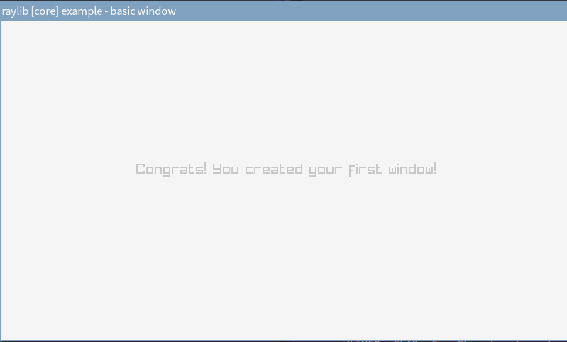
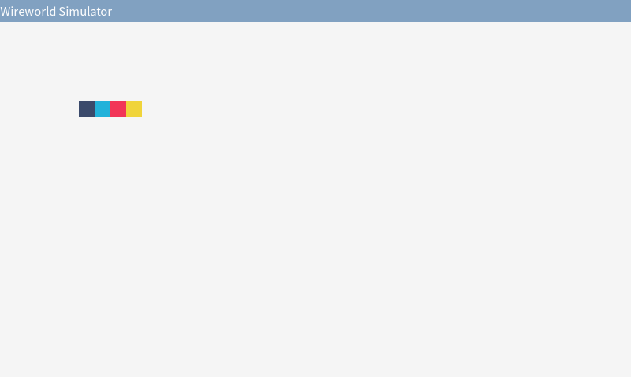
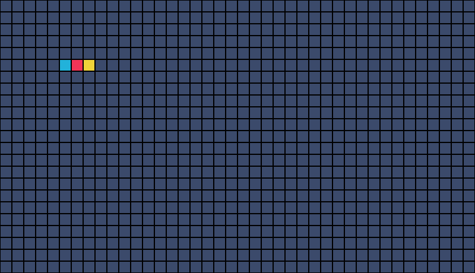

# Wireworld Simulator Using the Raylib: Part1

用 Raylib 写个 Wireworld 模拟器，试试自己能不能用 C 语言顺畅地做游戏。

这篇文章是制作过程的详细记录，记录编码、设计的思路和步骤，标题会非常细碎。当作一个 Step by Step 教程也许可以，每个阶段都附了完整代码可以对照。

项目地址：[github.com/13m0n4de/wireworld](https://github.com/13m0n4de/wireworld)

<!-- more -->

## 前言

[Wireworld](https://zh.wikipedia.org/wiki/Wireworld) 是一种[元胞自动机 (Cellular automaton)](https://zh.wikipedia.org/wiki/%E7%B4%B0%E8%83%9E%E8%87%AA%E5%8B%95%E6%A9%9F)，类似的还有[康威生命游戏 (Conway's Game of Life)](https://zh.wikipedia.org/wiki/%E7%94%9F%E5%91%BD%E6%B8%B8%E6%88%8F)。Wireworld 可以用来模拟电路逻辑，如下图的二极管：


[Raylib](https://github.com/raysan5/raylib) 是一个用于游戏制作的 C 语言库，设计上高度模块化、高度简洁，以下是它的官方说明：

> NOTE for ADVENTURERS: raylib is a programming library to enjoy videogames programming; no fancy interface, no visual helpers, no debug button... just coding in the most pure spartan-programmers way

本来是打算用 Bevy 来写的，但最近的 Rust 含量太多，受够了复杂过头的东西，所以这次用 C 语言，并且放弃诸如 Make 或 CMake 之类的构建系统，尽量保持一切简单可控。

## 运行 Raylib 基本示例

首先安装 Raylib 库，传统派一点，手动从 GitHub 上下载解压，不使用系统的包管理器。

```bash
wget "https://github.com/raysan5/raylib/releases/download/5.0/raylib-5.0_linux_amd64.tar.gz"
tar zxvf raylib-5.0_linux_amd64.tar.gz
```

官方给出的基本示例：

```c
#include "raylib.h"

int main(void) {
    InitWindow(800, 450, "raylib [core] example - basic window");

    while (!WindowShouldClose()) {
        BeginDrawing();
        ClearBackground(RAYWHITE);
        DrawText("Congrats! You created your first window!", 190, 200, 20,
                 LIGHTGRAY);
        EndDrawing();
    }

    CloseWindow();

    return 0;
}
```

编译它需要指定头文件路径和静态库文件路径：

```bash
gcc main.c -o main -Wall -Wextra -pedantic -I raylib-5.0_linux_amd64/include/ -L raylib-5.0_linux_amd64/lib/ -l:libraylib.a -lm
```

这样得到的文件只依赖 libc 和 libm，Raylib 的部分被静态链接进去：

```bash title="ldd main"
linux-vdso.so.1 (0x00007fff0e317000)
libm.so.6 => /usr/lib/libm.so.6 (0x000074151e365000)
libc.so.6 => /usr/lib/libc.so.6 (0x000074151e181000)
/lib64/ld-linux-x86-64.so.2 => /usr/lib64/ld-linux-x86-64.so.2 (0x000074151e5a5000)
```

动态链接也是同理，我认为这种游戏程序静态链接更合理。

运行出现 800 x 450 的窗口，显示文字 *Congrats! You created your first window!*，字体还蛮好看的。



## 设置编辑器

我的 NeoVim 一片红，原因是我用了 clangd 作 LSP，它默认情况下没法识别 Raylib 库（没装在系统路径里）。可以用 `bear` 命令生成 `compile_comannds.json` 文件帮助 clangd 识别，只需要传入刚刚的编译命令就可以了：

```bash
bear -- gcc main.c -o main -Wall -Wextra -pedantic -I raylib-5.0_linux_amd64/include/ -L raylib-5.0_
linux_amd64/lib/ -l:libraylib.a -lm
```

```json title="compile_comannds.json"
[
  {
    "arguments": [
      "/usr/bin/gcc",
      "-c",
      "-Wall",
      "-Wextra",
      "-pedantic",
      "-I",
      "raylib-5.0_linux_amd64/include/",
      "-o",
      "main",
      "main.c"
    ],
    "directory": "/path/to/wireworld",
    "file": "/path/to/wireworld/main.c",
    "output": "/path/to/wireworld/main"
  }
]
```

## 总之先显示点什么

先简单摸索一下 Raylib 的 API。

模拟器比常规的游戏要简单，预计只有窗口管理、输入管理和 2D 图形显示三个功能，只需要使用两个模块：

- [rcore](https://github.com/raysan5/raylib/blob/master/src/rcore.c): Window / Graphic Context / Inputs management.
- [rshapes](https://github.com/raysan5/raylib/blob/master/src/rshapes.c): Basic 2D shapes drawing functions.

它们都共用 `raylib.h` 头文件，不需要额外引入。

指定窗口的长宽和标题名称：

```c
const int screenWidth = 800;
const int screenHeight = 450;

InitWindow(screenWidth, screenHeight, "Wireworld Simulator");
```

设置 60 帧每秒：

```c
SetTargetFPS(60);
```

绘制 Wirewold 的四种细胞 (Cell)，[颜色是从 Color Hunt 上找的](https://colorhunt.co/palette/f23557f0d43a22b2da3b4a6b)，符合红黄蓝黑配色：

- 空：黑色 (`#3B4A6B`)
- 电子头：蓝色 (`22B2DA`)
- 电子尾：红色 (`F23557`)
- 导体：黄色 (`F0D43A`)

```c
#define EMPTY_COLOR         CLITERAL(Color) { 59, 74, 107, 255 }
#define HEAD_COLOR          CLITERAL(Color) { 34, 178, 218, 255 }
#define TAIL_COLOR          CLITERAL(Color) { 242, 53, 87, 255 }
#define CONDUCTOR_COLOR     CLITERAL(Color) { 240, 212, 58, 255 }

DrawRectangle(100, 100, cellSize, cellSize, EMPTY_COLOR);
DrawRectangle(120, 100, cellSize, cellSize, HEAD_COLOR);
DrawRectangle(140, 100, cellSize, cellSize, TAIL_COLOR);
DrawRectangle(160, 100, cellSize, cellSize, CONDUCTOR_COLOR);
```



??? example "当前完整代码"
    ```c linenums="1"
    #include "raylib.h"

    #define EMPTY_COLOR         CLITERAL(Color) { 59, 74, 107, 255 }
    #define HEAD_COLOR          CLITERAL(Color) { 34, 178, 218, 255 }
    #define TAIL_COLOR          CLITERAL(Color) { 242, 53, 87, 255 }
    #define CONDUCTOR_COLOR     CLITERAL(Color) { 240, 212, 58, 255 }

    const int screenWidth = 800;
    const int screenHeight = 450;

    const int cellSize = 20;

    int main(void) {

        InitWindow(screenWidth, screenHeight, "Wireworld Simulator");

        SetTargetFPS(60);

        while (!WindowShouldClose()) {
            BeginDrawing();
            ClearBackground(RAYWHITE);

            DrawRectangle(100, 100, cellSize, cellSize, EMPTY_COLOR);
            DrawRectangle(120, 100, cellSize, cellSize, HEAD_COLOR);
            DrawRectangle(140, 100, cellSize, cellSize, TAIL_COLOR);
            DrawRectangle(160, 100, cellSize, cellSize, CONDUCTOR_COLOR);

            EndDrawing();
        }

        CloseWindow();

        return 0;
    }
    ```

## 绘制网格

网格最讨人厌的是分界线，好在 Raylib 有一个绘制矩形边框的函数 `DrawRectangleLines`，直接使用格子边框作为网格分界线可以省去不少工作量。

```c
for (int i = 0; i < screenWidth / cellSize; i++) {
    for (int j = 0; j < screenHeight / cellSize; j++) {
        DrawRectangle(i * cellSize, j * cellSize, cellSize, cellSize,
                      EMPTY_COLOR);
        DrawRectangleLines(i * cellSize, j * cellSize, cellSize,
                           cellSize, BLACK);
    }
}

DrawRectangle(100, 100, cellSize, cellSize, EMPTY_COLOR);
DrawRectangleLines(100, 100, cellSize, cellSize, BLACK);
DrawRectangle(120, 100, cellSize, cellSize, HEAD_COLOR);
DrawRectangleLines(120, 100, cellSize, cellSize, BLACK);
DrawRectangle(140, 100, cellSize, cellSize, TAIL_COLOR);
DrawRectangleLines(140, 100, cellSize, cellSize, BLACK);
DrawRectangle(160, 100, cellSize, cellSize, CONDUCTOR_COLOR);
DrawRectangleLines(160, 100, cellSize, cellSize, BLACK);
```

效果如下（高度改成了 460，这样可以被细胞大小整除）：



这只是显示效果上的网格，对于网格数据，还是需要设计一个数据结构，比如二维数组。在二维数组中，每个元素存储细胞种类，比如「空」、「电子头」。

颜色、位置等信息不与单个细胞相关联，不需要额外保存在细胞中。

使用枚举表示细胞：

```c
typedef enum { EMPTY, HEAD, TAIL, CONDUCTOR } Cell;
```

创建网格并初始化所有格子为空：

```c
const int rows = screenHeight / cellSize;
const int cols = screenWidth / cellSize;

Cell grid[rows][cols];

for (int i = 0; i < rows; i++) {
    for (int j = 0; j < cols; j++) {
        grid[i][j] = EMPTY;
    }
}
```

使用 `switch` 根据格子类型返回对应颜色：

```c
Color GetCellColor(Cell cell) {
    switch (cell) {
        case EMPTY:
            return EMPTY_COLOR;
        case HEAD:
            return HEAD_COLOR;
        case TAIL:
            return TAIL_COLOR;
        case CONDUCTOR:
            return CONDUCTOR_COLOR;
        default:
            return EMPTY_COLOR;
    }
}
```

在主循环中遍历这个数组并绘制每个细胞：

```c hl_lines="1-3 9-17"
grid[5][5] = HEAD;
grid[5][6] = TAIL;
grid[5][7] = CONDUCTOR;

while (!WindowShouldClose()) {
    BeginDrawing();
    ClearBackground(RAYWHITE);

    for (int i = 0; i < rows; i++) {
        for (int j = 0; j < cols; j++) {
            Color cellColor = GetCellColor(grid[i][j]);
            DrawRectangle(j * cellSize, i * cellSize, cellSize, cellSize,
                          cellColor);
            DrawRectangleLines(j * cellSize, i * cellSize, cellSize,
                               cellSize, BLACK);
        }
    }

    EndDrawing();
}
```

??? example "当前完整代码"
    ```c linenums="1"
    #include "raylib.h"

    #define EMPTY_COLOR         CLITERAL(Color) { 59, 74, 107, 255 }
    #define HEAD_COLOR          CLITERAL(Color) { 34, 178, 218, 255 }
    #define TAIL_COLOR          CLITERAL(Color) { 242, 53, 87, 255 }
    #define CONDUCTOR_COLOR     CLITERAL(Color) { 240, 212, 58, 255 }

    const int screenWidth = 800;
    const int screenHeight = 460;

    const int cellSize = 20;

    const int rows = screenHeight / cellSize;
    const int cols = screenWidth / cellSize;

    typedef enum { EMPTY, HEAD, TAIL, CONDUCTOR } Cell;

    Color GetCellColor(Cell cell) {
        switch (cell) {
            case EMPTY:
                return EMPTY_COLOR;
            case HEAD:
                return HEAD_COLOR;
            case TAIL:
                return TAIL_COLOR;
            case CONDUCTOR:
                return CONDUCTOR_COLOR;
            default:
                return EMPTY_COLOR;
        }
    }

    int main(void) {
        InitWindow(screenWidth, screenHeight, "Wireworld Simulator");
        SetTargetFPS(60);

        Cell grid[rows][cols];

        for (int i = 0; i < rows; i++) {
            for (int j = 0; j < cols; j++) {
                grid[i][j] = EMPTY;
            }
        }

        grid[5][5] = HEAD;
        grid[5][6] = TAIL;
        grid[5][7] = CONDUCTOR;

        while (!WindowShouldClose()) {
            BeginDrawing();
            ClearBackground(RAYWHITE);

            for (int i = 0; i < rows; i++) {
                for (int j = 0; j < cols; j++) {
                    Color cellColor = GetCellColor(grid[i][j]);
                    DrawRectangle(j * cellSize, i * cellSize, cellSize, cellSize,
                                  cellColor);
                    DrawRectangleLines(j * cellSize, i * cellSize, cellSize,
                                       cellSize, BLACK);
                }
            }

            EndDrawing();
        }

        CloseWindow();

        return 0;
    }
    ```

## Wireworld 规则

时间以离散的步伐进行，单位是「代」(generations)。

每代细胞行为规则：

- 空 -> 空
- 电子头 -> 电子尾
- 电子尾 -> 导体
- 当导体拥有一至两个电子头邻居时，导体 -> 电子头，否则导体不变

对应代码：

```c
void UpdateGrid(Cell grid[rows][cols]) {
    Cell newGrid[rows][cols];

    for (int i = 0; i < rows; i++) {
        for (int j = 0; j < cols; j++) {
            switch (grid[i][j]) {
                case EMPTY:
                    newGrid[i][j] = EMPTY;
                    break;
                case HEAD:
                    newGrid[i][j] = TAIL;
                    break;
                case TAIL:
                    newGrid[i][j] = CONDUCTOR;
                    break;
                case CONDUCTOR: {
                    int headNeighbors = CountHeadNeighbors(grid, i, j);
                    if (headNeighbors == 1 || headNeighbors == 2) {
                        newGrid[i][j] = HEAD;
                    } else {
                        newGrid[i][j] = CONDUCTOR;
                    }
                } break;
            }
        }
    }

    memcpy(grid, newGrid, sizeof(newGrid));
}
```

不能边遍历边修改 `grid`，会影响到之后细胞的判断，需要创建一个新的网格 `newGrid`，在最后将 `newGrid` 复制给 `grid`（可以直接使用 `memcpy`）。

Wireworld 使用摩尔邻域 (Moore neighborhood)，这意味着在上面的规则中，「相邻」表示在任何方向上（正交和对角线）都有一个单元（范围值为 1）。


`CountHeadNeighbors` 的实现：

```c
int CountHeadNeighbors(Cell grid[rows][cols], int row, int col) {
    int headCount = 0;

    for (int i = -1; i <= 1; i++) {
        for (int j = -1; j <= 1; j++) {
            if (i == 0 && j == 0)
                continue;
            int newRow = row + i;
            int newCol = col + j;
            if (newRow >= 0 && newRow < rows && newCol >= 0 && newCol < cols) {
                if (grid[newRow][newCol] == HEAD) {
                    headCount++;
                }
            }
        }
    }

    return headCount;
}
```

将 `#!c UpdateGrid(grid);` 加入主循环，并初始化一些细胞：

```c hl_lines="1-5 7-8 10-14 20"
grid[5][5] = CONDUCTOR;
grid[5][6] = TAIL;
grid[5][7] = HEAD;
grid[5][8] = CONDUCTOR;
grid[5][9] = CONDUCTOR;

grid[6][4] = CONDUCTOR;
grid[6][10] = CONDUCTOR;

grid[7][5] = CONDUCTOR;
grid[7][6] = CONDUCTOR;
grid[7][7] = CONDUCTOR;
grid[7][8] = CONDUCTOR;
grid[7][9] = CONDUCTOR;

while (!WindowShouldClose()) {
    BeginDrawing();
    ClearBackground(RAYWHITE);

    UpdateGrid(grid);
```

将 FPS 暂时设置为 5：

```c
SetTargetFPS(5);
```

运行效果如图，一个时钟发射器：

<video width="800" height="460" autoplay loop muted>
  <source src="/assets/images/blog/wireworld_simulator_using_the_raylib/clock_generator.webm" type="video/webm">
Your browser does not support the video tag.
</video>

??? example "当前完整代码"
    ```c linenums="1"
    #include <string.h>
    #include "raylib.h"

    #define EMPTY_COLOR         CLITERAL(Color) { 59, 74, 107, 255 }
    #define HEAD_COLOR          CLITERAL(Color) { 34, 178, 218, 255 }
    #define TAIL_COLOR          CLITERAL(Color) { 242, 53, 87, 255 }
    #define CONDUCTOR_COLOR     CLITERAL(Color) { 240, 212, 58, 255 }

    const int screenWidth = 800;
    const int screenHeight = 460;

    const int cellSize = 20;

    const int rows = screenHeight / cellSize;
    const int cols = screenWidth / cellSize;

    typedef enum { EMPTY, HEAD, TAIL, CONDUCTOR } Cell;

    Color GetCellColor(Cell cell) {
        switch (cell) {
            case EMPTY:
                return EMPTY_COLOR;
            case HEAD:
                return HEAD_COLOR;
            case TAIL:
                return TAIL_COLOR;
            case CONDUCTOR:
                return CONDUCTOR_COLOR;
            default:
                return EMPTY_COLOR;
        }
    }

    int CountHeadNeighbors(Cell grid[rows][cols], int row, int col) {
        int headCount = 0;

        for (int i = -1; i <= 1; i++) {
            for (int j = -1; j <= 1; j++) {
                if (i == 0 && j == 0)
                    continue;
                int newRow = row + i;
                int newCol = col + j;
                if (newRow >= 0 && newRow < rows && newCol >= 0 && newCol < cols) {
                    if (grid[newRow][newCol] == HEAD) {
                        headCount++;
                    }
                }
            }
        }

        return headCount;
    }

    void UpdateGrid(Cell grid[rows][cols]) {
        Cell newGrid[rows][cols];

        for (int i = 0; i < rows; i++) {
            for (int j = 0; j < cols; j++) {
                switch (grid[i][j]) {
                    case EMPTY:
                        newGrid[i][j] = EMPTY;
                        break;
                    case HEAD:
                        newGrid[i][j] = TAIL;
                        break;
                    case TAIL:
                        newGrid[i][j] = CONDUCTOR;
                        break;
                    case CONDUCTOR: {
                        int headNeighbors = CountHeadNeighbors(grid, i, j);
                        if (headNeighbors == 1 || headNeighbors == 2) {
                            newGrid[i][j] = HEAD;
                        } else {
                            newGrid[i][j] = CONDUCTOR;
                        }
                    } break;
                }
            }
        }

        memcpy(grid, newGrid, sizeof(newGrid));
    }

    int main(void) {
        InitWindow(screenWidth, screenHeight, "Wireworld Simulator");
        SetTargetFPS(5);

        Cell grid[rows][cols];

        for (int i = 0; i < rows; i++) {
            for (int j = 0; j < cols; j++) {
                grid[i][j] = EMPTY;
            }
        }

        grid[5][5] = CONDUCTOR;
        grid[5][6] = TAIL;
        grid[5][7] = HEAD;
        grid[5][8] = CONDUCTOR;
        grid[5][9] = CONDUCTOR;

        grid[6][4] = CONDUCTOR;
        grid[6][10] = CONDUCTOR;

        grid[7][5] = CONDUCTOR;
        grid[7][6] = CONDUCTOR;
        grid[7][7] = CONDUCTOR;
        grid[7][8] = CONDUCTOR;
        grid[7][9] = CONDUCTOR;

        while (!WindowShouldClose()) {
            BeginDrawing();
            ClearBackground(RAYWHITE);

            UpdateGrid(grid);

            for (int i = 0; i < rows; i++) {
                for (int j = 0; j < cols; j++) {
                    Color cellColor = GetCellColor(grid[i][j]);
                    DrawRectangle(j * cellSize, i * cellSize, cellSize, cellSize,
                                  cellColor);
                    DrawRectangleLines(j * cellSize, i * cellSize, cellSize,
                                       cellSize, BLACK);
                }
            }

            EndDrawing();
        }

        CloseWindow();

        return 0;
    }
    ```

## 暂停和播放

先实现简单的暂停和播放功能，按下空格键暂停，再按一次播放。

游戏只有两个状态：「暂停」和「播放」，不需要使用枚举。

```c
int isPlaying = 0;
```

在按下空格时切换播放状态，且只有播放中才会更新网格：

```c
if (IsKeyPressed(KEY_SPACE))
    isPlaying = !isPlaying;

if (isPlaying) {
    UpdateGrid(grid);
}
```

之前将 FPS 设置为 5 是因为一秒更新六十次网格实在太快，但此时又会因为帧率过低导致键盘输入概率捕获不到。所以我们需要真正意义上的每秒迭代 N 次（刷新 N 次网格），而不是依靠 FPS。

## 网格刷新速率

使用 `GetFrameTime` 获得最后一帧的绘制时间 (delta time)，累加 `elapsedTime`，并在达到刷新间隔 `refreshInterval` 时刷新网格。

```c hl_lines="1-2 4 10-11 16 18"
const int refreshRate = 5;
const float refreshInterval = 1.0f / refreshRate;

float elapsedTime = 0.0f;

while (!WindowShouldClose()) {
    BeginDrawing();
    ClearBackground(RAYWHITE);

    float frameTime = GetFrameTime();
    elapsedTime += frameTime;

    if (IsKeyPressed(KEY_SPACE))
        isPlaying = !isPlaying;

    if (isPlaying && elapsedTime >= refreshInterval) {
        UpdateGrid(grid);
        elapsedTime = 0.0f;
    }
```

??? example "当前完整代码"
    ```c linenums="1"
    #include <string.h>
    #include "raylib.h"

    #define EMPTY_COLOR         CLITERAL(Color) { 59, 74, 107, 255 }
    #define HEAD_COLOR          CLITERAL(Color) { 34, 178, 218, 255 }
    #define TAIL_COLOR          CLITERAL(Color) { 242, 53, 87, 255 }
    #define CONDUCTOR_COLOR     CLITERAL(Color) { 240, 212, 58, 255 }

    const int screenWidth = 800;
    const int screenHeight = 460;

    const int cellSize = 20;

    const int rows = screenHeight / cellSize;
    const int cols = screenWidth / cellSize;

    int isPlaying = 0;

    const int refreshRate = 5;
    const float refreshInterval = 1.0f / refreshRate;

    typedef enum { EMPTY, HEAD, TAIL, CONDUCTOR } Cell;

    Color GetCellColor(Cell cell) {
        switch (cell) {
            case EMPTY:
                return EMPTY_COLOR;
            case HEAD:
                return HEAD_COLOR;
            case TAIL:
                return TAIL_COLOR;
            case CONDUCTOR:
                return CONDUCTOR_COLOR;
            default:
                return EMPTY_COLOR;
        }
    }

    int CountHeadNeighbors(Cell grid[rows][cols], int row, int col) {
        int headCount = 0;

        for (int i = -1; i <= 1; i++) {
            for (int j = -1; j <= 1; j++) {
                if (i == 0 && j == 0)
                    continue;
                int newRow = row + i;
                int newCol = col + j;
                if (newRow >= 0 && newRow < rows && newCol >= 0 && newCol < cols) {
                    if (grid[newRow][newCol] == HEAD) {
                        headCount++;
                    }
                }
            }
        }

        return headCount;
    }

    void UpdateGrid(Cell grid[rows][cols]) {
        Cell newGrid[rows][cols];

        for (int i = 0; i < rows; i++) {
            for (int j = 0; j < cols; j++) {
                switch (grid[i][j]) {
                    case EMPTY:
                        newGrid[i][j] = EMPTY;
                        break;
                    case HEAD:
                        newGrid[i][j] = TAIL;
                        break;
                    case TAIL:
                        newGrid[i][j] = CONDUCTOR;
                        break;
                    case CONDUCTOR: {
                        int headNeighbors = CountHeadNeighbors(grid, i, j);
                        if (headNeighbors == 1 || headNeighbors == 2) {
                            newGrid[i][j] = HEAD;
                        } else {
                            newGrid[i][j] = CONDUCTOR;
                        }
                    } break;
                }
            }
        }

        memcpy(grid, newGrid, sizeof(newGrid));
    }

    int main(void) {
        InitWindow(screenWidth, screenHeight, "Wireworld Simulator");
        SetTargetFPS(60);

        Cell grid[rows][cols];
        for (int i = 0; i < rows; i++) {
            for (int j = 0; j < cols; j++) {
                grid[i][j] = EMPTY;
            }
        }

        grid[5][5] = CONDUCTOR;
        grid[5][6] = TAIL;
        grid[5][7] = HEAD;
        grid[5][8] = CONDUCTOR;
        grid[5][9] = CONDUCTOR;

        grid[6][4] = CONDUCTOR;
        grid[6][10] = CONDUCTOR;

        grid[7][5] = CONDUCTOR;
        grid[7][6] = CONDUCTOR;
        grid[7][7] = CONDUCTOR;
        grid[7][8] = CONDUCTOR;
        grid[7][9] = CONDUCTOR;

        float elapsedTime = 0.0f;

        while (!WindowShouldClose()) {
            BeginDrawing();
            ClearBackground(RAYWHITE);

            float frameTime = GetFrameTime();
            elapsedTime += frameTime;

            if (IsKeyPressed(KEY_SPACE))
                isPlaying = !isPlaying;

            if (isPlaying && elapsedTime >= refreshInterval) {
                UpdateGrid(grid);
                elapsedTime = 0.0f;
            }

            for (int i = 0; i < rows; i++) {
                for (int j = 0; j < cols; j++) {
                    Color cellColor = GetCellColor(grid[i][j]);
                    DrawRectangle(j * cellSize, i * cellSize, cellSize, cellSize,
                                  cellColor);
                    DrawRectangleLines(j * cellSize, i * cellSize, cellSize,
                                       cellSize, BLACK);
                }
            }

            EndDrawing();
        }

        CloseWindow();

        return 0;
    }
    ```

## 高亮预选细胞

制作细胞位置预览效果：鼠标放置在的单元格边框会进行高亮。

使用 `GetMousePosition` 获得鼠标位置，并计算对应的细胞位置，使用 `DrawRectangleLines` 绘制高亮色边框。

```c hl_lines="11-15"
for (int i = 0; i < rows; i++) {
    for (int j = 0; j < cols; j++) {
        Color cellColor = GetCellColor(grid[i][j]);
        DrawRectangle(j * cellSize, i * cellSize, cellSize, cellSize,
                      cellColor);
        DrawRectangleLines(j * cellSize, i * cellSize, cellSize,
                           cellSize, BLACK);
    }
}

Vector2 mousePosition = GetMousePosition();
int mouseYGridPos = (int)(mousePosition.y / cellSize);
int mouseXGridPos = (int)(mousePosition.x / cellSize);
DrawRectangleLines(mouseXGridPos * cellSize, mouseYGridPos * cellSize,
                   cellSize, cellSize, WHITE);
```

为了避免与红黄蓝细胞颜色相近，高亮色选了纯白，正好也和网格边框颜色形成对比。

<video width="800" height="460" autoplay loop muted>
  <source src="/assets/images/blog/wireworld_simulator_using_the_raylib/mouse_pick.webm" type="video/webm">
Your browser does not support the video tag.
</video>

## 创建细胞

### 方案一

方案一是 [xvlv.io/WireWorld/](https://xvlv.io/WireWorld/) 网站的按键配置：

- 鼠标左击：放置导线，目标细胞不为空时将其设置为空
- 鼠标右击：放置电子头，或将电子头转换为导线

代码如下，顺带加上了按键显示：

```c
Color cellColor;
if (IsMouseButtonPressed(MOUSE_BUTTON_LEFT)) {
    if (grid[mouseYGridPos][mouseXGridPos] != EMPTY) {
        grid[mouseYGridPos][mouseXGridPos] = EMPTY;
        cellColor = EMPTY_COLOR;
    } else {
        grid[mouseYGridPos][mouseXGridPos] = CONDUCTOR;
        cellColor = CONDUCTOR_COLOR;
    }
    DrawRectangle(mouseXGridPos * cellSize, mouseYGridPos * cellSize,
                  cellSize, cellSize, cellColor);
    DrawRectangleLines(mouseXGridPos * cellSize,
                       mouseYGridPos * cellSize, cellSize, cellSize,
                       BLACK);
} else if (IsMouseButtonPressed(MOUSE_BUTTON_RIGHT)) {
    if (grid[mouseYGridPos][mouseXGridPos] != HEAD) {
        grid[mouseYGridPos][mouseXGridPos] = HEAD;
        cellColor = EMPTY_COLOR;
    } else {
        grid[mouseYGridPos][mouseXGridPos] = CONDUCTOR;
        cellColor = CONDUCTOR_COLOR;
    }
    DrawRectangle(mouseXGridPos * cellSize, mouseYGridPos * cellSize,
                  cellSize, cellSize, cellColor);
    DrawRectangleLines(mouseXGridPos * cellSize,
                       mouseYGridPos * cellSize, cellSize, cellSize,
                       BLACK);
}

if (IsMouseButtonDown(MOUSE_BUTTON_LEFT)) {
    DrawText("MOUSE: LEFT", 20, 420, 20, CONDUCTOR_COLOR);
} else if (IsMouseButtonDown(MOUSE_BUTTON_RIGHT)) {
    DrawText("MOUSE: RIGHT", 20, 420, 20, HEAD_COLOR);
} else {
    DrawText("MOUSE: NONE", 20, 420, 20, BROWN);
}
```

<video width="800" height="460" autoplay loop muted>
  <source src="/assets/images/blog/wireworld_simulator_using_the_raylib/put_cell1.webm" type="video/webm">
Your browser does not support the video tag.
</video>

这种方案不能手动放置电子尾。

??? example "方案一完整代码"
    ```c linenums="1"
    #include <string.h>
    #include "raylib.h"

    #define EMPTY_COLOR      \
        CLITERAL(Color) {    \
            59, 74, 107, 255 \
        }
    #define HEAD_COLOR        \
        CLITERAL(Color) {     \
            34, 178, 218, 255 \
        }
    #define TAIL_COLOR       \
        CLITERAL(Color) {    \
            242, 53, 87, 255 \
        }
    #define CONDUCTOR_COLOR   \
        CLITERAL(Color) {     \
            240, 212, 58, 255 \
        }

    const int screenWidth = 800;
    const int screenHeight = 460;

    const int cellSize = 20;

    const int rows = screenHeight / cellSize;
    const int cols = screenWidth / cellSize;

    int isPlaying = 0;

    const int refreshRate = 5;
    const float refreshInterval = 1.0f / refreshRate;

    typedef enum { EMPTY, HEAD, TAIL, CONDUCTOR } Cell;

    Color GetCellColor(Cell cell) {
        switch (cell) {
            case EMPTY:
                return EMPTY_COLOR;
            case HEAD:
                return HEAD_COLOR;
            case TAIL:
                return TAIL_COLOR;
            case CONDUCTOR:
                return CONDUCTOR_COLOR;
            default:
                return EMPTY_COLOR;
        }
    }

    int CountHeadNeighbors(Cell grid[rows][cols], int row, int col) {
        int headCount = 0;

        for (int y = -1; y <= 1; y++) {
            for (int x = -1; x <= 1; x++) {
                if (y == 0 && x == 0)
                    continue;
                int newRow = row + y;
                int newCol = col + x;
                if (newRow >= 0 && newRow < rows && newCol >= 0 && newCol < cols) {
                    if (grid[newRow][newCol] == HEAD) {
                        headCount++;
                    }
                }
            }
        }

        return headCount;
    }

    void UpdateGrid(Cell grid[rows][cols]) {
        Cell newGrid[rows][cols];

        for (int y = 0; y < rows; y++) {
            for (int x = 0; x < cols; x++) {
                switch (grid[y][x]) {
                    case EMPTY:
                        newGrid[y][x] = EMPTY;
                        break;
                    case HEAD:
                        newGrid[y][x] = TAIL;
                        break;
                    case TAIL:
                        newGrid[y][x] = CONDUCTOR;
                        break;
                    case CONDUCTOR: {
                        int headNeighbors = CountHeadNeighbors(grid, y, x);
                        if (headNeighbors == 1 || headNeighbors == 2) {
                            newGrid[y][x] = HEAD;
                        } else {
                            newGrid[y][x] = CONDUCTOR;
                        }
                    } break;
                }
            }
        }

        memcpy(grid, newGrid, sizeof(newGrid));
    }

    int main(void) {
        InitWindow(screenWidth, screenHeight, "Wireworld Simulator");
        SetTargetFPS(60);

        Cell grid[rows][cols];
        for (int y = 0; y < rows; y++) {
            for (int x = 0; x < cols; x++) {
                grid[y][x] = EMPTY;
            }
        }

        float elapsedTime = 0.0f;

        while (!WindowShouldClose()) {
            BeginDrawing();
            ClearBackground(RAYWHITE);

            float frameTime = GetFrameTime();
            elapsedTime += frameTime;

            if (IsKeyPressed(KEY_SPACE))
                isPlaying = !isPlaying;

            if (isPlaying && elapsedTime >= refreshInterval) {
                UpdateGrid(grid);
                elapsedTime = 0.0f;
            }

            for (int y = 0; y < rows; y++) {
                for (int x = 0; x < cols; x++) {
                    Color cellColor = GetCellColor(grid[y][x]);
                    DrawRectangle(x * cellSize, y * cellSize, cellSize, cellSize,
                                  cellColor);
                    DrawRectangleLines(x * cellSize, y * cellSize, cellSize,
                                       cellSize, BLACK);
                }
            }

            Vector2 mousePosition = GetMousePosition();
            int mouseYGridPos = (int)(mousePosition.y / cellSize);
            int mouseXGridPos = (int)(mousePosition.x / cellSize);
            DrawRectangleLines(mouseXGridPos * cellSize, mouseYGridPos * cellSize,
                               cellSize, cellSize, WHITE);

            Color cellColor;
            if (IsMouseButtonPressed(MOUSE_BUTTON_LEFT)) {
                if (grid[mouseYGridPos][mouseXGridPos] != EMPTY) {
                    grid[mouseYGridPos][mouseXGridPos] = EMPTY;
                    cellColor = EMPTY_COLOR;
                } else {
                    grid[mouseYGridPos][mouseXGridPos] = CONDUCTOR;
                    cellColor = CONDUCTOR_COLOR;
                }
                DrawRectangle(mouseXGridPos * cellSize, mouseYGridPos * cellSize,
                              cellSize, cellSize, cellColor);
                DrawRectangleLines(mouseXGridPos * cellSize,
                                   mouseYGridPos * cellSize, cellSize, cellSize,
                                   BLACK);
            } else if (IsMouseButtonPressed(MOUSE_BUTTON_RIGHT)) {
                if (grid[mouseYGridPos][mouseXGridPos] != HEAD) {
                    grid[mouseYGridPos][mouseXGridPos] = HEAD;
                    cellColor = EMPTY_COLOR;
                } else {
                    grid[mouseYGridPos][mouseXGridPos] = CONDUCTOR;
                    cellColor = CONDUCTOR_COLOR;
                }
                DrawRectangle(mouseXGridPos * cellSize, mouseYGridPos * cellSize,
                              cellSize, cellSize, cellColor);
                DrawRectangleLines(mouseXGridPos * cellSize,
                                   mouseYGridPos * cellSize, cellSize, cellSize,
                                   BLACK);
            }

            if (IsMouseButtonDown(MOUSE_BUTTON_LEFT)) {
                DrawText("MOUSE: LEFT", 20, 420, 20, CONDUCTOR_COLOR);
            } else if (IsMouseButtonDown(MOUSE_BUTTON_RIGHT)) {
                DrawText("MOUSE: RIGHT", 20, 420, 20, HEAD_COLOR);
            } else {
                DrawText("MOUSE: NONE", 20, 420, 20, BROWN);
            }

            EndDrawing();
        }

        CloseWindow();

        return 0;
    }
    ```

### 方案二

方案二是 [danprince.github.io/wireworld/](https://danprince.github.io/wireworld/) 网站的按键配置。

它使用数字键 1234 分别代表空、导体、电子头、电子尾，按住鼠标左键放置对应细胞。我更喜欢这个方案，之后的代码都会基于这个方案。

代码实现如下：

```c
Vector2 mousePosition = GetMousePosition();
int mouseYGridPos = (int)(mousePosition.y / cellSize);
int mouseXGridPos = (int)(mousePosition.x / cellSize);

if (IsKeyPressed(KEY_ONE) || IsKeyPressed(KEY_KP_1))
    selectCellType = EMPTY;
else if (IsKeyPressed(KEY_TWO) || IsKeyPressed(KEY_KP_2))
    selectCellType = CONDUCTOR;
else if (IsKeyPressed(KEY_THREE) || IsKeyPressed(KEY_KP_3))
    selectCellType = HEAD;
else if (IsKeyPressed(KEY_FOUR) || IsKeyPressed(KEY_KP_4))
    selectCellType = TAIL;

if (IsMouseButtonDown(MOUSE_BUTTON_LEFT)) {
    grid[mouseYGridPos][mouseXGridPos] = selectCellType;
    DrawCell(mouseXGridPos, mouseYGridPos,
             GetCellColor(selectCellType));
}

DrawCellLines(mouseXGridPos, mouseYGridPos, WHITE);
```

个人认为预选高亮放在后面（优先级更高）会比较好，能时刻看清当前选中细胞在哪，哪怕是按住鼠标放置细胞时。

`DrawCell` 和 `DrawCellLines` 是对 `DrawRectangle` 和 `DrawRectangleLines` 的封装：

```c
void DrawCell(int xGridPos, int yGridPos, Color cellColor) {
    DrawRectangle(xGridPos * cellSize, yGridPos * cellSize, cellSize, cellSize,
                  cellColor);
    DrawRectangleLines(xGridPos * cellSize, yGridPos * cellSize, cellSize,
                       cellSize, BLACK);
}

void DrawCellLines(int xGridPos, int yGridPos, Color cellColor) {
    DrawRectangleLines(xGridPos * cellSize, yGridPos * cellSize, cellSize,
                       cellSize, cellColor);
}
```

接下来还需要在右上角添加四个色块，用于指示当前选中的细胞类型：

```c
const int indicatorSize = cellSize;
const int indicatorPadding = cellSize / 2;
const int indicatorX = screenWidth - indicatorSize * 4 - indicatorPadding;
const int indicatorY = indicatorPadding;

void DrawIndicators(void) {
    Cell cellTypes[] = {EMPTY, CONDUCTOR, HEAD, TAIL};
    for (int i = 0; i < 4; i++) {
        int x = indicatorX + indicatorSize * i;
        DrawRectangle(x, indicatorY, indicatorSize, indicatorSize,
                      GetCellColor(cellTypes[i]));
        DrawRectangleLines(x, indicatorY, indicatorSize, indicatorSize, BLACK);
        if (selectCellType == cellTypes[i]) {
            DrawRectangleLines(x, indicatorY, indicatorSize, indicatorSize,
                               WHITE);
        }
    }
}
```

效果如下：

<video width="800" height="460" autoplay loop muted>
  <source src="/assets/images/blog/wireworld_simulator_using_the_raylib/put_cell2.webm" type="video/webm">
Your browser does not support the video tag.
</video>

??? example "方案二完整代码"
    ```c linenums="1"
    #include <string.h>
    #include "raylib.h"

    #define EMPTY_COLOR      \
        CLITERAL(Color) {    \
            59, 74, 107, 255 \
        }
    #define HEAD_COLOR        \
        CLITERAL(Color) {     \
            34, 178, 218, 255 \
        }
    #define TAIL_COLOR       \
        CLITERAL(Color) {    \
            242, 53, 87, 255 \
        }
    #define CONDUCTOR_COLOR   \
        CLITERAL(Color) {     \
            240, 212, 58, 255 \
        }

    typedef enum { EMPTY, CONDUCTOR, HEAD, TAIL } Cell;

    const int screenWidth = 800;
    const int screenHeight = 460;

    const int cellSize = 20;

    const int indicatorSize = cellSize;
    const int indicatorPadding = cellSize / 2;
    const int indicatorX = screenWidth - indicatorSize * 4 - indicatorPadding;
    const int indicatorY = indicatorPadding;

    const int rows = screenHeight / cellSize;
    const int cols = screenWidth / cellSize;

    int isPlaying = 0;

    const int refreshRate = 5;
    const float refreshInterval = 1.0f / refreshRate;

    Cell selectCellType = EMPTY;

    Color GetCellColor(Cell cell) {
        switch (cell) {
            case EMPTY:
                return EMPTY_COLOR;
            case HEAD:
                return HEAD_COLOR;
            case TAIL:
                return TAIL_COLOR;
            case CONDUCTOR:
                return CONDUCTOR_COLOR;
            default:
                return EMPTY_COLOR;
        }
    }

    int CountHeadNeighbors(Cell grid[rows][cols], int row, int col) {
        int headCount = 0;

        for (int y = -1; y <= 1; y++) {
            for (int x = -1; x <= 1; x++) {
                if (y == 0 && x == 0)
                    continue;
                int newRow = row + y;
                int newCol = col + x;
                if (newRow >= 0 && newRow < rows && newCol >= 0 && newCol < cols) {
                    if (grid[newRow][newCol] == HEAD) {
                        headCount++;
                    }
                }
            }
        }

        return headCount;
    }

    void UpdateGrid(Cell grid[rows][cols]) {
        Cell newGrid[rows][cols];

        for (int y = 0; y < rows; y++) {
            for (int x = 0; x < cols; x++) {
                switch (grid[y][x]) {
                    case EMPTY:
                        newGrid[y][x] = EMPTY;
                        break;
                    case HEAD:
                        newGrid[y][x] = TAIL;
                        break;
                    case TAIL:
                        newGrid[y][x] = CONDUCTOR;
                        break;
                    case CONDUCTOR: {
                        int headNeighbors = CountHeadNeighbors(grid, y, x);
                        if (headNeighbors == 1 || headNeighbors == 2) {
                            newGrid[y][x] = HEAD;
                        } else {
                            newGrid[y][x] = CONDUCTOR;
                        }
                    } break;
                }
            }
        }

        memcpy(grid, newGrid, sizeof(newGrid));
    }

    void DrawCell(int xGridPos, int yGridPos, Color cellColor) {
        DrawRectangle(xGridPos * cellSize, yGridPos * cellSize, cellSize, cellSize,
                      cellColor);
        DrawRectangleLines(xGridPos * cellSize, yGridPos * cellSize, cellSize,
                           cellSize, BLACK);
    }

    void DrawCellLines(int xGridPos, int yGridPos, Color cellColor) {
        DrawRectangleLines(xGridPos * cellSize, yGridPos * cellSize, cellSize,
                           cellSize, cellColor);
    }

    int main(void) {
        InitWindow(screenWidth, screenHeight, "Wireworld Simulator");
        SetTargetFPS(60);

        Cell grid[rows][cols];
        for (int y = 0; y < rows; y++) {
            for (int x = 0; x < cols; x++) {
                grid[y][x] = EMPTY;
            }
        }

        float elapsedTime = 0.0f;

        while (!WindowShouldClose()) {
            BeginDrawing();
            ClearBackground(RAYWHITE);

            float frameTime = GetFrameTime();
            elapsedTime += frameTime;

            if (IsKeyPressed(KEY_SPACE))
                isPlaying = !isPlaying;

            if (isPlaying && elapsedTime >= refreshInterval) {
                UpdateGrid(grid);
                elapsedTime = 0.0f;
            }

            for (int y = 0; y < rows; y++) {
                for (int x = 0; x < cols; x++) {
                    Color cellColor = GetCellColor(grid[y][x]);
                    DrawCell(x, y, cellColor);
                }
            }

            Vector2 mousePosition = GetMousePosition();
            int mouseYGridPos = (int)(mousePosition.y / cellSize);
            int mouseXGridPos = (int)(mousePosition.x / cellSize);

            if (IsKeyPressed(KEY_ONE) || IsKeyPressed(KEY_KP_1))
                selectCellType = EMPTY;
            else if (IsKeyPressed(KEY_TWO) || IsKeyPressed(KEY_KP_2))
                selectCellType = CONDUCTOR;
            else if (IsKeyPressed(KEY_THREE) || IsKeyPressed(KEY_KP_3))
                selectCellType = HEAD;
            else if (IsKeyPressed(KEY_FOUR) || IsKeyPressed(KEY_KP_4))
                selectCellType = TAIL;

            if (IsMouseButtonDown(MOUSE_BUTTON_LEFT)) {
                grid[mouseYGridPos][mouseXGridPos] = selectCellType;
                DrawCell(mouseXGridPos, mouseYGridPos,
                         GetCellColor(selectCellType));
            }

            DrawCellLines(mouseXGridPos, mouseYGridPos, WHITE);

            Cell cellTypes[] = {EMPTY, CONDUCTOR, HEAD, TAIL};
            for (int i = 0; i < 4; i++) {
                int x = indicatorX + indicatorSize * i;
                DrawRectangle(x, indicatorY, indicatorSize, indicatorSize,
                              GetCellColor(cellTypes[i]));
                DrawRectangleLines(x, indicatorY, indicatorSize, indicatorSize, BLACK);
                if (selectCellType == cellTypes[i]) {
                    DrawRectangleLines(x, indicatorY, indicatorSize, indicatorSize,
                                       WHITE);
                }
            }

            EndDrawing();
        }

        CloseWindow();

        return 0;
    }
    ```

## 绘制播放按钮

按钮兼顾了状态切换和状态显示的功能，使用一个按钮即可表示当前是「播放」还是「暂停」状态，点击切换另一状态时也不会令人困惑。恰到好处的信息量与操作复杂程度。

在左上角绘制播放按钮，播放状态是两条竖着的矩形，暂停状态是个等腰三角：

```c
const int buttonX = cellSize / 2;
const int buttonY = cellSize / 2;
const int buttonSize = cellSize;
const int barWidth = buttonSize / 4;
const int barGap = barWidth;

if (isPlaying) {
    DrawRectangle(buttonX, buttonY, barWidth, buttonSize, WHITE);
    DrawRectangle(buttonX + barWidth + barGap, buttonY, barWidth,
                  buttonSize, WHITE);
} else {
    Vector2 v1 = (Vector2){buttonX, buttonY};
    Vector2 v2 = (Vector2){buttonX, buttonY + buttonSize};
    Vector2 v3 =
        (Vector2){buttonX + buttonSize, (buttonY + buttonSize / 2.0)};
    DrawTriangle(v1, v2, v3, WHITE);
}
```

<video width="800" height="460" autoplay loop muted>
  <source src="/assets/images/blog/wireworld_simulator_using_the_raylib/play_button.webm" type="video/webm">
Your browser does not support the video tag.
</video>

## 整理代码

将处理用户输入的代码封装到 `HandleUserInput` 函数里：

```c
void HandleUserInput(void) {
    Vector2 mousePosition = GetMousePosition();
    int mouseYGridPos = (int)(mousePosition.y / cellSize);
    int mouseXGridPos = (int)(mousePosition.x / cellSize);

    if (IsKeyPressed(KEY_SPACE))
        isPlaying = !isPlaying;

    if (IsKeyPressed(KEY_ONE) || IsKeyPressed(KEY_KP_1))
        selectCellType = EMPTY;
    else if (IsKeyPressed(KEY_TWO) || IsKeyPressed(KEY_KP_2))
        selectCellType = CONDUCTOR;
    else if (IsKeyPressed(KEY_THREE) || IsKeyPressed(KEY_KP_3))
        selectCellType = HEAD;
    else if (IsKeyPressed(KEY_FOUR) || IsKeyPressed(KEY_KP_4))
        selectCellType = TAIL;

    if (IsMouseButtonDown(MOUSE_BUTTON_LEFT)) {
        grid[mouseYGridPos][mouseXGridPos] = selectCellType;
        DrawCell(mouseXGridPos, mouseYGridPos, GetCellColor(selectCellType));
    }

    DrawCellLines(mouseXGridPos, mouseYGridPos, WHITE);
}
```

将绘制指示器的代码封装到 `DrawIndicators` 函数里：

```c
void DrawIndicators(void) {
    Cell cellTypes[] = {EMPTY, CONDUCTOR, HEAD, TAIL};
    for (int i = 0; i < 4; i++) {
        int x = indicatorX + indicatorSize * i;
        DrawRectangle(x, indicatorY, indicatorSize, indicatorSize,
                      GetCellColor(cellTypes[i]));
        DrawRectangleLines(x, indicatorY, indicatorSize, indicatorSize, BLACK);
        if (selectCellType == cellTypes[i]) {
            DrawRectangleLines(x, indicatorY, indicatorSize, indicatorSize,
                               WHITE);
        }
    }
}
```

将绘制按钮的代码封装到 `DrawPlayButton` 函数里：

```c
void DrawPlayButton(void) {
    if (isPlaying) {
        DrawRectangle(buttonX, buttonY, barWidth, buttonSize, WHITE);
        DrawRectangle(buttonX + barWidth + barGap, buttonY, barWidth, buttonSize,
                      WHITE);
    } else {
        Vector2 v1 = (Vector2){buttonX, buttonY};
        Vector2 v2 = (Vector2){buttonX, buttonY + buttonSize};
        Vector2 v3 =
            (Vector2){buttonX + buttonSize, (buttonY + buttonSize / 2.0)};
        DrawTriangle(v1, v2, v3, WHITE);
    }
}
```

将网格数组 `grid` 放在堆上，并将其指针作为全局变量，在 `#! main` 函数开始和结束时分别初始化和释放内存。

```c
Cell** grid;

void InitGrid(void) {
    grid = malloc(rows * sizeof(Cell*));
    for (int y = 0; y < rows; y++) {
        grid[y] = malloc(cols * sizeof(Cell));
    }

    for (int y = 0; y < rows; y++) {
        for (int x = 0; x < cols; x++) {
            grid[y][x] = EMPTY;
        }
    }
}

void FreeGrid(void) {
    for (int i = 0; i < rows; i++) {
        free(grid[i]);
    }
    free(grid);
}
```

`UpdateGrid` 函数中的 `memcpy` 不能用了，因为 `malloc` 分配出的 `grid` 内存布局与栈上的二维数组 `newGrid` 内存布局不一致：

```c hl_lines="28-32"
void UpdateGrid(void) {
    Cell newGrid[rows][cols];

    for (int y = 0; y < rows; y++) {
        for (int x = 0; x < cols; x++) {
            switch (grid[y][x]) {
                case EMPTY:
                    newGrid[y][x] = EMPTY;
                    break;
                case HEAD:
                    newGrid[y][x] = TAIL;
                    break;
                case TAIL:
                    newGrid[y][x] = CONDUCTOR;
                    break;
                case CONDUCTOR: {
                    int headNeighbors = CountHeadNeighbors(y, x);
                    if (headNeighbors == 1 || headNeighbors == 2) {
                        newGrid[y][x] = HEAD;
                    } else {
                        newGrid[y][x] = CONDUCTOR;
                    }
                } break;
            }
        }
    }

    for (int y = 0; y < rows; y++) {
        for (int x = 0; x < cols; x++) {
            grid[y][x] = newGrid[y][x];
        }
    }
}
```

这样子主函数就非常干净了：

```c
int main(void) {
    InitWindow(screenWidth, screenHeight, "Wireworld Simulator");
    SetTargetFPS(60);

    InitGrid();

    float elapsedTime = 0.0f;

    while (!WindowShouldClose()) {
        BeginDrawing();
        ClearBackground(RAYWHITE);

        float frameTime = GetFrameTime();
        elapsedTime += frameTime;

        if (isPlaying && elapsedTime >= refreshInterval) {
            UpdateGrid();
            elapsedTime = 0.0f;
        }

        for (int y = 0; y < rows; y++) {
            for (int x = 0; x < cols; x++) {
                Color cellColor = GetCellColor(grid[y][x]);
                DrawCell(x, y, cellColor);
            }
        }

        HandleUserInput();

        DrawIndicators();

        DrawPlayButton();

        EndDrawing();
    }

    CloseWindow();

    FreeGrid();

    return 0;
}
```

??? example "当前完整代码"
    ```c
    #include <stdlib.h>
    #include "raylib.h"

    #define EMPTY_COLOR      \
        CLITERAL(Color) {    \
            59, 74, 107, 255 \
        }
    #define HEAD_COLOR        \
        CLITERAL(Color) {     \
            34, 178, 218, 255 \
        }
    #define TAIL_COLOR       \
        CLITERAL(Color) {    \
            242, 53, 87, 255 \
        }
    #define CONDUCTOR_COLOR   \
        CLITERAL(Color) {     \
            240, 212, 58, 255 \
        }

    typedef enum { EMPTY, CONDUCTOR, HEAD, TAIL } Cell;

    const int screenWidth = 800;
    const int screenHeight = 460;

    const int cellSize = 20;

    const int indicatorSize = cellSize;
    const int indicatorPadding = cellSize / 2;
    const int indicatorX = screenWidth - indicatorSize * 4 - indicatorPadding;
    const int indicatorY = indicatorPadding;

    const int buttonX = cellSize / 2;
    const int buttonY = cellSize / 2;
    const int buttonSize = cellSize;
    const int barWidth = buttonSize / 4;
    const int barGap = barWidth;

    const int rows = screenHeight / cellSize;
    const int cols = screenWidth / cellSize;

    int isPlaying = 0;

    const int refreshRate = 5;
    const float refreshInterval = 1.0f / refreshRate;

    Cell selectCellType = EMPTY;

    Cell** grid;

    Color GetCellColor(Cell cell) {
        switch (cell) {
            case EMPTY:
                return EMPTY_COLOR;
            case HEAD:
                return HEAD_COLOR;
            case TAIL:
                return TAIL_COLOR;
            case CONDUCTOR:
                return CONDUCTOR_COLOR;
            default:
                return EMPTY_COLOR;
        }
    }

    int CountHeadNeighbors(int row, int col) {
        int headCount = 0;

        for (int y = -1; y <= 1; y++) {
            for (int x = -1; x <= 1; x++) {
                if (y == 0 && x == 0)
                    continue;
                int newRow = row + y;
                int newCol = col + x;
                if (newRow >= 0 && newRow < rows && newCol >= 0 && newCol < cols) {
                    if (grid[newRow][newCol] == HEAD) {
                        headCount++;
                    }
                }
            }
        }

        return headCount;
    }

    void InitGrid(void) {
        grid = malloc(rows * sizeof(Cell*));
        for (int y = 0; y < rows; y++) {
            grid[y] = malloc(cols * sizeof(Cell));
        }

        for (int y = 0; y < rows; y++) {
            for (int x = 0; x < cols; x++) {
                grid[y][x] = EMPTY;
            }
        }
    }

    void FreeGrid(void) {
        for (int i = 0; i < rows; i++) {
            free(grid[i]);
        }
        free(grid);
    }

    void UpdateGrid(void) {
        Cell newGrid[rows][cols];

        for (int y = 0; y < rows; y++) {
            for (int x = 0; x < cols; x++) {
                switch (grid[y][x]) {
                    case EMPTY:
                        newGrid[y][x] = EMPTY;
                        break;
                    case HEAD:
                        newGrid[y][x] = TAIL;
                        break;
                    case TAIL:
                        newGrid[y][x] = CONDUCTOR;
                        break;
                    case CONDUCTOR: {
                        int headNeighbors = CountHeadNeighbors(y, x);
                        if (headNeighbors == 1 || headNeighbors == 2) {
                            newGrid[y][x] = HEAD;
                        } else {
                            newGrid[y][x] = CONDUCTOR;
                        }
                    } break;
                }
            }
        }

        for (int y = 0; y < rows; y++) {
            for (int x = 0; x < cols; x++) {
                grid[y][x] = newGrid[y][x];
            }
        }
    }

    void DrawCell(int xGridPos, int yGridPos, Color cellColor) {
        DrawRectangle(xGridPos * cellSize, yGridPos * cellSize, cellSize, cellSize,
                      cellColor);
        DrawRectangleLines(xGridPos * cellSize, yGridPos * cellSize, cellSize,
                           cellSize, BLACK);
    }

    void DrawCellLines(int xGridPos, int yGridPos, Color cellColor) {
        DrawRectangleLines(xGridPos * cellSize, yGridPos * cellSize, cellSize,
                           cellSize, cellColor);
    }

    void DrawIndicators(void) {
        Cell cellTypes[] = {EMPTY, CONDUCTOR, HEAD, TAIL};
        for (int i = 0; i < 4; i++) {
            int x = indicatorX + indicatorSize * i;
            DrawRectangle(x, indicatorY, indicatorSize, indicatorSize,
                          GetCellColor(cellTypes[i]));
            DrawRectangleLines(x, indicatorY, indicatorSize, indicatorSize, BLACK);
            if (selectCellType == cellTypes[i]) {
                DrawRectangleLines(x, indicatorY, indicatorSize, indicatorSize,
                                   WHITE);
            }
        }
    }

    void DrawPlayButton(void) {
        if (isPlaying) {
            DrawRectangle(buttonX, buttonY, barWidth, buttonSize, WHITE);
            DrawRectangle(buttonX + barWidth + barGap, buttonY, barWidth, buttonSize,
                          WHITE);
        } else {
            Vector2 v1 = (Vector2){buttonX, buttonY};
            Vector2 v2 = (Vector2){buttonX, buttonY + buttonSize};
            Vector2 v3 =
                (Vector2){buttonX + buttonSize, (buttonY + buttonSize / 2.0)};
            DrawTriangle(v1, v2, v3, WHITE);
        }
    }

    void HandleUserInput(void) {
        Vector2 mousePosition = GetMousePosition();
        int mouseYGridPos = (int)(mousePosition.y / cellSize);
        int mouseXGridPos = (int)(mousePosition.x / cellSize);

        if (IsKeyPressed(KEY_SPACE))
            isPlaying = !isPlaying;

        if (IsKeyPressed(KEY_ONE) || IsKeyPressed(KEY_KP_1))
            selectCellType = EMPTY;
        else if (IsKeyPressed(KEY_TWO) || IsKeyPressed(KEY_KP_2))
            selectCellType = CONDUCTOR;
        else if (IsKeyPressed(KEY_THREE) || IsKeyPressed(KEY_KP_3))
            selectCellType = HEAD;
        else if (IsKeyPressed(KEY_FOUR) || IsKeyPressed(KEY_KP_4))
            selectCellType = TAIL;

        if (IsMouseButtonDown(MOUSE_BUTTON_LEFT)) {
            grid[mouseYGridPos][mouseXGridPos] = selectCellType;
            DrawCell(mouseXGridPos, mouseYGridPos, GetCellColor(selectCellType));
        }

        DrawCellLines(mouseXGridPos, mouseYGridPos, WHITE);
    }

    int main(void) {
        InitWindow(screenWidth, screenHeight, "Wireworld Simulator");
        SetTargetFPS(60);

        InitGrid();

        float elapsedTime = 0.0f;

        while (!WindowShouldClose()) {
            BeginDrawing();
            ClearBackground(RAYWHITE);

            float frameTime = GetFrameTime();
            elapsedTime += frameTime;

            if (isPlaying && elapsedTime >= refreshInterval) {
                UpdateGrid();
                elapsedTime = 0.0f;
            }

            for (int y = 0; y < rows; y++) {
                for (int x = 0; x < cols; x++) {
                    Color cellColor = GetCellColor(grid[y][x]);
                    DrawCell(x, y, cellColor);
                }
            }

            HandleUserInput();

            DrawIndicators();

            DrawPlayButton();

            EndDrawing();
        }

        CloseWindow();

        FreeGrid();

        return 0;
    }
    ```

## 按钮点击

当鼠标左键按下时，使用 `CheckCollisionPointRec` 检测鼠标位置是否在按钮范围内，以此判断是否按下按钮。当按下按钮时，不绘制细胞。

```c
Rectangle buttonRect = {buttonX, buttonY, buttonSize, buttonSize};
Rectangle indicatorRect = {indicatorX, indicatorY, indicatorSize * 4,
                           indicatorSize};

if (IsMouseButtonPressed(MOUSE_BUTTON_LEFT)) {
    if (CheckCollisionPointRec(mousePosition, buttonRect))
        isPlaying = !isPlaying;

    for (int i = 0; i < 4; i++) {
        int x = indicatorX + indicatorSize * i;
        Rectangle indicatorRect = {x, indicatorY, indicatorSize,
                                   indicatorSize};
        if (CheckCollisionPointRec(mousePosition, indicatorRect)) {
            selectCellType = cellTypes[i];
            break;
        }
    }
}

if (IsMouseButtonDown(MOUSE_BUTTON_LEFT) &&
    !CheckCollisionPointRec(mousePosition, buttonRect) &&
    !CheckCollisionPointRec(mousePosition, indicatorRect)) {
    grid[mouseYGridPos][mouseXGridPos] = selectCellType;
    DrawCell(mouseXGridPos, mouseYGridPos, GetCellColor(selectCellType));
}
```

<video width="800" height="460" autoplay loop muted>
  <source src="/assets/images/blog/wireworld_simulator_using_the_raylib/mouse_click_button.webm" type="video/webm">
Your browser does not support the video tag.
</video>

## 单次迭代

在暂停时按下 N 键进行单次迭代：

```c
if (IsKeyPressed(KEY_G) && !isPlaying) {
    UpdateGrid(grid);
}
```

当然按钮也是需要的。单次迭代的按钮形状，是暂停与播放状态的按钮形状相结合，放置在播放按钮后面：

```c
const int nextButtonX = playButtonX + playButtonSize + cellSize / 2;
const int nextButtonY = cellSize / 2;
const int nextButtonSize = cellSize;
const int nextButtonBarWidth = playButtonSize / 4;

void DrawNextButton(void) {
    if (!isPlaying) {
        Vector2 v1 = (Vector2){nextButtonX, nextButtonY};
        Vector2 v2 = (Vector2){nextButtonX, nextButtonY + nextButtonSize};
        Vector2 v3 = (Vector2){nextButtonX + nextButtonSize,
                               (nextButtonY + nextButtonSize / 2.0)};
        DrawTriangle(v1, v2, v3, WHITE);
        DrawRectangle(nextButtonX + nextButtonSize - nextButtonBarWidth,
                      nextButtonY, nextButtonBarWidth, nextButtonSize, WHITE);
    }
}
```

点击的实现与之前差不多，但要注意只有在暂停时（显示时）才可以点击：

```c hl_lines="1-2 8-9 24"
Rectangle nextButtonRect = {nextButtonX, nextButtonY, nextButtonSize,
                            nextButtonSize};

if (IsMouseButtonPressed(MOUSE_BUTTON_LEFT)) {
    if (CheckCollisionPointRec(mousePosition, playButtonRect))
        isPlaying = !isPlaying;

    if (CheckCollisionPointRec(mousePosition, nextButtonRect) && !isPlaying)
        UpdateGrid();

    for (int i = 0; i < 4; i++) {
        int x = indicatorX + indicatorSize * i;
        Rectangle indicatorRect = {x, indicatorY, indicatorSize,
                                   indicatorSize};
        if (CheckCollisionPointRec(mousePosition, indicatorRect)) {
            selectCellType = cellTypes[i];
            break;
        }
    }
}

if (IsMouseButtonDown(MOUSE_BUTTON_LEFT) &&
    !CheckCollisionPointRec(mousePosition, playButtonRect) &&
    !CheckCollisionPointRec(mousePosition, nextButtonRect) &&
    !CheckCollisionPointRec(mousePosition, indicatorRect)) {
    grid[mouseYGridPos][mouseXGridPos] = selectCellType;
    DrawCell(mouseXGridPos, mouseYGridPos, GetCellColor(selectCellType));
}
```

<video width="800" height="460" autoplay loop muted>
  <source src="/assets/images/blog/wireworld_simulator_using_the_raylib/next_button.webm" type="video/webm">
Your browser does not support the video tag.
</video>

??? example "当前完整代码"
    ```c linenums="1"
    #include <stdlib.h>
    #include "raylib.h"

    #define EMPTY_COLOR      \
        CLITERAL(Color) {    \
            59, 74, 107, 255 \
        }
    #define HEAD_COLOR        \
        CLITERAL(Color) {     \
            34, 178, 218, 255 \
        }
    #define TAIL_COLOR       \
        CLITERAL(Color) {    \
            242, 53, 87, 255 \
        }
    #define CONDUCTOR_COLOR   \
        CLITERAL(Color) {     \
            240, 212, 58, 255 \
        }

    typedef enum { EMPTY, CONDUCTOR, HEAD, TAIL } Cell;

    const int screenWidth = 800;
    const int screenHeight = 460;

    const int cellSize = 20;

    const int indicatorSize = cellSize;
    const int indicatorPadding = cellSize / 2;
    const int indicatorX = screenWidth - indicatorSize * 4 - indicatorPadding;
    const int indicatorY = indicatorPadding;

    const int playButtonX = cellSize / 2;
    const int playButtonY = cellSize / 2;
    const int playButtonSize = cellSize;
    const int playButtonBarWidth = playButtonSize / 4;
    const int playButtonBarGap = playButtonBarWidth;

    const int nextButtonX = playButtonX + playButtonSize + cellSize / 2;
    const int nextButtonY = cellSize / 2;
    const int nextButtonSize = cellSize;
    const int nextButtonBarWidth = playButtonSize / 4;

    const int rows = screenHeight / cellSize;
    const int cols = screenWidth / cellSize;

    int isPlaying = 0;

    const int refreshRate = 5;
    const float refreshInterval = 1.0f / refreshRate;

    Cell selectCellType = EMPTY;
    Cell cellTypes[] = {EMPTY, CONDUCTOR, HEAD, TAIL};

    Cell** grid;

    Color GetCellColor(Cell cell) {
        switch (cell) {
            case EMPTY:
                return EMPTY_COLOR;
            case HEAD:
                return HEAD_COLOR;
            case TAIL:
                return TAIL_COLOR;
            case CONDUCTOR:
                return CONDUCTOR_COLOR;
            default:
                return EMPTY_COLOR;
        }
    }

    int CountHeadNeighbors(int row, int col) {
        int headCount = 0;

        for (int y = -1; y <= 1; y++) {
            for (int x = -1; x <= 1; x++) {
                if (y == 0 && x == 0)
                    continue;
                int newRow = row + y;
                int newCol = col + x;
                if (newRow >= 0 && newRow < rows && newCol >= 0 && newCol < cols) {
                    if (grid[newRow][newCol] == HEAD) {
                        headCount++;
                    }
                }
            }
        }

        return headCount;
    }

    void InitGrid(void) {
        grid = malloc(rows * sizeof(Cell*));
        for (int y = 0; y < rows; y++) {
            grid[y] = malloc(cols * sizeof(Cell));
        }

        for (int y = 0; y < rows; y++) {
            for (int x = 0; x < cols; x++) {
                grid[y][x] = EMPTY;
            }
        }
    }

    void FreeGrid(void) {
        for (int i = 0; i < rows; i++) {
            free(grid[i]);
        }
        free(grid);
    }

    void UpdateGrid(void) {
        Cell newGrid[rows][cols];

        for (int y = 0; y < rows; y++) {
            for (int x = 0; x < cols; x++) {
                switch (grid[y][x]) {
                    case EMPTY:
                        newGrid[y][x] = EMPTY;
                        break;
                    case HEAD:
                        newGrid[y][x] = TAIL;
                        break;
                    case TAIL:
                        newGrid[y][x] = CONDUCTOR;
                        break;
                    case CONDUCTOR: {
                        int headNeighbors = CountHeadNeighbors(y, x);
                        if (headNeighbors == 1 || headNeighbors == 2) {
                            newGrid[y][x] = HEAD;
                        } else {
                            newGrid[y][x] = CONDUCTOR;
                        }
                    } break;
                }
            }
        }

        for (int y = 0; y < rows; y++) {
            for (int x = 0; x < cols; x++) {
                grid[y][x] = newGrid[y][x];
            }
        }
    }

    void DrawCell(int xGridPos, int yGridPos, Color cellColor) {
        DrawRectangle(xGridPos * cellSize, yGridPos * cellSize, cellSize, cellSize,
                      cellColor);
        DrawRectangleLines(xGridPos * cellSize, yGridPos * cellSize, cellSize,
                           cellSize, BLACK);
    }

    void DrawCellLines(int xGridPos, int yGridPos, Color cellColor) {
        DrawRectangleLines(xGridPos * cellSize, yGridPos * cellSize, cellSize,
                           cellSize, cellColor);
    }

    void DrawIndicators(void) {
        for (int i = 0; i < 4; i++) {
            int x = indicatorX + indicatorSize * i;
            DrawRectangle(x, indicatorY, indicatorSize, indicatorSize,
                          GetCellColor(cellTypes[i]));
            DrawRectangleLines(x, indicatorY, indicatorSize, indicatorSize, BLACK);
            if (selectCellType == cellTypes[i]) {
                DrawRectangleLines(x, indicatorY, indicatorSize, indicatorSize,
                                   WHITE);
            }
        }
    }

    void DrawPlayButton(void) {
        if (isPlaying) {
            DrawRectangle(playButtonX, playButtonY, playButtonBarWidth,
                          playButtonSize, WHITE);
            DrawRectangle(playButtonX + playButtonBarWidth + playButtonBarGap,
                          playButtonY, playButtonBarWidth, playButtonSize, WHITE);
        } else {
            Vector2 v1 = (Vector2){playButtonX, playButtonY};
            Vector2 v2 = (Vector2){playButtonX, playButtonY + playButtonSize};
            Vector2 v3 = (Vector2){playButtonX + playButtonSize,
                                   (playButtonY + playButtonSize / 2.0)};
            DrawTriangle(v1, v2, v3, WHITE);
        }
    }

    void DrawNextButton(void) {
        if (!isPlaying) {
            Vector2 v1 = (Vector2){nextButtonX, nextButtonY};
            Vector2 v2 = (Vector2){nextButtonX, nextButtonY + nextButtonSize};
            Vector2 v3 = (Vector2){nextButtonX + nextButtonSize,
                                   (nextButtonY + nextButtonSize / 2.0)};
            DrawTriangle(v1, v2, v3, WHITE);
            DrawRectangle(nextButtonX + nextButtonSize - nextButtonBarWidth,
                          nextButtonY, nextButtonBarWidth, nextButtonSize, WHITE);
        }
    }

    void HandleUserInput(void) {
        Vector2 mousePosition = GetMousePosition();
        int mouseYGridPos = (int)(mousePosition.y / cellSize);
        int mouseXGridPos = (int)(mousePosition.x / cellSize);

        Rectangle playButtonRect = {playButtonX, playButtonY, playButtonSize,
                                    playButtonSize};
        Rectangle nextButtonRect = {nextButtonX, nextButtonY, nextButtonSize,
                                    nextButtonSize};
        Rectangle indicatorRect = {indicatorX, indicatorY, indicatorSize * 4,
                                   indicatorSize};

        if (IsKeyPressed(KEY_SPACE))
            isPlaying = !isPlaying;

        if (IsKeyPressed(KEY_N) && !isPlaying) {
            UpdateGrid();
        }

        if (IsKeyPressed(KEY_ONE) || IsKeyPressed(KEY_KP_1))
            selectCellType = EMPTY;
        else if (IsKeyPressed(KEY_TWO) || IsKeyPressed(KEY_KP_2))
            selectCellType = CONDUCTOR;
        else if (IsKeyPressed(KEY_THREE) || IsKeyPressed(KEY_KP_3))
            selectCellType = HEAD;
        else if (IsKeyPressed(KEY_FOUR) || IsKeyPressed(KEY_KP_4))
            selectCellType = TAIL;

        if (IsMouseButtonPressed(MOUSE_BUTTON_LEFT)) {
            if (CheckCollisionPointRec(mousePosition, playButtonRect))
                isPlaying = !isPlaying;

            if (CheckCollisionPointRec(mousePosition, nextButtonRect) && !isPlaying)
                UpdateGrid();

            for (int i = 0; i < 4; i++) {
                int x = indicatorX + indicatorSize * i;
                Rectangle indicatorRect = {x, indicatorY, indicatorSize,
                                           indicatorSize};
                if (CheckCollisionPointRec(mousePosition, indicatorRect)) {
                    selectCellType = cellTypes[i];
                    break;
                }
            }
        }

        if (IsMouseButtonDown(MOUSE_BUTTON_LEFT) &&
            !CheckCollisionPointRec(mousePosition, playButtonRect) &&
            !CheckCollisionPointRec(mousePosition, nextButtonRect) &&
            !CheckCollisionPointRec(mousePosition, indicatorRect)) {
            grid[mouseYGridPos][mouseXGridPos] = selectCellType;
            DrawCell(mouseXGridPos, mouseYGridPos, GetCellColor(selectCellType));
        }

        DrawCellLines(mouseXGridPos, mouseYGridPos, WHITE);
    }

    int main(void) {
        InitWindow(screenWidth, screenHeight, "Wireworld Simulator");
        SetTargetFPS(60);

        InitGrid();

        float elapsedTime = 0.0f;

        while (!WindowShouldClose()) {
            BeginDrawing();
            ClearBackground(RAYWHITE);

            float frameTime = GetFrameTime();
            elapsedTime += frameTime;

            if (isPlaying && elapsedTime >= refreshInterval) {
                UpdateGrid();
                elapsedTime = 0.0f;
            }

            for (int y = 0; y < rows; y++) {
                for (int x = 0; x < cols; x++) {
                    Color cellColor = GetCellColor(grid[y][x]);
                    DrawCell(x, y, cellColor);
                }
            }

            HandleUserInput();

            DrawIndicators();

            DrawPlayButton();

            DrawNextButton();

            EndDrawing();
        }

        CloseWindow();

        FreeGrid();

        return 0;
    }
    ```

## 清除网格

将设置所有细胞为空的代码放在 `ClearGrid` 函数里：

```c
void ClearGrid(void) {
    for (int y = 0; y < rows; y++) {
        for (int x = 0; x < cols; x++) {
            grid[y][x] = EMPTY;
        }
    }
}

void InitGrid(void) {
    grid = malloc(rows * sizeof(Cell*));
    for (int y = 0; y < rows; y++) {
        grid[y] = malloc(cols * sizeof(Cell));
    }
    ClearGrid();
}
```

按下 C 键时清除网格：

```c
if (IsKeyPressed(KEY_C)) {
    ClearGrid();
}
```

## 总结

最终代码见 [github.com/13m0n4de/wireworld/blob/main/main.c](https://github.com/13m0n4de/wireworld/blob/main/main.c)。

暂时就到这里，设置和无限画布功能之后再写吧，这篇文章有点长了。

Raylib 真的很好用，找回了不少开发游戏的快乐。

[下一部分](./wireworld_simulator_using_the_raylib_part2.md)。

## 参考

- [en.wikipedia.org/wiki/Wireworld](https://en.wikipedia.org/wiki/Wireworld)
- [github.com/raysan5/raylib](https://github.com/raysan5/raylib)
- [github.com/raysan5/raylib/tree/master/examples](https://github.com/raysan5/raylib/tree/master/examples)
- [www.raylib.com/cheatsheet/cheatsheet.html](https://www.raylib.com/cheatsheet/cheatsheet.html)
- [danprince.github.io/wireworld/](https://danprince.github.io/wireworld/)
- [xvlv.io/WireWorld/](https://xvlv.io/WireWorld/)
- [colorhunt.co/palette/f23557f0d43a22b2da3b4a6b](https://colorhunt.co/palette/f23557f0d43a22b2da3b4a6b)
- [github.com/13m0n4de/wireworld](https://github.com/13m0n4de/wireworld)
