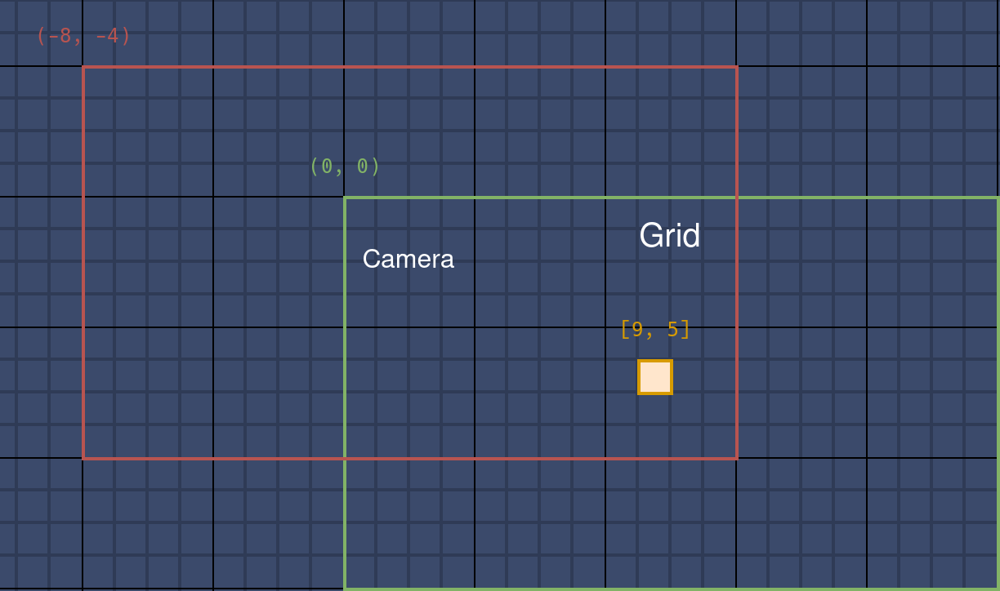
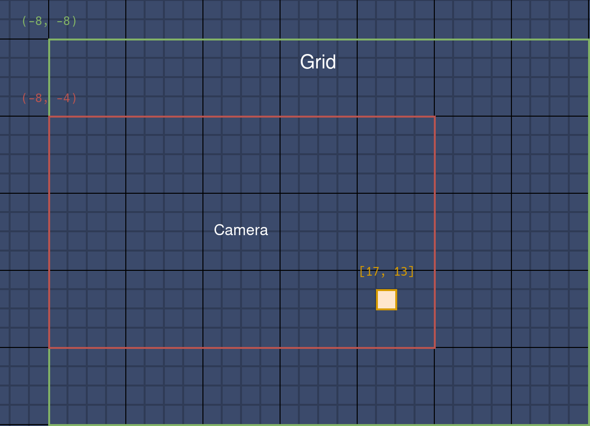

# Wireworld Simulator Using the Raylib: Part2

继续[上一部分](./wireworld_simulator_using_the_raylib_part1.md)。

这部分主要实现 **无限画布** 的功能，包含视角移动、网格自动拓展、视图缩放，

<!-- more -->

## 修复网格外绘制造成的问题

某些情况下，窗口大小会大于网格大小，鼠标在网格外点击会导致 `grid` 下标溢出。

限制范围：

```diff
diff --git a/main.c b/main.c
index 828e1c8..f86f289 100644
--- a/main.c
+++ b/main.c
@@ -252,8 +252,12 @@ void HandleUserInput(void) {
         !CheckCollisionPointRec(mousePosition, playButtonRect) &&
         !CheckCollisionPointRec(mousePosition, nextButtonRect) &&
         !CheckCollisionPointRec(mousePosition, indicatorRect)) {
-        grid[mouseYGridPos][mouseXGridPos] = selectCellType;
-        DrawCell(mouseXGridPos, mouseYGridPos, GetCellColor(selectCellType));
+        if ((mouseXGridPos >= 0 && mouseXGridPos < cols) &&
+            (mouseYGridPos >= 0 && mouseYGridPos < rows)) {
+            grid[mouseYGridPos][mouseXGridPos] = selectCellType;
+            DrawCell(mouseXGridPos, mouseYGridPos,
+                     GetCellColor(selectCellType));
+        }
     }
 
     DrawCellLines(mouseXGridPos, mouseYGridPos, WHITE);

```

## 使用 calloc 初始化网格

使用 `calloc` 可以在分配内存的同时将内存初始化为 `0`，也正好就是 `EMPTY`，省去额外遍历初始化的过程。

```c
void InitGrid(void) {
    grid.cells = RL_CALLOC(grid.rows, sizeof(Cell*));
    for (int y = 0; y < grid.rows; y++) {
        grid.cells[y] = RL_CALLOC(grid.cols, sizeof(Cell));
    }
}
```

## 视角移动

无限画布的前置功能，按住鼠标右键拖动画布。

试了几个方案，最后还是用了 2D 摄像头，通过移动摄像头位置模拟画布拖动，这种方法不会太过复杂。

```c
Camera2D camera = {0};

camera.zoom = 1.0f;

if (IsMouseButtonDown(MOUSE_BUTTON_RIGHT)) {
    Vector2 delta = GetMouseDelta();
    delta = Vector2Scale(delta, -1.0f / camera.zoom);
    camera.target = Vector2Add(camera.target, delta);
}
```

这时网格的绘制逻辑需要放在 2D 模式中（`BeginMode2D` 和 `EndMode2D` 之间）。

由于 `HandleUserInput` 函数需要在鼠标左击时绘制「细胞」以及在鼠标悬停时绘制「预览边框」，所以也需要放在 2D 模式中：

```c
BeginMode2D(camera);

float frameTime = GetFrameTime();
elapsedTime += frameTime;

if (isPlaying && elapsedTime >= refreshInterval) {
    UpdateGrid();
    elapsedTime = 0.0f;
}

for (int y = 0; y < rows; y++) {
    for (int x = 0; x < cols; x++) {
        Color cellColor = GetCellColor(grid[y][x]);
        DrawCell(x, y, cellColor);
    }
}

HandleUserInput();

EndMode2D();
```

按钮我希望保持屏幕固定位置，不会被脱拽移动，它们在结束 2D 模式后绘制：

```c hl_lines="3-5"
EndMode2D();

DrawIndicators();
DrawPlayButton();
DrawNextButton();
```

顺带把 `HandleUserInput` 重构了，拆成几个函数：

```c
void HandleUserInput(void) {
    HandleCellPlacements();
    HandleButtonClicks();
    HandleShortcuts();
    HandleCameraMovement();
}
```

<video width="800" height="460" controls>
  <source src="/assets/images/blog/wireworld_simulator_using_the_raylib/panning.webm" type="video/webm">
Your browser does not support the video tag.
</video>

## 网格拓展

### 策略

策略很简单，下面几张图展示了一个基本案例。

初始时相机和网格坐标一致，同为 `(0, 0)`。网格大小 20 x 12，其中有一细胞位于 `[9, 5]` 处（第 6 行，第 10 列）。

当按住鼠标右键向右下角滑动时，相机向左上角移动到 `(-8, -4)`，越过网格的横纵边界。



此时网格需向 X 和 Y 方向拓展一个固定的单位长度，这里设置为 8。于是网格坐标变成了 `(-8, -8)`，大小变成了 28 x 20。

细胞变成 `[17, 13]`，在网格中的位置变化了，但相对相机的位置没变，屏幕上不会有感知。



只在越过边界时拓展网格，同时选择一个合适的值作为每次拓展的单位长度，可以避免频繁地内存分配。

当相机越过右或下边界时，网格坐标不需要更改，只需要拓展大小。

### 代码

因为需要同时管理网格的坐标、长宽和细胞，所以创建 `Grid` 结构体用来表示网格信息：

```c
typedef struct {
    Vector2 position;
    int rows;
    int cols;
    Cell** cells;
} Grid;
```

一些代码要进行相应更改，比如：

```c
for (int y = 0; y < grid.rows; y++) {
    for (int x = 0; x < grid.cols; x++) {
        Color cellColor = GetCellColor(grid.cells[y][x]);
        DrawCell(x, y, cellColor);
    }
}
```

移动相机时，检查是否越过网格边界，并针对特定方向拓展网格。

```c
void HandleCameraMovement(void) {
    if (IsMouseButtonDown(MOUSE_BUTTON_RIGHT)) {
        Vector2 delta = GetMouseDelta();
        delta = Vector2Scale(delta, -1.0f / camera.zoom);
        camera.target = Vector2Add(camera.target, delta);

        Vector2 cameraOffset = Vector2Subtract(camera.target, grid.position);
        bool isOutsideX = cameraOffset.x + screenWidth >
                          grid.position.x + grid.cols * cellSize;
        bool isOutsideY = cameraOffset.y + screenHeight >
                          grid.position.y + grid.rows * cellSize;
        if (cameraOffset.x < 0)
            ExpandGrid(LEFT);
        if (cameraOffset.y < 0)
            ExpandGrid(UP);
        if (isOutsideX)
            ExpandGrid(RIGHT);
        if (isOutsideY)
            ExpandGrid(DOWN);
    }
}
```

根据拓展方向计算新的行列数，创建新的 `cells`。计算偏移，将之前的细胞按照偏移放置在新 `cells` 中，以确保它们在屏幕上的位置不变。最后使用新的数据更新 grid 完成拓展：

```c
const int gridIncrement = 10;

void ExpandGrid(Direction direction) {
    int newRows =
        grid.rows + (direction == UP || direction == DOWN ? gridIncrement : 0);
    int newCols = grid.cols +
                  (direction == LEFT || direction == RIGHT ? gridIncrement : 0);
    int xOffset = (direction == LEFT ? gridIncrement : 0);
    int yOffset = (direction == UP ? gridIncrement : 0);

    Cell** newCells = RL_CALLOC(newRows, sizeof(Cell*));
    for (int y = 0; y < newRows; y++) {
        newCells[y] = RL_CALLOC(newCols, sizeof(Cell));
    }

    for (int y = 0; y < grid.rows; y++) {
        for (int x = 0; x < grid.cols; x++) {
            newCells[y + yOffset][x + xOffset] = grid.cells[y][x];
        }
    }

    FreeGrid();

    grid.cells = newCells;
    grid.rows = newRows;
    grid.cols = newCols;

    grid.position.x -= cellSize * xOffset;
    grid.position.y -= cellSize * yOffset;
}
```

算得上是无限画布了。

<video width="800" height="460" controls>
  <source src="/assets/images/blog/wireworld_simulator_using_the_raylib/expand_grid.webm" type="video/webm">
Your browser does not support the video tag.
</video>

## 仅绘制可见部分

网格过大时会出现明显的卡顿，因为视图外的细胞也照常绘制了。

可以通过计算当前相机视野内的网格单元格范围，只绘制这些单元格：

```c
void DrawVisibleCells(void) {
    Vector2 topLeft = GetScreenToWorld2D(Vector2Zero(), camera);
    Vector2 bottomRight =
        GetScreenToWorld2D((Vector2){screenWidth, screenHeight}, camera);

    int startX = (int)floor((topLeft.x - grid.position.x) / cellSize);
    int startY = (int)floor((topLeft.y - grid.position.y) / cellSize);
    int endX = (int)ceil((bottomRight.x - grid.position.x) / cellSize);
    int endY = (int)ceil((bottomRight.y - grid.position.y) / cellSize);

    startX = Clamp(startX, 0, grid.cols);
    startY = Clamp(startY, 0, grid.rows);
    endX = Clamp(endX, 0, grid.cols);
    endY = Clamp(endY, 0, grid.rows);

    for (int y = startY; y < endY; y++) {
        for (int x = startX; x < endX; x++) {
            Color cellColor = GetCellColor(grid.cells[y][x]);
            DrawCell(x, y, cellColor);
        }
    }
}
```

## 视图缩放

最初实验了使用相机的 `zoom` 字段完成缩放，但发现效果不怎么好，缩得太小时网格线会变得不清晰甚至消失，并且给许多计算引入了新变量。

所以，最终还是使用了调整细胞大小 `cellSize` 的方案，以此模拟“视图的缩放”。

滚动鼠标滚轮时，调整细胞大小和网格位置，确保网格会以鼠标指针所在的位置为中心进行缩放，使得鼠标指针所指的网格单元在缩放前后保持不变：

```c
void HandleZoom(void) {
    float wheel = GetMouseWheelMove();
    if (wheel != 0) {
        int newCellSize = cellSize + wheel * zoomSpeed;
        if (newCellSize >= minCellSize && newCellSize <= maxCellSize) {
            Vector2 mousePos = GetScreenToWorld2D(GetMousePosition(), camera);
            Vector2 gridPos =
                Vector2Divide(Vector2Subtract(mousePos, grid.position),
                              (Vector2){cellSize, cellSize});

            cellSize = newCellSize;

            grid.position = Vector2Subtract(
                mousePos,
                Vector2Multiply(gridPos, (Vector2){cellSize, cellSize}));
        }
    }
}
```

拓展网格在视图的移动和缩放结束后进行：

```c
void HandleCameraMovement(void) {
    if (IsMouseButtonDown(MOUSE_BUTTON_RIGHT)) {
        Vector2 delta = GetMouseDelta();
        delta = Vector2Scale(delta, -1.0f / camera.zoom);
        camera.target = Vector2Add(camera.target, delta);
    }
}

void HandleUserInput(void) {
    HandleCellPlacements();
    HandleButtonClicks();
    HandleShortcuts();
    HandleCameraMovement();
    HandleZoom();

    Vector2 cameraOffset = Vector2Subtract(camera.target, grid.position);
    if (cameraOffset.x < 0) {
        ExpandGrid(LEFT);
    }
    if (cameraOffset.y < 0) {
        ExpandGrid(UP);
    }
    if (cameraOffset.x + screenWidth > grid.position.x + grid.cols * cellSize) {
        ExpandGrid(RIGHT);
    }
    if (cameraOffset.y + screenHeight >
        grid.position.y + grid.rows * cellSize) {
        ExpandGrid(DOWN);
    }
}
```

<video width="800" height="460" controls>
  <source src="/assets/images/blog/wireworld_simulator_using_the_raylib/zoom.webm" type="video/webm">
Your browser does not support the video tag.
</video>
