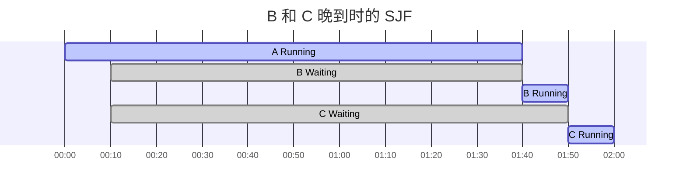

```mermaid
gantt
    title 轮转（响应时间好）
    dateFormat s
    axisFormat %S
    tickInterval 1second

    section A
        A   :   0,  1s
        A   :   3,  1s
        A   :   6,  1s
        A   :   9,  1s
        A   :   12, 1s
    
    section B
        B   :   1,  1s
        B   :   4,  1s
        B   :   7,  1s
        B   :   10, 1s
        B   :   13, 1s

    section C
        C   :   2,  1s
        C   :   5,  1s
        C   :   8,  1s
        C   :   11,  1s
        C   :   14,  1s
```

# 第 7 章 进程调度：介绍

[上一章](./06direct_execution.md)介绍了进程调度的底层机制（mechanism）（上下文切换），这章介绍的是上层策略（policy）。

## 7.1 工作负载假设

可能是翻译问题，对照着原文我才读明白是什么意思。

> let us first make a number of simplifying assumptions about the processes running in the system, sometimes collectively called the workload.

可以翻译为：

> 首先对 **运行在系统中的一组进程** 进行一系列简化假设，有时统称它们为工作负载。

这个“它们”，我理解为指的是“运行在系统中的一组进程”，因为 *about the processes running in the system* 在句末。

探讨调度策略需要先对工作负载（一组进程）做一些假设：

1. 每一个工作运行相同的时间。
1. 所有的工作同时到达。
1. 一旦开始，每个工作保持运行直到完成。
1. 所有的工作只是用 CPU（即它们不执行 IO 操作）。
1. 每个工作的运行时间是已知的。

这些假设都是不现实的，接下来几个小节会逐步放宽它们。

## 7.2 调度指标

为了比较调度策略，需要定义调度指标，目前只用一个：周转时间（turnaround time）。

$$
T_{\text{turnaround}} = T_{\text{completion}} - T_{\text{arrival}}
$$

因为假设了所有任务同一时间到达，所以 $ T_{\text{arrival}} = 0 $ ，因此 $ T_{\text{turnaround}} = T_{\text{completion}} $

> 周转时间是一个性能（performance）指标，这将是本章的首要关注点。另一个有趣的指标是公平（fairness），性能和公平在调度系统中往往是矛盾的。例如，调度程序可以优化性能，但代价是以阻止一些任务运行，这就降低了公平。

## 7.3 先进先出（FIFO）

先进先出（First In First Out，FIFO）

假设任务 A 在 10s 时完成，B 在 20s 时完成，C 在 30s 时完成，因此这 3 个任务的平均周转时间是 20s ：

$$
\bar{T_{\text{turnaround}}} = \frac{10 + 20 + 30}{3} = 20 \text{s}
$$



```mermaid
gantt
    title FIFO 的简单例子
    dateFormat s
    axisFormat %S
    tickInterval 10second

    A   : 0,    10s
    B   :       10s
    C   :       10s
```

但当任务时间不同时，比如 A 需要先运行 100s ，B 或 C 才有机会运行，这样时候系统的平均周转时间就变成了 110s ：

$$
\bar{T_{\text{turnaround}}} = \frac{100 + 110 + 120}{3} = 110 \text{s}
$$



> 这个问题通常被称为护航效应（convoy effect），一些耗时较少的潜在资源消费者被排在重量级的资源消费者之后。<br>

```mermaid
gantt
    title 为什么 FIFO 没有那么好
    dateFormat s
    axisFormat %M:%S
    tickInterval 10second

    A   : 0,    100s
    B   :       10s
    C   :       10s
```

> 这个调度方案可能让你想起在杂货店只有一个排队队伍的时候，如果看到前面的人装满 3 辆购物车食品并且掏出了支票本，你感觉如何？这会等很长时间。

## 7.4 最短任务优先（SJF）

最短任务优先（Shortest Job First，SJF）

```mermaid
gantt
    title SJF 的简单例子
    dateFormat s
    axisFormat %M:%S
    tickInterval 10second

    B   : 0,    10s
    C   :       10s
    A   :       100s
```



$$
\bar{T_{\text{turnaround}}} = \frac{10 + 20 + 120}{3} = 50 \text{s}
$$

如果所有工作同时到达，SJF 就是一个最优调度算法，但这并不现实，工作往往都是随时到达的，比如 B 和 C 晚到了 10s ：



这又会遭遇护航问题，平均周转时间变成了 $\frac{100 + (100 - 10) + (120 -10)}{3} \approx 103.33s$

## 7.5 最短完成时间优先（STCF）

最短完成时间优先（Shortest Time-to-Completion First，STCF）或抢占式最短作业优先（Preemptive Shortest Job First ，PSJF）

它基本等于向 SJF 添加抢占，每当新工作进入系统时，它就会确定剩余工作和新工作中，谁的剩余时间最少，然后调度该工作。

```mermaid
gantt
    title STCF 的简单例子
    dateFormat s
    axisFormat %M:%S
    tickInterval 10second

    A Running   : active,   0,  10s
    A Pausing   : done,     10, 20s
    A Running   : active,   30, 110s
    B Running   : active,   10, 10s
    C Waiting   : done,     10, 10s
    C Running   : active,   20, 10s
```



STCF 将抢占 A 并运行 B 和 C 以完成，只有在它们完成后，才能调度 A 的剩余时间。

$$
\bar{T_{\text{turnaround}}} = \frac{120 + 10 + 20}{3} = 50 \text{s}
$$

平均周转时间大大提高，以前一样。

> STCF 是抢占式的调度程序，而 SJF 是非抢占式的。

## 7.6 新度量指标：响应时间

> 因此，如果我们知道任务长度，而且任务只使用 CPU，而我们唯一的衡量是周转时间，STCF 将是一个很好的策略。<br>
> 事实上，对于许多早期批处理系统，这些类型的调度算法有一定的意义。<br>
> 然而，引入分时系统改变了这一切。现在，用户将会坐在终端前面，同时也要求系统的交互性好。<br>
> 因此，一个新的度量标准诞生了：响应时间（response time）

$$
T_{\text{response}} = T_{\text{firstrun}} - T_{\text{arrival}}
$$

上小节示例中，A 在 0s 到达，B 和 C 在 10s 到达，作业的响应时间如下：

$$
\begin{align}
    T_{\text{A response}} &= 0s \\
    T_{\text{B response}} &= 0s \\
    T_{\text{B response}} &= 10s \\
    \bar{T_{\text{response}}} &\approx 3.33s
\end{align}
$$

这种方法虽然有很好的周转时间，但对于响应时间和交互性是相当糟糕的。

## 7.7 轮转

> 为了解决这个问题，我们将介绍一种新的调度算法，通常被称为轮转（Round-Robin，RR）调度。

> 基本思想很简单：RR 在一个时间片（time slice，有时称为调度量子，scheduling quantum）内运行一个工作，然后切换到运行队列中的下一个任务，而不是运行一个任务直到结束。它反复执行，直到所有任务完成。<br>
> 因此，RR 有时被称为时间切片（time-slicing）。

> 请注意，时间片长度必须是时钟中断周期的倍数。因此，如果时钟中断是每 10ms 中断一次，则时间片可以是 10ms、20ms 或 10ms 的任何其他倍数。

```mermaid
gantt
    title 又是 SJF（响应时间不好）
    dateFormat s
    axisFormat %S
    tickInterval 5second

    A   :   0,  5s
    B   :       5s
    C   :       5s
```



$$
\bar{T_{\text{SJF response}}} = \frac{0 + 5 + 10}{3} = 5s
$$



$$
\bar{T_{\text{RR response}}} = \frac{0 + 1 + 2}{3} = 1s
$$

时间片长度对于 RR 是至关重要的，越短，RR 在响应时间上表现越好，但太短的话会使上下文切换的成本过高。

> 系统设计者需要权衡时间片的长度，使其足够长，以便摊销（amortize）上下文切换成本，而又不会使系统不及时响应

!!! note "提示：摊销可以减少成本"
    当系统某些操作有固定成本时，通常会使用摊销技术（amortization）。通过减少成本的频度（即执行较少次的操作），系统的总成本就会降低。<br>
    例如，如果时间片设置为 10ms ，并且上下文切换时间为 1ms ，那么浪费大约 10% 的时间用于上下文切换。<br>
    如果要摊销这个成本，可以把时间片增加到 100ms 。在这种情况下，不到 1% 的时间用于上下文切换，因此时间片带来的成本就被摊销了

!!! note "上下文切换的成本不仅仅来自保存和恢复少量寄存器的操作系统操作"
    程序运行时，它们在 CPU 高速缓存、TLB、分支预测器和其他片上硬件中建立了大量的状态。<br>
    切换到另一个工作会导致此状态被刷新，且与当前运行的作业相关的新状态被引入，这可能导致显著的性能成本

回头看看老朋友周转时间：$\bar{T_{\text{RR turnaround}}} = \frac{13 + 14 + 15}{3} = 14s$ ，相当可怕。

> 这并不奇怪，如果周转时间是我们的指标，那么 RR 确实是最糟糕的策略之一。<br>
> 直观地说，这应该是有意义的：RR 所做的正是延伸每个工作，只运行每个工作一小段时间，就转向下一个工作。<br>
> 因为周转时间只关心作业何时完成，RR 几乎是最差的，在很多情况下甚至比简单的 FIFO 更差。

> 更一般地说，任何公平（fair）的政策（如 RR），即在小规模的时间内将 CPU 均匀分配到活动进程之间，在周转时间这类指标上表现不佳。<br>
> 事实上，这是固有的权衡：如果你愿意不公平，你可以运行较短的工作直到完成，但是要以响应时间为代价。如果你重视公平性，则响应时间会较短，但会以周转时间为代价。

## 7.8 结合 I/O

假设 4：所有的工作只是用 CPU（即它们不执行 IO 操作）。

我们放宽它，假设所有程序会执行 I/O 。举个例子，有两项工作 A 和 B ，每项工作需要 50ms 的 CPU 时间，A 运行 10ms 后发出 I/O 请求，每个 I/O 需要 10ms ，而 B 只是使用 CPU 50ms ，不执行 I/O 。

```mermaid
gantt
    title 资源的糟糕使用
    dateFormat SSS
    axisFormat %Lms
    tickInterval 10millisecond

    section CPU
        A   :   active, 000,  10ms
        A   :   active, 020,  10ms
        A   :   active, 040,  10ms
        A   :   active, 060,  10ms
        A   :   active, 080,  10ms
        B   :           100,  50ms
 
    section 磁盘
        A   :   active, 010,  10ms
        A   :   active, 030,  10ms
        A   :   active, 050,  10ms
        A   :   active, 070,  10ms
        A   :   active, 090,  10ms
```

```mermaid
gantt
    title 重叠可以更好地使用资源
    dateFormat SSS
    axisFormat %Lms
    tickInterval 10millisecond

    section CPU
        A   :   active, 000,  10ms
        B   :           010,  10ms
        A   :   active, 020,  10ms
        B   :           030,  10ms
        A   :   active, 040,  10ms
        B   :           050,  10ms
        A   :   active, 060,  10ms
        B   :           070,  10ms
        A   :   active, 080,  10ms
        B   :           090,  10ms
 
    section 磁盘
        A   :   active,   010,  10ms
        A   :   active,   030,  10ms
        A   :   active,   050,  10ms
        A   :   active,   070,  10ms
        A   :   active,   090,  10ms
```





!!! note "提示：重叠可以提高利用率"
    如有可能，重叠（overlap）操作可以最大限度地提高系统的利用率。重叠在许多不同的领域很有用，包括执行磁盘 I/O 或将消息发送到远程机器时。<br>
    在任何一种情况下，开始操作然后切换到其他工作都是一个好主意，这也提高了系统的整体利用率和效率。

## 7.9 无法预知

假设 5：每个工作的运行时间是已知的。

但在一个通用的操作系统中，操作系统对每个作业的长度其实是知之甚少的，如何建立一个没有这种先验知识的 SJF/STCF ？

答案是 **多级反馈队列调度** ，因为我先看了 rCore ，被剧透了，这其实是下一章的内容。

## 作业

!!! question
    1．使用 SJF 和 FIFO 调度程序运行长度为 200 的 3 个作业时，计算响应时间和周转时间。

!!! note "Answer"
    $\bar{T_{\text{SJF response}}} \approx 107.33$ $\bar{T_{\text{SJF turnaround}}} \approx 242.67$

    $\bar{T_{\text{FIFO response}}} \approx 163.33$ $\bar{T_{\text{FIFO turnaround}}} \approx 298.67$

    ```title='python scheduler.py -p SJF -j 3 -m 200 -c'
    ARG policy SJF
    ARG jobs 3
    ARG maxlen 200
    ARG seed 0

    Here is the job list, with the run time of each job:
      Job 0 ( length = 169 )
      Job 1 ( length = 152 )
      Job 2 ( length = 85 )

    ** Solutions **

    Execution trace:
      [ time   0 ] Run job 2 for 85.00 secs ( DONE at 85.00 )
      [ time  85 ] Run job 1 for 152.00 secs ( DONE at 237.00 )
      [ time 237 ] Run job 0 for 169.00 secs ( DONE at 406.00 )

    Final statistics:
      Job   2 -- Response: 0.00  Turnaround 85.00  Wait 0.00
      Job   1 -- Response: 85.00  Turnaround 237.00  Wait 85.00
      Job   0 -- Response: 237.00  Turnaround 406.00  Wait 237.00

      Average -- Response: 107.33  Turnaround 242.67  Wait 107.33
    ```

    ```title='python scheduler.py -p FIFO -j 3 -m 200 -c'
    ARG policy FIFO
    ARG jobs 3
    ARG maxlen 200
    ARG seed 0

    Here is the job list, with the run time of each job:
      Job 0 ( length = 169 )
      Job 1 ( length = 152 )
      Job 2 ( length = 85 )

    ** Solutions **

    Execution trace:
      [ time   0 ] Run job 0 for 169.00 secs ( DONE at 169.00 )
      [ time 169 ] Run job 1 for 152.00 secs ( DONE at 321.00 )
      [ time 321 ] Run job 2 for 85.00 secs ( DONE at 406.00 )

    Final statistics:
      Job   0 -- Response: 0.00  Turnaround 169.00  Wait 0.00
      Job   1 -- Response: 169.00  Turnaround 321.00  Wait 169.00
      Job   2 -- Response: 321.00  Turnaround 406.00  Wait 321.00

      Average -- Response: 163.33  Turnaround 298.67  Wait 163.33
    ```

!!! question
    2．现在做同样的事情，但有不同长度的作业，即 100、200 和 300。

!!! note "Answer"
    同上，SFJ 的响应时间和周转时间都要比 FIFO 少。

!!! question
    3．现在做同样的事情，但采用 RR 调度程序，时间片为 1。

!!! note "Answer"
    $\bar{T_{\text{RR response}}} = 1$ $\bar{T_{\text{RR turnaround}}} = 350$

    ```title='python scheduler.py -p RR -j 3 -m 200 -q 1 -c'
    ARG policy RR
    ARG jobs 3
    ARG maxlen 200
    ARG seed 0

    Here is the job list, with the run time of each job:
      Job 0 ( length = 169 )
      Job 1 ( length = 152 )
      Job 2 ( length = 85 )

    ** Solutions **

    Execution trace:
      [ time   0 ] Run job   0 for 1.00 secs
      [ time   1 ] Run job   1 for 1.00 secs
      [ time   2 ] Run job   2 for 1.00 secs
      [ time   3 ] Run job   0 for 1.00 secs
      ...
      [ time 402 ] Run job   0 for 1.00 secs
      [ time 403 ] Run job   0 for 1.00 secs
      [ time 404 ] Run job   0 for 1.00 secs
      [ time 405 ] Run job   0 for 1.00 secs ( DONE at 406.00 )

    Final statistics:
      Job   0 -- Response: 0.00  Turnaround 406.00  Wait 237.00
      Job   1 -- Response: 1.00  Turnaround 389.00  Wait 237.00
      Job   2 -- Response: 2.00  Turnaround 255.00  Wait 170.00
    ```

!!! question
    4．对于什么类型的工作负载，SJF 提供与 FIFO 相同的周转时间？

!!! note "Answer"
    任务同时到达，并且短任务在前。

!!! question
    5．对于什么类型的工作负载和量子长度，SJF 与 RR 提供相同的响应时间？

!!! note "Answer"
    任务长度相同且等于量子长度。

    ```title='python scheduler.py -p SJF -c -l 10,10,10'
    ARG policy SJF
    ARG jlist 10,10,10

    Here is the job list, with the run time of each job:
      Job 0 ( length = 10.0 )
      Job 1 ( length = 10.0 )
      Job 2 ( length = 10.0 )

    ** Solutions **

    Execution trace:
      [ time   0 ] Run job 0 for 10.00 secs ( DONE at 10.00 )
      [ time  10 ] Run job 1 for 10.00 secs ( DONE at 20.00 )
      [ time  20 ] Run job 2 for 10.00 secs ( DONE at 30.00 )

    Final statistics:
      Job   0 -- Response: 0.00  Turnaround 10.00  Wait 0.00
      Job   1 -- Response: 10.00  Turnaround 20.00  Wait 10.00
      Job   2 -- Response: 20.00  Turnaround 30.00  Wait 20.00

      Average -- Response: 10.00  Turnaround 20.00  Wait 10.00
    ```

    ```title='python scheduler.py -p RR -q 10 -c -l 10,10,10'
    ARG policy RR
    ARG jlist 10,10,10

    Here is the job list, with the run time of each job:
      Job 0 ( length = 10.0 )
      Job 1 ( length = 10.0 )
      Job 2 ( length = 10.0 )

    ** Solutions **

    Execution trace:
      [ time   0 ] Run job   0 for 10.00 secs ( DONE at 10.00 )
      [ time  10 ] Run job   1 for 10.00 secs ( DONE at 20.00 )
      [ time  20 ] Run job   2 for 10.00 secs ( DONE at 30.00 )

    Final statistics:
      Job   0 -- Response: 0.00  Turnaround 10.00  Wait 0.00
      Job   1 -- Response: 10.00  Turnaround 20.00  Wait 10.00
      Job   2 -- Response: 20.00  Turnaround 30.00  Wait 20.00

      Average -- Response: 10.00  Turnaround 20.00  Wait 10.00
    ```

!!! question
    6．随着工作长度的增加，SJF 的响应时间会怎样？你能使用模拟程序来展示趋势吗？

!!! note "Answer"
    ```
    $ python scheduler.py -p SJF -j 3 -m 10 -c
    $ python scheduler.py -p SJF -j 3 -m 100 -c
    $ python scheduler.py -p SJF -j 3 -m 1000 -c
    ```

    $T_{\text{SJF response}}$ 会不断增加。

!!! question
    7．随着量子长度的增加，RR 的响应时间会怎样？你能写出一个方程，计算给定 N 个工作时，最坏情况的响应时间吗？

!!! note "Answer"
    $T_{\text{worst-case response}} = (N - 1) \times T_{\text{quantum}}$
