# 第 8 章 调度：多级反馈队列

多级反馈队列（Multi-level Feedback Queue，MLFQ）

## 8.1 MLFQ：基本规则

> MLFQ 中有许多独立的队列（queue），每个队列有不同的优先级（priority level）。任何时刻，一个工作只能存在于一个队列中。MLFQ 总是优先执行较高优先级的工作（即在较高级队列中的工作）。

> 当然，每个队列中可能会有多个工作，因此具有同样的优先级。在这种情况下，我们就对这些工作采用轮转调度。
>
> 因此，MLFQ 调度策略的关键在于如何设置优先级。

- 如果一个工作不断放弃CPU 去等待键盘输入，这是交互型进程的可能行为，MLFQ 因此会让它保持高优先级。
- 如果一个工作长时间地占用 CPU ，MLFQ 会降低其优先级。

通过这种方式，MLFQ 在进程运行过程中学习其行为，从而利用工作的历史来 **预测** 它未来的行为。

MLFQ 的两条基本规则：

- 规则 1：如果 A 的优先级 > B 的优先级，运行 A（不运行 B）。
- 规则 2：如果 A 的优先级 = B 的优先级，轮转运行。

## 8.2 尝试 1：如何改变优先级

- 规则 3：工作进入系统时，放在最高优先级（最上层队列）。
- 规则 4a：工作用完整个时间片后，降低其优先级（移入下一个队列）。
- 规则 4b：如果工作在其时间片以内主动释放 CPU ，则优先级不变。

### 实例 1：单个长工作

该工作首先进入最高优先级（Q2）。执行一个 10ms 的时间片后，调度程序将工作的优先级减 1，因此进入 Q1。在 Q1 执行一个时间片后，最终降低优先级进入系统的最低优先级（Q0），一直留在那里。

```mermaid
gantt
    title 长时间工作随时间的变换
    dateFormat SSS
    axisFormat %Lms
    tickInterval 10millisecond

    section Q2
        task:   000,    10ms
    section Q1
        task:           10ms
    section Q0
        task:           180ms
```



### 实例 2：来了一个短工作

A 是一个长时间运行的 CPU 密集型工作，B 是一个运行时间很短的交互型工作。

A 在最低优先级队列执行（长时间运行的 CPU 密集型工作都这样），B 在 100ms 时到达，并被加入最高优先级队列。由于它的运行时间很短（只有 20ms），经过两个时间片，在被移入最低优先级队列之前，B 执行完毕。然后 A 继续运行（在低优先级）。

```mermaid
---
displayMode: compact
---
gantt
    title 一个交互型工作
    dateFormat SSS
    axisFormat %Lms
    tickInterval 10millisecond

    section Q2
        B:  100,    10ms
    section Q1
        B:          10ms
    section Q0
        A:  000,    100ms
        A:  120,    80ms
```



!!! note "算法的主要目标"
    如果不知道工作是短工作还是长工作，那么就在开始的时候假设其是短工作，并赋予最高优先级。<br>
    如果确实是短工作，则很快会执行完毕，否则将被慢慢移入低优先级队列，而这时该工作也被认为是长工作了。<br>
    通过这种方式，MLFQ 近似于 SJF。

### 实例 3：如果有 I/O 呢

如果进程在时间片用完之前主动放弃 CPU ，则不“处罚”它，保持它的优先级不变。

交互型工作 B 每执行 1ms 便需要进行 I/O 操作，它与长时间运行的工作 A 竞争 CPU 。MLFQ 算法保持 B 在最高优先级，因为 B 总是让出 CPU 。

```mermaid
---
displayMode: compact
---
gantt
    title 混合 I/O 密集型和 CPU 密集型工作负载
    dateFormat SSS
    axisFormat %Lms
    tickInterval 10millisecond

    section Q2
        B:  000,    1ms
        B:  010,    1ms
        B:  020,    1ms
        B:  030,    1ms
        B:  040,    1ms
        B:  050,    1ms
        B:  060,    1ms
        B:  070,    1ms
        B:  080,    1ms
        B:  090,    1ms
        B:  100,    1ms
        B:  110,    1ms
        B:  120,    1ms
        B:  130,    1ms
        B:  140,    1ms
        B:  150,    1ms
        B:  160,    1ms
        B:  170,    1ms
        B:  180,    1ms
        B:  190,    1ms
    section Q1
    section Q0
        A:  001,    9ms
        A:  011,    9ms
        A:  021,    9ms
        A:  031,    9ms
        A:  041,    9ms
        A:  051,    9ms
        A:  061,    9ms
        A:  071,    9ms
        A:  081,    9ms
        A:  091,    9ms
        A:  101,    9ms
        A:  111,    9ms
        A:  121,    9ms
        A:  131,    9ms
        A:  141,    9ms
        A:  151,    9ms
        A:  161,    9ms
        A:  171,    9ms
        A:  181,    9ms
        A:  191,    9ms
```



### 当前 MLFQ 的一些问题

“饥饿问题”

:   如果系统有“太多”交互型工作，就会不断占用 CPU ，导致长工作永远无法得到 CPU（它们饿死了）。

愚弄调度程序（game the scheduler）

: 用一些卑鄙的手段欺骗调度程序，让它给你远超公平的资源。上述算法对如下的攻击束手无策：进程在时间片用完之前，调用一个 I/O 操作（比如访问一个无关的文件），从而主动释放 CPU。如此便可以保持在高优先级，占用更多的 CPU 时间。

## 8.3 尝试 2：提升优先级

- 规则 5：经过一段时间 $S$，就将系统中所有工作重新加入最高优先级队列。

长工作与两个短工作竞争 CPU 时，长工作在两个短工作到达后被饿死。

```mermaid
---
displayMode: compact
---
gantt
    title 不采用优先级提升
    dateFormat SSS
    axisFormat %Lms
    tickInterval 50millisecond

    section Q2
        A:  000,    10ms
        B:  100,    5ms
        C:  105,    5ms
        B:  110,    5ms
        C:  115,    5ms
        B:  120,    5ms
        C:  125,    5ms
        B:  130,    5ms
        C:  135,    5ms
        B:  140,    5ms
        C:  145,    5ms
        B:  150,    5ms
        C:  155,    5ms
        B:  160,    5ms
        C:  165,    5ms
        B:  170,    5ms
        C:  175,    5ms
        B:  180,    5ms
        C:  185,    5ms
        B:  190,    5ms
        C:  195,    5ms
    section Q1
        A:  010,    10ms
    section Q0
        A:  020,    80ms
```



每 50ms 就有一次优先级提升（这里只是举例，这个值可能过小），因此至少保证长工作会有一些进展，每过 50ms 就被提升到最高优先级，从而定期获得执行。

```mermaid
---
displayMode: compact
---
gantt
    title 采用优先级提升
    dateFormat SSS
    axisFormat %Lms
    tickInterval 50millisecond

    section Q2
        A:  000,    10ms
        A:  050,    10ms
        A:  100,    10ms
        B:  110,    5ms
        C:  115,    5ms
        B:  120,    5ms
        C:  125,    5ms
        B:  130,    5ms
        C:  135,    5ms
        B:  140,    5ms
        C:  145,    5ms
        A:  150,    10ms
        B:  160,    5ms
        C:  165,    5ms
        B:  170,    5ms
        C:  175,    5ms
        B:  180,    5ms
        C:  185,    5ms
        B:  190,    5ms
        C:  195,    5ms
    section Q1
        A:  010,    10ms
        A:  060,    10ms
    section Q0
        A:  020,    30ms
        A:  070,    30ms
```



如果 $S$ 设置得太高，长工作会饥饿；如果设置得太低，交互型工作又得不到合适的 CPU 时间比例。

## 8.4 尝试 3：更好的计时方式

> 调度程序应该记录一个进程在某一层中消耗的总时间，而不是在调度时重新计时。只要进程用完了自己的配额，就将它降到低一优先级的队列中去。不论它是一次用完的，还是拆成很多次用完。

重写规则 4a 和 4b ：

- 规则 4：一旦工作用完了其在某一层中的时间配额（无论中间主动放弃了多少次CPU），就降低其优先级（移入低一级队列）。

```mermaid
---
displayMode: compact
---
gantt
    title 不采用愚弄反制
    dateFormat SSS
    axisFormat %Lms
    tickInterval 10millisecond
section Q2
        B:  001,    9ms
        B:  011,    9ms
        B:  021,    9ms
        B:  031,    9ms
        B:  041,    9ms
        B:  051,    9ms
        B:  061,    9ms
        B:  071,    9ms
        B:  081,    9ms
        B:  091,    9ms
        B:  101,    9ms
        B:  111,    9ms
        B:  121,    9ms
        B:  131,    9ms
        B:  141,    9ms
        B:  151,    9ms
        B:  161,    9ms
        B:  171,    9ms
        B:  181,    9ms
        B:  191,    9ms
    section Q1
    section Q0
        A:  000,    1ms
        A:  010,    1ms
        A:  020,    1ms
        A:  030,    1ms
        A:  040,    1ms
        A:  050,    1ms
        A:  060,    1ms
        A:  070,    1ms
        A:  080,    1ms
        A:  090,    1ms
        A:  100,    1ms
        A:  110,    1ms
        A:  120,    1ms
        A:  130,    1ms
        A:  140,    1ms
        A:  150,    1ms
        A:  160,    1ms
        A:  170,    1ms
        A:  180,    1ms
        A:  190,    1ms
```

```mermaid
---
displayMode: compact
---
gantt
    title 采用愚弄反制
    dateFormat SSS
    axisFormat %Lms
    tickInterval 10millisecond

    section Q2
        B:  active, 000,    10ms
    section Q1
        B:  active, 011,    9ms
        B:  active, 021,    1ms
    section Q0
        A:          010,    1ms
        A:          020,    1ms
        A:          022,    8ms
        B:  active,         9ms
        A:                  1ms
        B:  active,         1ms
        A:                  9ms
        B:  active,         9ms
        A:                  1ms
        B:  active,         1ms
        A:                  9ms
        B:  active,         9ms
        A:                  1ms
        B:  active,         1ms
        A:                  9ms
        B:  active,         9ms
        A:                  1ms
        B:  active,         1ms
        A:                  9ms
```





B 每个时间片的最后 1ms 时会主动调用 I/O 一次，以此愚弄调度器。

通过采用愚弄反制，记录工作在某层消耗的总时间，不论它是以此用完还是多次用完，只要耗尽了时间配额，就降低其优先级（当然还会中断它）。

## 8.5 MLFQ 调优及其他问题

> 关于 MLFQ 调度算法还有一些问题。其中一个大问题是如何配置一个调度程序，例如，配置多少队列？每一层队列的时间片配置多大？为了避免饥饿问题以及进程行为改变，应该多久提升一次进程的优先级？这些问题都没有显而易见的答案，因此只有利用对工作负载的经验，以及后续对调度程序的调优，才会导致令人满意的平衡。

大多数的 MLFQ 变体都支持不同队列可变的时间片长度。

- 高优先级队列通常只有较短的时间片（比如 10ms 或者更少），因而这一层的交互工作可以更快地切换。
- 低优先级队列中更多的是 CPU 密集型工作，配置更长的时间片会取得更好的效果。

```mermaid
---
displayMode: compact
---
gantt
    title 优先级越低，时间片越长
    dateFormat SSS
    axisFormat %Lms
    tickInterval 10millisecond

    section Q2
        A:          000,    10ms
        B:  active,         10ms
    section Q1
        A:                  20ms
        B:  active,         20ms
    section Q0
        A:                  40ms
        B:  active,         40ms
        A:                  40ms
        B:  active,         40ms
```



!!! note "提示：避免巫毒常量（Ousterhout 定律）"
    尽可能避免巫毒常量是个好主意。然而，从上面的例子可以看出，这通常很难。当然，我们也可以让系统自己去学习一个很优化的值，但这同样也不容易。<br>
    因此，通常我们会有一个写满各种参数值默认值的配置文件，使得系统管理员可以方便地进行修改调整。然而，大多数使用者并不会去修改这些默认值，这时就寄希望于默认值合适了。<br>
    这个提示是由资深的 OS 教授 John Ousterhout 提出的，因此称为 Ousterhout 定律（Ousterhout’s Law）。

Solaris 的 MLFQ 实现提供了一组表来配置调度程序，该表默认有 60 层队列，时间片长度从 20ms（最高优先级），到几百 ms（最低优先级），每一秒左右提升一次进程的优先级。

FreeBSD 调度车很难过序（4.3 版本）没用表，它采用数学公式来计算某个工作的优先级。

有些调度程序将最高优先级队列留给操作系统使用，有些系统支持用户给出优先级建议（是的只是建议），会略微提高优先级。

## 8.6 MLFQ：小结

- 规则 1：如果 A 的优先级 > B 的优先级，运行 A（不运行 B）；
- 规则 2：如果 A 的优先级 = B 的优先级，轮转运行 A 和 B；
- 规则 3：工作进入系统时，放在最高优先级（最上层队列）；
- 规则 4：一旦工作用完了其在某一层中的时间配额（无论中间主动放弃了多少次 CPU），就降低其优先级（移入低一级队列）；
- 规则 5：经过一段时间 $S$ ，就将系统中所有工作重新加入最高优先级队列。

## 作业

好像回到了中学时代，我还是很不喜欢作业。

!!! question
    1．只用两个工作和两个队列运行几个随机生成的问题。针对每个工作计算 MLFQ 的执行记录。限制每项作业的长度并关闭 I/O，让你的生活更轻松。

!!! note "Answer"
    ```title="./mlfq.py -n 2 -j 2 -M 0 -c"
    Job List:
      Job  0: startTime   0 - runTime  84 - ioFreq   0
      Job  1: startTime   0 - runTime  42 - ioFreq   0
    ...
    Final statistics:
      Job  0: startTime   0 - response   0 - turnaround 126
      Job  1: startTime   0 - response  10 - turnaround  92

      Avg  1: startTime n/a - response 5.00 - turnaround 109.00
    ```

    $ \bar{T_{\text{turnaround}}} = \frac{T_{\text{0 finish}} + T_{\text{1 finish}}}{2} = \frac{92 + 126}{2} = 109 $

    $ \bar{T_{\text{response}}} = \frac{T_{\text{0 response}} + T_{\text{1 response}}}{2} = \frac{0 + 10}{2} = 5 $

!!! question
    2．如何运行调度程序来重现本章中的每个实例？

!!! note "Answer"
    ```
    $ # 8.2
    $ ./mlfq.py -n 3 -l 0,200,0 -q 10 -c
    $ # 8.3
    $ ./mlfq.py -n 3 -l 0,200,0:100,20,0 -q 10 -c
    $ # 8.4
    $ ./mlfq.py -n 3 -l 0,200,0:50,25,1 -q 10 -i 4 -c
    $ # 8.5
    $ ./mlfq.py -n 3 -l 0,200,0:50,20,3:53,20,3 -q 10 -i 3 -c
    $ ./mlfq.py -n 3 -l 0,200,0:50,20,3:53,20,3 -q 10 -i 3 -c -B 30 -S
    $ # 8.6
    $ ./mlfq.py -n 3 -l 0,200,0:50,100,9 -i 1 -S -c
    $ ./mlfq.py -n 3 -l 0,200,0:50,100,9 -i 1 -c
    ```

!!! question
    3．将如何配置调度程序参数，像轮转调度程序那样工作？

!!! note "Answer"
    只用一个队列，这样就不存在任务优先级的问题了，同队列采用轮转。

!!! question
    4．设计两个工作的负载和调度程序参数，以便一个工作利用较早的规则 4a 和 4b（用 -S 标志打开）来“愚弄”调度程序，在特定的时间间隔内获得 99%的 CPU。

!!! note "Answer"
    ```
    $ ./mlfq.py -n 3 -q 10 -i 1 -S -l 0,50,9:0,50,0 -c | grep "Run JOB 0"
    ```

    会发现任务 0 一直在优先级 2 下运行

!!! question
    5．给定一个系统，其最高队列中的时间片长度为 10ms，你需要如何频繁地将工作推回到最高优先级级别（带有-B 标志），以保证一个长时间运行（并可能饥饿）的工作得到至少5%的 CPU？

!!! note "Answer"
    $ T_{\text{Boost}} = \frac{10}{5\%} = 200ms $

!!! question
    6．调度中有一个问题，即刚完成 I/O 的作业添加在队列的哪一端。-I 标志改变了这个调度模拟器的这方面行为。尝试一些工作负载，看看你是否能看到这个标志的效果。

!!! note "Answer"
    ```title="push back"
    $ ./mlfq.py -j 2 -n 3 -q 20 -l 0,20,2:0,20,2 -i 1 -c
    ```

    ```title="push head"
    $ ./mlfq.py -j 2 -n 3 -q 20 -l 0,20,2:0,20,2 -i 1 -I -c
    ```
