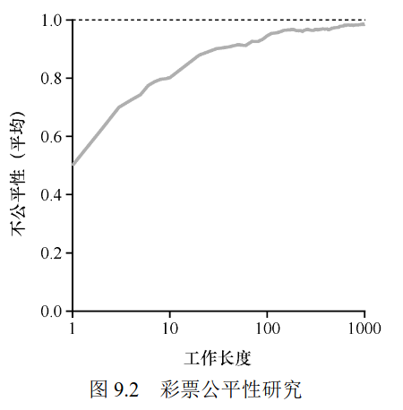

# 第 9 章 调度：比例份额

!!! quote

    比例份额（proportional-share）调度程序，有时也称为公平份额（fair-share）调度程序。

    比例份额算法基于一个简单的想法：调度程序的最终目标，是确保每个工作获得一定比例的 CPU 时间，而不是优化周转时间和响应时间。

彩票调度（lottery scheduling）

: 每隔一段时间，都会举行一次彩票抽奖，以确定接下来应该运行哪个进程。越是应该频繁运行的进程，越是应该拥有更多的赢得彩票的机会。

## 9.1 基本概念：彩票数表示份额

彩票数（ticket）代表了进程（或用户或其他）占有某个资源的份额。一个进程拥有的彩票数占总彩票数的百分比，就是它占有资源的份额。

!!! quote "提示：利用随机性"

    彩票调度最精彩的地方在于利用了随机性（randomness）。当你需要做出决定时，采用随机的方式常常是既可靠又简单的选择。

    随机方法相对于传统的决策方式，至少有 3 点优势。

    1. **随机方法常常可以避免奇怪的边角情况**，较传统的算法可能在处理这些情况时遇到麻烦。例如 LRU 替换策略（稍后会在虚拟内存的章节详细介绍）。虽然 LRU 通常是很好的替换算法，但在有重复序列的负载时表现非常差。但随机方法就没有这种最差情况。

    1. **随机方法很轻量**，几乎不需要记录任何状态。在传统的公平份额调度算法中，记录每个进程已经获得了多少的 CPU 时间，需要对每个进程计时，这必须在每次运行结束后更新。而采用随机方式后每个进程只需要非常少的状态（即每个进程拥有的彩票号码）。

    1. **随机方法很快**。只要能很快地产生随机数，做出决策就很快。因此，随机方式在对运行速度要求高的场景非常适用。当然，越是需要快的计算速度，随机就会越倾向于伪随机。

## 9.2 彩票机制

彩票货币（ticket currency）
: 用户可以为他们的进程或任务分配“局部彩票”，而这些局部彩票随后会根据用户的总彩票配额被转换成“全局彩票”，以此允许用户以更灵活和细粒度的方式分配系统资源。

彩票转让（ticket transfer）
: 进程可以将它持有的一部分或全部彩票转让给另一个进程，以便临时提高接收进程的调度优先级。在 客户端/服务端 模型的应用场景中，客户端请求服务端执行某项任务时，可以选择将一部分或者全部彩票转让给服务端，从而更快地完成客户端请求的任务。

彩票通胀（ticket inflation）
: 进程可以临时提升或降低自己拥有的彩票数量，但在竞争环境中进程之间互相不信任，就没什么意义了。

## 9.3 实现

使用单向链表来记录所有的进程及其彩票数。


```c linenums="1"
// counter: used to track if we've found the winner yet
int counter = 0;

// winner: use some call to a random number generator to
// get a value, between 0 and the total # of tickets
int winner = getrandom(0, totaltickets);

// current: use this to walk through the list of jobs
node_t *current = head;

// loop until the sum of ticket values is > the winner
while (current) {
  counter = counter + current->tickets;
  if (counter > winner)
  break; // found the winner
  current = current->next;
}
// 'current' is the winner: schedule it...
```

从前向后遍历链表，将每张票的值加到 counter 上，直到超过 winner，此时的节点对应进程就是中奖者。

要让这个过程更有效率，可以保持链表递减排序，这样就能使用最小的迭代次数找到需要的节点。（并不会影响算法正确性，机率只于彩票数有关，与顺序无关）

## 9.4 一个例子

假设两个相互竞争的工作，每个工作都有相同数目的 100 张彩票，以及相同的运行时间 $R$。

我们希望两个工作在大约同时完成，但由于彩票调度算法的随机性，有时一个工作会先于另一个完成。为了量化这种区别，我们定义了一个简单的不公平指标 $U$ (unfairness metric)，将两个工作完成时刻相除得到 $U$ 的值。

比如运行时间 $R$ 为 10，第一个工作在时刻 10 完成，另一个在 20，$U = \frac{10}{20} = 0.5$。

如果两个工作几乎同时完成，$U$ 的值将很接近于 1。

在这种情况下，我们的目标是：完美的公平调度程序可以做到 $U = 1$。

图中展示了两个工作的运行时间从 1 到 1000 变化时，30 次实验的平均 $U$ 值。



可以看出，当工作执行时间很短时，平均不公平度非常糟糕。只有当工作执行非常多的时间片时，彩票调度算法才能得到期望的结果。

这个很符合“抛硬币”的直觉对吧，抛的次数越多，概率就越趋近于二分之一。

## 9.5 如何分配彩票

!!! quote

    关于彩票调度，还有一个问题没有提到，那就是如何为工作分配彩票？这是一个非常棘手的问题，系统的运行严重依赖于彩票的分配。假设用户自己知道如何分配，因此可以给每个用户一定量的彩票，由用户按照需要自主分配给自己的工作。然而这种方案似乎什么也没有解决——还是没有给出具体的分配策略。因此对于给定的一组工作，彩票分配的问题依然没有最佳答案。

就算用户知道如何分配，也只能表示个大概，没有办法指定一个确切的策略，因为用户也没法确切地“知道”。

我是这么理解的。

## 9.6 为什么是不确定的

!!! quote

    虽然随机方式可以使得调度程序的实现简单（且大致正确），但偶尔并不能产生正确的比例，尤其在工作运行时间很短的情况下。由于这个原因，Waldspurger 提出了步长调度（stride scheduling），一个确定性的公平分配算法。

!!! quote "步长调度"

    系统中的每个工作都有自己的步长，这个值与票数值成反比。
    A、B、C 这 3 个工作的票数分别是 100、50 和 250，我们通过用一个大数分别除以他们的票数来获得每个进程的步长。
    比如用 10000 除以这些票数值，得到了 3 个进程的步长分别为 100、200 和 40。我们称这个值为每个进程的步长（stride）。
    每次进程运行后，我们会让它的计数器（称为行程（pass）值）增加它的步长，记录它的总体进展。

在示例中，3 个进程（A, B, C）的步长值分别为 100、200 和 40，初始行程值都为 0。

| 行程值（A）（步长=100） | 行程值（B）（步长=200） | 行程值（C）（步长=40） | 谁运行 |
| ----------------------- | ----------------------- | ---------------------- | ------ |
| 0                       | 0                       | 0                      | A      |
| 100                     | 0                       | 0                      | B      |
| 100                     | 200                     | 0                      | C      |
| 100                     | 200                     | 40                     | C      |
| 100                     | 200                     | 80                     | C      |
| 100                     | 200                     | 120                    | A      |
| 200                     | 200                     | 120                    | C      |
| 200                     | 200                     | 160                    | C      |
| 200                     | 200                     | 200                    | …      |

1. 最初所有的进程都可能被选择执行，假设选择 A，执行一个时间片之后，更新行程值为 100
1. 运行 B，更新行程值为 200
1. 执行 C，更新行程值为 40
1. 最小还是 C，执行并增加行程值到 80
1. 最小仍是 C，执行并增加行程值到 120
1. 运行 A，更新行程值为 200（于 B 相同）
1. C，更新行程值为 160
1. C，更新行程值为 200

C 运行了 5 次，A 运行了 2 次，B 一次，正好是票数的比例——200、100 和 50。

彩票调度算法只能一段时间后，在概率上实现比例，而步长调度算法可以在每个调度周期后做到完全正确。

但是彩票调度有一个步长调度没有的优势——不需要全局状态。

一个新的进程在执行过程中加入系统，应该怎么设置行程值？设置成 0 的话就独占 CPU 了。

彩票算法只需要用新进程的票数更新全局的总票数就可以了，因为彩票调度算法能够更合理地处理新加入的进程。

## 9.7 小结

彩票调度和步长调度都没能作为 CPU 调度被广泛使用，一个原因是 **都不能很好地适合 I/O**，另一个原因是 **其中最难的票数分配问题没有确定的解决方式**。

## 作业

!!! question

    1．计算 3 个工作在随机种子为 1、2 和 3 时的模拟解

!!! note "Answer"

    ```
    $ ./lottery.py -j 3 -s 1 -c
    $ ./lottery.py -j 3 -s 2 -c
    $ ./lottery.py -j 3 -s 3 -c
    ```

!!! question

    2．现在运行两个具体的工作：每个长度为 10，但是一个（工作 0）只有一张彩票，另一个（工作 1）有 100 张（−l 10∶1,10∶100）。
    彩票数量如此不平衡时会发生什么？在工作 1 完成之前，工作 0 是否会运行？多久？一般来说，这种彩票不平衡对彩票调度的行为有什么影响？

!!! note "Answer"

    ```
    $ ./lottery.py -l 10:1,10:100 -c
    ```

    在工作 1 完成之前，工作 0 可能运行，但概率只有工作 1 的 $\frac{1}{100}$。

!!! question

    3．如果运行两个长度为 100 的工作，都有 100 张彩票（−l100∶100,100∶100），调度程序有多不公平？
    运行一些不同的随机种子来确定（概率上的）答案。不公平性取决于一项工作比另一项工作早完成多少。

!!! note "Answer"

    ```
    $ # U = 196 / 200 = 0.98
    $ ./lottery.py -l 100:100,100:100 -s 1 -c | grep DONE
    --> JOB 1 DONE at time 196
    --> JOB 0 DONE at time 200

    $ # U = 190 / 200 = 0.95
    $ ./lottery.py -l 100:100,100:100 -s 2 -c | grep DONE
    --> JOB 1 DONE at time 190
    --> JOB 0 DONE at time 200

    $ # U = 181 / 200 = 0.905
    $ ./lottery.py -l 100:100,100:100 -s 5 -c | grep DONE
    --> JOB 1 DONE at time 181
    --> JOB 0 DONE at time 200
    ```

!!! question

    4．随着量子规模（-q）变大，你对上一个问题的答案如何改变？

!!! note "Answer"

    参考：[github.com/xxyzz/ostep-hw/tree/master/9](https://github.com/xxyzz/ostep-hw/tree/master/9)

    越小的量子规模越公平。
