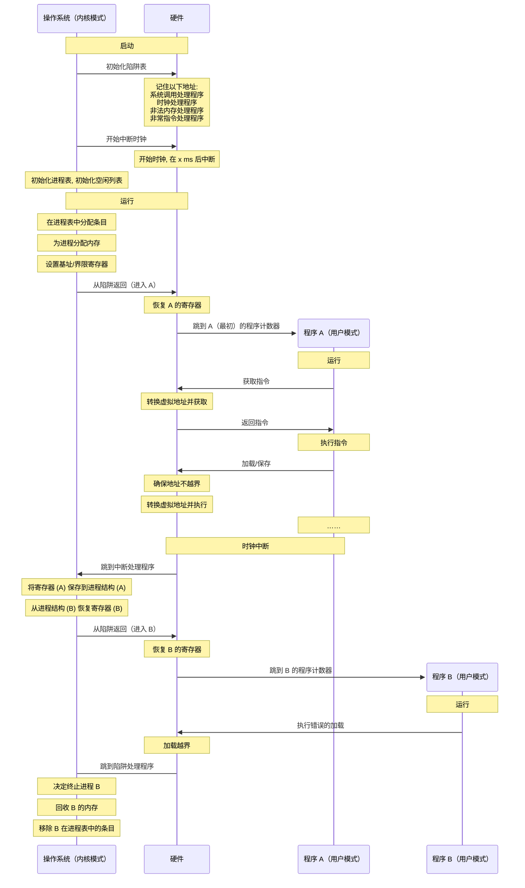
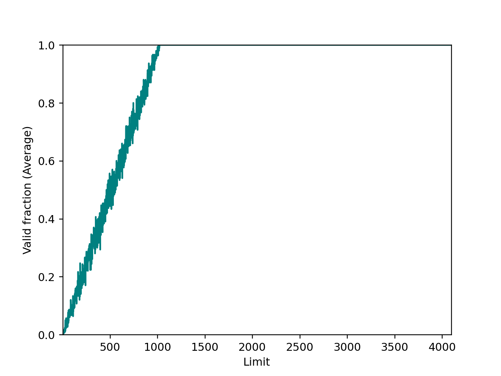

# 第 15 章 机制：地址转换

这章是讲如何高效、灵活地虚拟化内存。

当 CPU 取指令或者执行一条访存指令的时候，它都是基于虚拟地址访问属于当前正在运行的应用的地址空间。

此时，CPU 中的 内存管理单元 (MMU, Memory Management Unit) 自动将这个虚拟地址进行 地址转换 (Address Translation) 变为一个物理地址，即这个应用的数据/指令的物理内存位置。

参考：[rCore-Tutorial-Book-v3 #增加硬件加速虚实地址转换](https://rcore-os.cn/rCore-Tutorial-Book-v3/chapter4/2address-space.html#id6)

## 15.1 假设

??? quote "来自操作系统的嘲笑"
    我们对内存虚拟化的第一次尝试非常简单，甚至有点可笑。如果你觉得可笑就笑吧，很快就轮到操作系统嘲笑你了。当你试图理解 TLB 的换入换出、多级页表，和其他技术一样有奇迹之处的时候。不喜欢操作系统嘲笑你？很不幸，但这就是操作系统的运行方式。

假设：

1. 用户的地址空间必须连续地放在物理内存中；
1. 地址空间不是很大；
1. 每个地址空间大小完全一样。

## 15.2 一个例子

```c
void func() {
    int x;
    x = x + 3; // this is the line of code we are interested in
}
```

```asm
128: movl 0x0(%ebx), %eax ;load 0+ebx into eax
132: addl $0x03, %eax ;add 3 to eax register
135: movl %eax, 0x0(%ebx) ;store eax back to mem
```

代码和数据都位于进程的地址口令你感觉，3 条指令序列位于地址 128（靠近头部的代码段），变量 x 的值位于地址 15 KB （在靠近底部的栈中）。

如果这 3 条指令执行，从进程的角度来看，发生了以下几次内存访问：

- 从地址 128 获取指令；
- 执行指令（从地址 15 KB 加载数据）；
- 从地址 132 获取命令；
- 执行命令（没有内存访问）；
- 从地址 135 获取指令；
- 执行指令（新值存入地址 15 KB）。

从程序的角度来看，它的地址空间（address space）从 0 开始到 16 KB 结束。它包含的所有内存引用都应该在这个范围内。然而，对虚拟内存来说，操作系统希望将这个进程地址空间放在物理内存的其他位置，并不一定从地址 0 开始。

因此我们遇到了如下问题：

- 怎样在内存中重定位这个进程，同时对该进程透明（transparent）？
- 怎么样提供一种虚拟地址空间从 0 开始的假象，而实际上地址空间位于另外某个物理地址？

例子：

| Physics Address | Virtual Address | Data         |
| --------------- | --------------- | ------------ |
| 0 KB - 16 KB    |                 | OS           |
| 16 KB - 32 KB   |                 | (not in use) |
| 32 KB - 48 KB   | 0 KB - 2 KB     | Program Code |
| 32 KB - 48 KB   | 2 KB - 4 KB     | Heap         |
| 32 KB - 48 KB   | 4 KB - 14 KB    | (free)       |
| 32 KB - 48 KB   | 14 KB - 16 KB   | Stack        |
| 48 KB - 64 KB   |                 | (not in use) |

!!! note "关于介入 (Interposition)"
    书中介绍介入有点突然，介入其实指的是在不同的软件组件或硬件之间插入一个 **中间层** 来实现对它们之间交互的监视、修改或拓展

## 15.3 动态（基于硬件）重定位

动态（基于硬件）重定位，最初只是一个简单的实现，称为基址加界限 (base and bound) 机制，有时又称为动态重定位 (dynamic relocation)。

每个 CPU 需要两个硬件寄存器：

- 基址 (base) 寄存器
- 界限 (bound) 寄存器，有时称为限制 (limit) 寄存器

程序真正运行时，操作系统会决定其在物理内存中的实际加载地址，并将起始地址记录在基址寄存器中。进程中使用的内存引用都是虚拟地址 (virtual address)，硬件将虚拟地址加上基址寄存器的值，得到物理地址 (physical address)，再发给内存系统。

界限寄存器被用来保存虚拟地址空间的大小，如果程序访问超过这个界限或者为负数的虚拟地址，CPU 将触发异常。（界限寄存器也可以记录地址空间结束的物理地址，硬件在转化虚拟地址到物理地址之后才去检查这个界限，逻辑上是等价的。）

!!! quote "补充：基于软件的重定位"
    在早期，在硬件支持重定位之前，一些系统曾经采用纯软件的重定位方式。基本技术被称为静态重定位（static relocation），其中一个名为加载程序（loader）的软件接手将要运行的可执行程序，将它的地址重写到物理内存中期望的偏移位置。

    例如，程序中有一条指令是从地址 1000 加载到寄存器（即 movl 1000，%eax），当整个程序的地址空间被加载到从 3000（不是程序认为的 0）开始的物理地址中，加载程序会重写指令中的地址（即 movl4000, %eax），从而完成简单的静态重定位。

    然而，静态重定位有许多问题，首先也是最重要的是不提供访问保护，进程中的错误地址可能导致对其他进程或操作系统内存的非法访问，一般来说，需要硬件支持来实现真正的访问保护。静态重定位的另一个缺点是一旦完成，稍后很难将内存空间重定位到其他位置。

### 转换示例

| Virtual Address | Physical Address      |
| --------------- | --------------------- |
| 0               | 16 KB                 |
| 1 KB            | 17 KB                 |
| 3000            | 19384                 |
| 4400            | Fault (out of bounds) |

## 15.4 硬件支持：总结

| 硬件要求             | 解释                           |
| ---------------- | ---------------------------- |
| 特权模式             | 需要，以防用户模式的进程执行特权操作           |
| 基址/界限寄存器         | 每个CPU需要一对寄存器来支持地址转换和界限检查     |
| 能够转换虚拟地址并检查它是否越界 | 需要电路来完成转换和检查界限，在这种情况下，非常简单   |
| 修改基址/界限寄存器的特权指令  | 在让用户程序运行之前，操作系统必须能够设置这些值     |
| 注册异常处理程序的特权指令    | 操作系统必须能告诉硬件，如果异常发生，那么执行哪些代码  |
| 能够触发异常           | 如果进程试图使用特权指令或越界的内存，则必须能够触发异常 |

## 15.5 操作系统的问题

| 操作系统的要求 | 解释                                                   |
| ------- | ---------------------------------------------------- |
| 内存管理    | 需要为新进程分配内存<br>从终止的进程回收内存<br>一般通过空闲列表（free list）来管理内存 |
| 基址/界限管理 | 必须在上下文切换时正确设置基址/界限寄存器                                |
| 异常处理    | 当异常发生时执行的代码，可能的动作是终止犯错的进程                            |

硬件与操作系统的交互过程：



## 作业

!!! question
    1．用种子 1、2 和 3 运行，并计算进程生成的每个虚拟地址是处于界限内还是界限外?如果在界限内，请计算地址转换。

!!! note "Answer"
    ```title="./relocation.py -s 1"
    ARG seed 1
    ARG address space size 1k
    ARG phys mem size 16k

    Base-and-Bounds register information:

      Base   : 0x0000363c (decimal 13884)
      Limit  : 290

    Virtual Address Trace
      VA  0: 0x0000030e (decimal:  782) --> PA or segmentation violation?
      VA  1: 0x00000105 (decimal:  261) --> PA or segmentation violation?
      VA  2: 0x000001fb (decimal:  507) --> PA or segmentation violation?
      VA  3: 0x000001cc (decimal:  460) --> PA or segmentation violation?
      VA  4: 0x0000029b (decimal:  667) --> PA or segmentation violation?
    ```

    `VA 1` 在 Limit 内，其他都超出了界限。

    剩下两个同理计算。

!!! question
    2．使用以下标志运行：-s 0 -n 10。为了确保所有生成的虚拟地址都处于边界内，要将 -l（界限寄存器）设置为什么值？

!!! note "Answer"
    ```title="./relocation.py -s 0 -n 10"
    ARG seed 0
    ARG address space size 1k
    ARG phys mem size 16k

    Base-and-Bounds register information:

      Base   : 0x00003082 (decimal 12418)
      Limit  : 472

    Virtual Address Trace
      VA  0: 0x000001ae (decimal:  430) --> PA or segmentation violation?
      VA  1: 0x00000109 (decimal:  265) --> PA or segmentation violation?
      VA  2: 0x0000020b (decimal:  523) --> PA or segmentation violation?
      VA  3: 0x0000019e (decimal:  414) --> PA or segmentation violation?
      VA  4: 0x00000322 (decimal:  802) --> PA or segmentation violation?
      VA  5: 0x00000136 (decimal:  310) --> PA or segmentation violation?
      VA  6: 0x000001e8 (decimal:  488) --> PA or segmentation violation?
      VA  7: 0x00000255 (decimal:  597) --> PA or segmentation violation?
      VA  8: 0x000003a1 (decimal:  929) --> PA or segmentation violation?
      VA  9: 0x00000204 (decimal:  516) --> PA or segmentation violation?
    ```

    最大 929，设置 Limit 大于 929 的就可以了，但更推荐设置为 1024 的倍数。

!!! question
    3．使用以下标志运行：-s 1 -n 10 -l 100。可以设置 ~~界限~~ 基址的最大值是多少，以便地址空间仍然完全放在物理内存中？

!!! note "Answer"
    翻译有误，“界限”应是“基址”。

    界限为 100，默认物理内存大小为 16 KB，计算得最大基址为 `(16 << 10) - 100 = 16284`

    ```
    $ ./relocation.py -s 1 -n 10 -l 100 -b 16284 -c
    ```

!!! question
    4．运行和第 3 题相同的操作，但使用较大的地址空间（-a）和物理内存（-p）。

!!! note "Answer"
    `-a 32m -p 1g` 时，`-b` 的最大值为 `(1 << 10 << 10 << 10) - 100 = 1073741724`

    ```
    $ ./relocation.py -s 1 -n 10 -l 100 -b 16284 -a 32m -p 1g -c
    ```

!!! question
    5．作为边界寄存器的值的函数，随机生成的虚拟地址的哪一部分是有效的？画一个图，使用不同随机种子运行，限制值从 0 到最大地址空间大小。

!!! note "Answer"
    ```python
    import numpy as np
    import matplotlib.pyplot as plt

    # 定义常量
    address_size = 1 << 10
    phys_size = 4 << 10
    iterations = 300

    # 预先生成所有需要的随机地址
    random_addresses = np.random.randint(0, address_size, size=(phys_size, iterations))

    # 通过累计求和计算每个限制值下的有效地址分数
    valid_counts = np.sum(random_addresses < np.arange(phys_size)[:, None], axis=1)

    # 计算有效地址的平均分数
    valid_fraction = valid_counts / iterations

    # 绘图
    fig = plt.figure()
    x = np.linspace(1, phys_size, phys_size)
    plt.plot(x, valid_fraction, color="teal")
    plt.ylim(0, 1)
    plt.margins(0)
    plt.xlabel("Limit")
    plt.ylabel("Valid fraction (Average)")
    plt.savefig("valid_fraction.png", dpi=227)
    plt.show()
    ```

    
