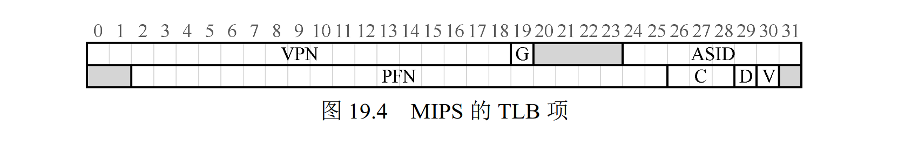

# 第 19 章 分页：快速地址转换 (TLB)

在分页中，每次指令获取、加载和保存，都要额外读一次内存，慢得无法接受。

这一章介绍了硬件———— **地址转换旁路缓冲器 (translation-lookaside-buffer)**，每次内存访问时，硬件先检查 TLB，如果存在匹配的映射，就直接完成转换，不用访问页表。

叫这个名称是历史原因，更好的名称是 **地址转换缓存 (address-translation cache)**，当然也可以叫 **快表**，我喜欢快表这个简短的名字。

与 CPU L1 L2 L3 Cache 的缓存不同，TLB 仅拥有映射，不会复制内容。

## 19.1 TLB 的基本算法

```c
VPN = (VirtualAddress & VPN_MASK) >> SHIFT
(Success, TlbEntry) = TLB_Lookup(VPN)

if (Success == True) // TLB Hit
    if (CanAccess(TlbEntry.ProtectBits) == True)
        Offset = VirtualAddress & OFFSET_MASK
        PhysAddr = (TlbEntry.PFN << SHIFT) | Offset
        AccessMemory(PhysAddr)
    else
        RaiseException(PROTECTION_FAULT)
else
    PTEAddr = PTBR + (VPN * sizeof(PTE))
    PTE = AccessMemory(PTEAddr)

    if (PTE.Valid == False)
        RaiseException(SEGMENTATION_FAULT)
    else if (CanAccess(PTE.ProtectBits) == False)
        RaiseException(PROTECTION_FAULT)
    else
        TLB_Insert(VPN, PTE.PFN, PTE.ProtectBits)
        RetryInstruction()
```

缓存命中时，直接取出 PFN `#!c TlbEntry.PFN` 与虚拟地址中的 `#!c Offset` 组成物理地址 `#c! PhysAddr`。

缓存没有命中时，就得从庞大的页表中查询了，所以我们希望尽可能避免 TLB 未命中。

## 19.2 示例：访问数组

小地址空间中的一个数组：

```
         00     04     08     12     16
         +------+------+------+------+
VPN = 00 |                           |
         +---------------------------+
VPN = 01 |                           |
         +---------------------------+
VPN = 02 |                           |
         +---------------------------+
VPN = 03 |                           |
         +---------------------------+
VPN = 04 |                           |
         +---------------------------+
VPN = 05 |                           |
         +---------------------------+
VPN = 06 |      | a[0] | a[1] | a[2] |
         +---------------------------+
VPN = 07 | a[3] | a[4] | a[5] | a[6] |
         +---------------------------+
VPN = 08 | a[7] | a[8] | a[9] |      |
         +---------------------------+
VPN = 09 |                           |
         +---------------------------+
VPN = 10 |                           |
         +---------------------------+
VPN = 11 |                           |
         +---------------------------+
VPN = 12 |                           |
         +---------------------------+
VPN = 13 |                           |
         +---------------------------+
VPN = 14 |                           |
         +---------------------------+
VPN = 15 |                           |
         +---------------------------+
```

遍历数组的过程：

- `a[0]`：提取 VPN `06` 检查 TLB，未命中；
- `a[1]`：与 `a[0]` 在同一页，TLB 命中；
- `a[2]`：同上，TLB 命中；
- `a[3]`：TLB 未命中；
- `a[4]`：TLB 命中；
- `a[5]`：TLB 命中；
- `a[6]`：TLB 命中；
- `a[7]`：TLB 未命中；
- `a[8]`：TLB 命中；
- `a[9]`：TLB 命中。

命中率为 70%，已经提升不少了，如果页大小变得更大，数组访问遇到的未命中就更少。

典型页的大小一般为 4 KB，这种情况下，密集的、基于数组的访问会实现极好的 TLB 性能。

缓存是计算机系统中最基本的性能改进技术之一，一次又一次地用于让“常见的情况更快”，硬件缓存背后的思想是利用指令和数据引用的局部性 (locality)。

通常有两种局部性：
时间局部性 (temporal locality)：
: 最近访问过的指令或数据项可能很快会再次访问。想想循环中的循环变量或指令，它们被多次反复访问。

空间局部性 (spatial locality)：
: 程序访问内存地址 x 时，可能很快会访问邻近 x 的内存。想想遍历某种数组，访问一个接一个的元素。

## 19.3 谁来处理 TLB 未命中

硬件处理：
: 通过页表基址寄存器记录页表地址，发生 TLB 未命中时直接遍历页表。

软件（操作系统）处理：
: 发生 TLB 未命中时系统抛出一个异常，将特权级提升至内核态，跳转至陷阱处理程序 (trap handler)。
: 这个陷阱处理程序会查找页表中的转换映射，然后更新 TLB，并从陷阱返回。此时，硬件会重试该指令（导致 TLB 命中）。

现代操作系统中大多都是软件处理。

这里的陷阱返回稍不同于系统调用时的陷阱返回，后者继续执行陷入操作系统之后的那条指令，但前者必须从导致陷入的指令继续执行，这次重试会命中 TLB。

因此，根据陷阱或异常的原因，系统在陷入内核时必须保存不同的程序计数器。

在运行 TLB 未命中处理代码时，需要格外小心避免引起 TLB 未命中的无限递归。有很多解决方案，例如：

- 把 TLB 未命中陷阱处理程序直接放到物理内存中（它们没有映射过，不用经过地址转换）；
- 在 TLB 中保留一些项，记录永久有效的地址转换，并将其中一些永久地址转换槽块留给处理代码本身，这些被监听的地址转换总是会命中 TLB。

软件管理的方法，有两个主要优势：

- **灵活性**：操作系统可以用任意数据结构来实现页表，不需要改变硬件；
- **简单性**：从 TLB 控制流中可以看出，硬件不需要做太多工作，它抛出异常，操作系统的处理程序会负责剩下工作。

## 19.4 TLB 的内容

```
VPN | PFN | other bits
```

VPN 和 PFN 同时存在于 TLB 中，因为一条地址映射可能出现在任意位置（用硬件的术语，TLB 被称为全相联的 (fully-associative) 缓存），硬件可以并行地查找这些项。

!!! quote "补充：TLB 的有效位!=页表的有效位"
    常见的错误是混淆 TLB 的有效位和页表的有效位。
    在页表中，如果一个页表项（PTE）被标记为无效，就意味着该页并没有被进程申请使用，正常运行的程序不应该访问该地址。
    当程序试图访问这样的页时，就会陷入操作系统，操作系统会杀掉该进程。

    TLB 的有效位不同，只是指出 TLB 项是不是有效的地址映射。
    例如，系统启动时，所有的 TLB 项通常被初始化为无效状态，因为还没有地址转换映射被缓存在这里。
    一旦启用虚拟内存，当程序开始运行，访问自己的虚拟地址，TLB 就会慢慢地被填满，因此有效的项很快会充满 TLB。

    TLB 有效位在系统上下文切换时起到了很重要的作用，后面我们会进一步讨论。
    通过将所有 TLB项设置为无效，系统可以确保将要运行的进程不会错误地使用前一个进程的虚拟到物理地址转换映射。

## 19.5 上下文切换时对 TLB 的处理

示例 TLB 的内容：

| VPN | PFN | valid | prot |
| --- | --- | ----- | ---- |
| 10  | 100 | 1     | rwx  |
| -   | -   | 0     | -    |
| 10  | 100 | 1     | rwx  |
| -   | -   | 0     | -    |

缓存了两个进程的地址映射，都是 10 -> 100，硬件分不清哪项属于哪个进程。

解决问题：**如果发生进程间上下文切换，上一个进程在 TLB 中的地址映射对于即将运行的进程是无意义，硬件或操作系统应该如何管理 TLB 的内容呢？**

- 方案一：在上下文切换时，简单地清空 TLB，会有一定开销；
- 方案二：添加硬件支持，实现跨上下文切换的 TLB 共享。

比如有的系统在 TLB 中添加一个地址空间标识符 (Address Space Identifier, ASID)，可以把 ASID 看作是进程标识符，但通常比 PID 位数少。

| VPN | PFN | valid | prot | ASID |
| --- | --- | ----- | ---- | ---- |
| 10  | 100 | 1     | rwx  | 1    |
| -   | -   | 0     | -    |      |
| 10  | 100 | 1     | rwx  | 2    |
| -   | -   | 0     | -    |      |

当然，硬件也需要知道当前是哪个进程正在运行，因此操作系统在上下文切换时，必须将某个特权寄存器设置为当前进程的 ASID。

## 19.6 TLB 替换策略

TLB 和其他缓存一样，还有一个问题要考虑，即缓存替换 (cache replacement)。

具体来说，向 TLB 中插入新项时，会替换 (replace) 一个旧项，这样问题就来了：应该替换那一个？

- 策略一：替换最近最少使用的项，尝试利用局部性；
- 策略二：随机，避免极端情况。

## 19.7 实际系统的 TLB 表项

真实的 TLB 案例，来自 MISP R4000：



MIPS R4000 支持 32 位的地址空间，页大小为 4 KB，在典型的虚拟地址中，理应看到 20 位的 VPN 和 12 位的偏移量。

但是，实际的 TLB 中只有 19 位的 VPN。事实上，用户地址只占地址空间的一半（剩下的留给内核），所以只需要 19 位的 VPN。

VPN 转换成最大 24 位的 PFN，因此可以支持最多有 64 GB 的物理内存的系统。

MIPS TLB 还有一些有趣的标志位：

- 全局位 (Global, G)：用来指示这个页是不是所有进程全局共享的，如果为 1，就会忽略 ASID；
- 一致性位 (Coherence, C)：决定硬件如何缓存该页；
- 脏位 (Dirty, D)：表示该页是否被写入新数据；
- 有效位 (Valid, V)：告诉硬件该项的地址映射是否有效；

## 作业

最不想写作业的一次。

!!! question
    1．为了计时，可能需要一个计时器，例如 gettimeofday()提供的。这种计时器的精度如何？操作要花多少时间，才能让你对它精确计时？（这有助于确定需要循环多少次，反复访问内存页，才能对它成功计时。）

!!! note "Answer"
    ```title="man gettimeofday"
    DESCRIPTION
           The gettimeofday() function shall obtain the current time, expressed as seconds and microseconds since the Epoch, and  store  it in the timeval structure pointed to by tp.  The resolution of the system clock is unspecified.
    ```

    说是最低微秒，想要获得纳秒级精度的结果需要重复测量计算平均值。

---

!!! question
    2．写一个程序，命名为 tlb.c，大体测算一下每个页的平均访问时间。程序的输入参数有：页的数目和尝试的次数。

!!! note "Answer"
    没有具体实现思路，搬了 [https://github.com/xxyzz/ostep-hw/blob/master/19/tlb.c](https://github.com/xxyzz/ostep-hw/blob/master/19/tlb.c)。

    ```c title="tlb.c"
    #include <stdio.h>   // printf, fprintf
    #include <stdlib.h>  // exit, calloc, free
    #include <time.h>    // clock_gettime
    #include <unistd.h>  // sysconf

    #define handle_error(msg)   \
        do {                    \
            perror(msg);        \
            exit(EXIT_FAILURE); \
        } while (0)

    int main(int argc, char* argv[]) {
        if (argc < 3) {
            fprintf(stderr, "Usage: %s pages trials\n", argv[0]);
            exit(EXIT_FAILURE);
        }

        long PAGESIZE = sysconf(_SC_PAGESIZE);  // 4096
        long jump = PAGESIZE / sizeof(int);     // 1024
        int pages = atoi(argv[1]);
        int trials = atoi(argv[2]);
        if (pages <= 0 || trials <= 0) {
            fprintf(stderr, "Invalid input\n");
            exit(EXIT_FAILURE);
        }
        int* a = calloc(pages, PAGESIZE);
        struct timespec start, end;
        if (clock_gettime(CLOCK_PROCESS_CPUTIME_ID, &start) == -1)
            handle_error("clock_gettime");

        for (int j = 0; j < trials; j++) {
            for (int i = 0; i < pages * jump; i += jump)
                a[i] += 1;
        }

        if (clock_gettime(CLOCK_PROCESS_CPUTIME_ID, &end) == -1)
            handle_error("clock_gettime");

        // nanoseconds
        printf("Jump%f\n",
               ((end.tv_sec - start.tv_sec) * 1E9 + end.tv_nsec - start.tv_nsec) /
                   (trials * pages));
        free(a);
        return 0;
    }
    ```

---

!!! question
    3．用你喜欢的脚本语言（csh、Python 等）写一段脚本来运行这个程序，当访问页面从 1 增长到几千，也许每次迭代都乘 2。在不同的机器上运行这段脚本，同时收集相应数据。需要试多少次才能获得可信的测量结果？

!!! note "Answer"
    我能写个 Fish、Bash 什么的，但我没法在各种设备上测试。

    ```fish
    set num $argv[1]

    set p 1
    for i in (seq 1 $num)
        ./tlb $p 1000
        set p (math $p \* 2)
    end
    ```

    ```title="fish test.fish 13"
    Jump     1 pages | time    3.2 nanoseconds
    Jump     2 pages | time    3.3 nanoseconds
    Jump     4 pages | time    2.7 nanoseconds
    Jump     8 pages | time    2.7 nanoseconds
    Jump    16 pages | time    5.6 nanoseconds
    Jump    32 pages | time    6.1 nanoseconds
    Jump    64 pages | time    8.4 nanoseconds
    Jump   128 pages | time    6.7 nanoseconds
    Jump   256 pages | time    7.7 nanoseconds
    Jump   512 pages | time    7.6 nanoseconds
    Jump  1024 pages | time    6.3 nanoseconds
    Jump  2048 pages | time    7.9 nanoseconds
    Jump  4096 pages | time    7.0 nanoseconds
    ```

---

!!! question
    4．接下来，将结果绘图，类似于上图。可以用 ploticus 这样的好工具画图。可视化使数据更容易理解，你认为是什么原因？

!!! note "Answer"
    我真的不想再写图表代码了，不擅长这个。

    参考这个吧：[https://github.com/xxyzz/ostep-hw/blob/master/19/plot.py](https://github.com/xxyzz/ostep-hw/blob/master/19/plot.py)

---

!!! question
    5．要注意编译器优化带来的影响。编译器做各种聪明的事情，包括优化掉循环，如果循环中增加的变量后续没有使用。如何确保编译器不优化掉你写的 TLB 大小测算程序的主循环？

!!! note "Answer"
    关闭编译器的优化选项，比如 GCC 可以使用 `-O0`

---

!!! question
    6．还有一个需要注意的地方，今天的计算机系统大多有多个 CPU，每个 CPU 当然有自己的 TLB 结构。为了得到准确的测量数据，我们需要只在一个 CPU 上运行程序，避免调度器把进程从一个 CPU 调度到另一个去运行。如何做到？（提示：在 Google 上搜索“pinning a thread”相关的信息）如果没有这样做，代码从一个 CPU 移到了另一个，会发生什么情况？

!!! note "Answer"
    在[第六章的作业](./06direct_execution.md#_5)中写过。

    可以使用 `#!c sched_setaffinity`、`#!c pthread_setaffinity_np` 等。

---

!!! question
    7．另一个可能发生的问题与初始化有关。如果在访问数组 a 之前没有初始化，第一次访问将非常耗时，由于初始访问开销，比如要求置 0。这会影响你的代码及其计时吗？如何抵消这些潜在的开销？

!!! note "Answer"
    使用 `#!c calloc` 初始化数组。
