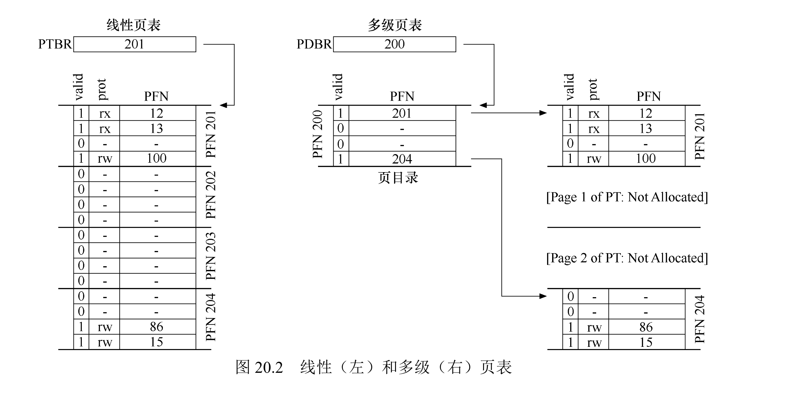

# 第 20 章 分页：较小的表

上章解决了速度问题，这章解决内存问题。

总之就是三种方案：

- 使用更大的页，页更大，页表就更小；
- 使用分段和分页混合，减少一些无效区域；
- 改进页表的结构，从线性改为树或其他结构。

## 20.1 简单的解决方案：更大的页

很简单的思路，页更大，表就更小。

但这种方法之前的作业里就发现了有问题，大内存页会导致每页内的浪费，称为内部碎片 (internal fragmentation)。

所以大多数系统在常见的情况下使用相对较小的页大小：4 KB 或 8 KB。

## 20.2 混合方法：分页和分段

就我的个人感受，任何事情最悲哀的情况都是在两种方案中找折中，两害相权。

混合的方法不能完美地解决一件事情，却总是带来双倍的复杂度。

这节说的混合方法就是为进程的每个逻辑分段提供一个页表，而非为整个地址空间提供一个页表。

因为不是所有分段的页表都会同时活跃，通过精细控制哪些分段被加载和映射，可以减少页表的总体大小。（比如栈和堆之间未分配的页不再占用页表中的空间）

但是，分段的缺点被带了进来，外部碎片再次出现，也让原先的分页机制变得不够灵活。

## 20.3 多级页表

这种方法不依赖分段，但也试图解决相同的问题：**如何去掉页表中的所有无效区域，而不是将它们全部保留在内存中？**

多级页表 (multi-level page table)，将线性页表变成了类似树的东西。



多级页表是有成本的，当 TLB 未命中时，需要从内存加载两次(1)，才能从页表中获取正确的地址转换信息（一次用于页目录，另一次用于 PTE 用于页目录，另一次用于 PTE 本身）。
{ .annotate }

1. 这就是为什么 [rCore 里关于 TLB 的部分](https://rcore-os.cn/rCore-Tutorial-Book-v3/chapter4/3sv39-implementation-1.html#tlb) 说“将一个虚拟地址转化为物理地址需要访问 3 次物理内存”，它指的是多级页表的情况，而 OSTEP 前几章节说的都是线性页表，只有 2 次。

因此，多级表是一个时间——空间折中 (time-space trade-off) 的例子，得到更小的表的同时，也付出了代价。

!!! quote "提示：理解时空折中"
    在构建数据结构时，应始终考虑时间和空间的折中 (time-space trade-off)。
    通常，如果你希望更快地访问特定的数据结构，就必须为该结构付出空间的代价。

另一个明显的缺点是复杂性，但只要得到的收益远高过成本，这些复杂性就是可接受的。

### 详细的多级示例

16 KB 的地址空间和 64 字节的页：

```
          +--------+
0000 0000 |  code  |
          +--------+
0000 0001 |  code  |
          +--------+
0000 0010 | (free) |
          +--------+
0000 0011 | (free) |
          +--------+
0000 0100 |  heap  |
          +--------+
0000 0101 |  heap  |
          +--------+
0000 0110 | (free) |
          +--------+
0000 0111 | (free) |
          +--------+
.... ....  all free
          +--------+
1111 1100 | (free) |
          +--------+
1111 1101 | (free) |
          +--------+
1111 1110 | stack  |
          +--------+
1111 1111 | stack  |
          +--------+
```

我们需要 8 位的 VPN，其中前四位用来索引目录，后四位用来索引页表。

```
           VPN                offset
+-----------------------+-----------------+
|13|12|11|10|09|08|07|06|05|04|03|02|01|00|
+-----------+-----------+
      |           |
      |           +------ Page Table Index
      |

Page Directory Index
```

我们可以通过简单的计算来找到页目录项 (PDE) 的地址，再通过 `#!c PDEAddr` 和 `#!c PTIndex` 计算得到 PTE 的地址：

```c
PDEAddr = PageDirBase + (PDIndex * sizeof(PDE))
PTEAddr = (PDE.PFN << SHIFT) + (PTIndex * sizeof(PTE))
```

### 超过两级

页目录太大时，我们很可能得构建更深层次的多级页表。

拓展 VPN 的位数，成为 `PDIndex[0]` + `PDIndex[1]` + `PTIndex`。

先使用 `PDIndex[0]` 索引第一级目录，再使用 `PDIndex[1]` 索引第二级目录，继而得到 PTE 地址。

### 地址转换过程：记住 TLB

在任何复杂的多级页表访问发生之前，硬件首先检查 TLB。在命中时，物理地址直接形成，而不像之前一样访问页表。

只有在 TLB 未命中时，硬件才需要执行完整的多级查找。在这条路径上，可以看到传统的两级页表的成本：两次额外的内存访问来查找有效的转换映射。

```c
VPN = (VirtualAddress & VPN_MASK) >> SHIFT
(Success, TlbEntry) = TLB_Lookup(VPN)

if (Success == True) // TLB Hit
    if (CanAccess(TlbEntry.ProtectBits) == True)
        Offset = VirtualAddress & OFFSET_MASK
        PhysAddr = (TlbEntry.PFN << SHIFT) | Offset
        Register = AccessMemory(PhysAddr)
    else
        RaiseException(PROTECTION_FAULT)
else // TLB Miss
    // first, get page directory entry
    PDIndex = (VPN & PD_MASK) >> PD_SHIFT
    PDEAddr = PDBR + (PDIndex * sizeof(PDE))
    PDE = AccessMemory(PDEAddr)

    if (PDE.Valid == False)
        RaiseException(SEGMENTATION_FAULT)
    else
        // PDE is valid: now fetch PTE from page table
        PTIndex = (VPN & PT_MASK) >> PT_SHIFT
        PTEAddr = (PDE.PFN << SHIFT) + (PTIndex * sizeof(PTE))
        PTE = AccessMemory(PTEAddr)

        if (PTE.Valid == False)
            RaiseException(SEGMENTATION_FAULT)
        else if (CanAccess(PTE.ProtectBits) == False)
            RaiseException(PROTECTION_FAULT)
        else
            TLB_Insert(VPN, PTE.PFN, PTE.ProtectBits)
            RetryInstruction()
```

## 20.4 反向页表 (inverted page table)

这种设计中直接维护一个全局的页表，直接索引物理内存页，用于所有进程，以此减少页表大小。

缺点是查找需要遍历整个表，导致搜索更慢，所以有时在基础结构上建立散列表，以加速查找。

而由于是全局的，维护成本更大。

## 20.5 将页表交换到磁盘

即使我们可以通过各种技巧减小页表的大小，但是它仍然有可能是太大而无法一次装入内存。

因此，在系统内存压力较大时，可以将这些页表的一部分交换 (swap) 到磁盘。

这是下几章的内容了。

## 作业

!!! question
    1．对于线性页表，你需要一个寄存器来定位页表，假设硬件在 TLB 未命中时进行查找。你需要多少个寄存器才能找到两级页表？三级页表呢？

!!! note "Answer"
    只需要一个顶级页目录的基地址寄存器。

---

!!! question
    2．使用模拟器对随机种子 0、1 和 2 执行翻译，并使用-c 标志检查你的答案。需要多少内存引用来执行每次查找？

!!! note "Answer"
    一运行直接黑客帝国，字符冲进眼睛里把我本就容量不足的脑袋整宕机了。

    简单计算一个吧，`0x611c`，页目录在 `page 108`：

    | PDIndex | PTIndex | OFFSET |
    | ------- | ------- | ------ |
    | 11000   | 01000   | 11100  |
    | 24      | 8       |        |

    ```title="page 108"
    83 fe e0 da 7f d4 7f eb be 9e d5 ad e4 ac 90 d6 92 d8 c1 f8 9f e1 ed e9 a1 e8 c7 c2 a9 d1 db ff
                                                                            ^^
                                                                            PDE
    ```

    `0xa1` 首位是有效位：

    | Valid | PDE     |
    | ----- | ------- |
    | 1     | 0100001 |
    |       | 33      |

    ```title="page 33"
    7f 7f 7f 7f 7f 7f 7f 7f b5 7f 9d 7f 7f 7f 7f 7f 7f 7f 7f 7f 7f 7f 7f 7f 7f 7f f6 b1 7f 7f 7f 7f
                            ^^
                            PTE
    ```

    `b5` 首位是有效位：

    | Valid | PFN     |
    | ----- | ------- |
    | 1     | 0110101 |

    所以最终地址是 `PFN + OFFSET` 为 `011010111100`，也就是 `0x6bc`

---

!!! question
    3．根据你对缓存内存的工作原理的理解，你认为对页表的内存引用如何在缓存中工作？它们是否会导致大量的缓存命中（并导致快速访问）或者很多未命中（并导致访问缓慢）？

!!! note "Answer"
    顶级页目录表适合时间局部性，因为它在每次 TLB 未命中时被访问。

    页条目表适合空间局部性。
