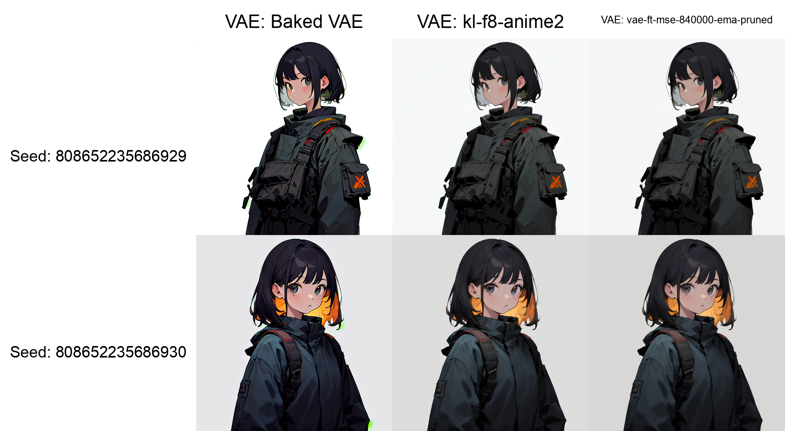
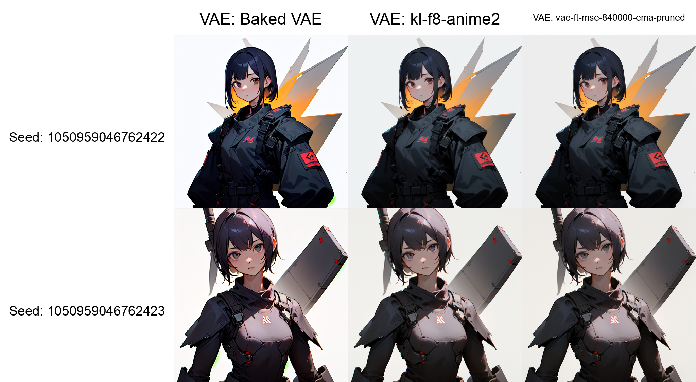
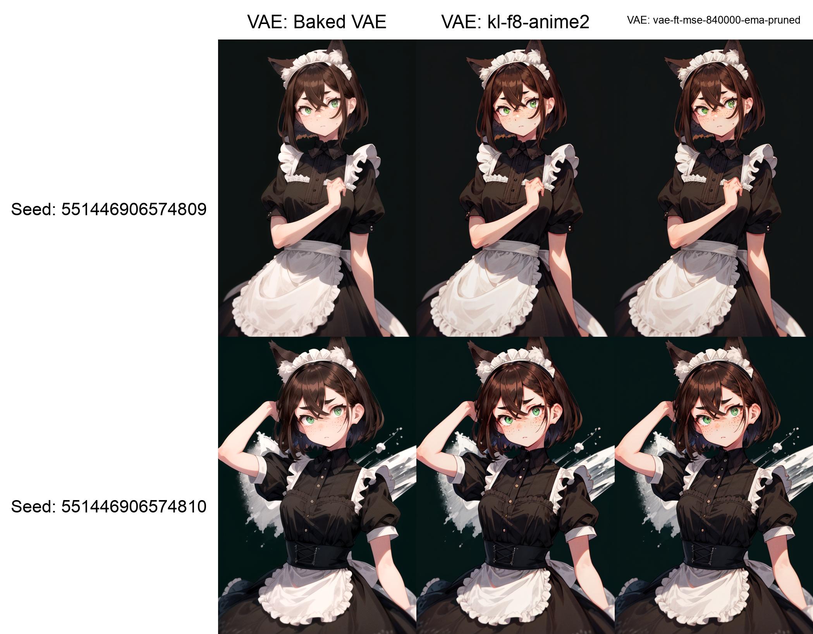
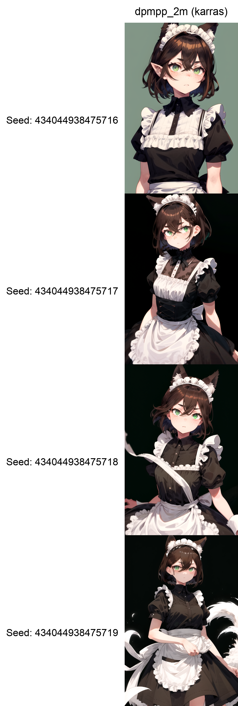

# Checkpoint 筛选 2024-02-07

!!! warning
    由于 CFG、Ksampler、Steps 关联性强，不太适合拆开分析，所以 `Ksampler & Steps` 小节里，固定 CFG 值，变动采样器和和步数的方式，并不能完全完全体现采样器在模型上的工作情况。（有的采样器需要特殊的 CFG ，不同的 CFG 也需要不同的步数来配合）

    所以现在认为此部分内容不太具有分析意义，在下次筛选时会制作 X/Y/Z 图表，将三个参数都纳作变量。

    不过，还是在过程中还是发现了各个模型的问题和特性。

这次筛选是用于虚拟小说的原型设计，基本需求有：

- 干净的人物立绘（与背景区别明显，便于抠图）
- 多角度的人物脸部、身体
- 丰富的表情
- 多种性别、年龄、身高
- 稳定配合两到三个 Lora（服饰、配饰、发型等）
- 稳定配合两到三个 ControlNet （姿势、语义等）
- 室内室外、不同时间段的场景

初选的五个模型（画风在 2D ~ 2.5D 之间）：

- [Counterfeit-V3.0](https://civitai.com/models/4468/counterfeit-v30)
- [AbyssOrangeMix3 (AOM3A1B)](https://civitai.com/models/9942/abyssorangemix3-aom3)
- [Store Bought Gyoza (VV)](https://civitai.com/models/14734?modelVersionId=107360)
- [Cetus-Mix (fp16/cleaned) (WhaleFall2)](https://civitai.com/models/116867/cetus-mix-fp16cleaned)
- [TMND-Mix (VI-Pruned)](https://civitai.com/models/27259?modelVersionId=116759)

这些模型的版本不一定是最新，此次筛选也不会检测需求的所有部分，就当作是整理一下硬盘里常用的模型，同样也是为了试验一下工作流。

顺利的话过些日子进行正式的测试，重新从网站上挑选模型，并且设置更详细的需求。

我的工作流见[引用](#_10)。

## 初筛

为了确定模型是否满足基本需求，准备了五组提示词，都是剧本中经常出现的人和物。

测试参数从简。

| Parameter       | Configuration                  |
| --------------- | ------------------------------ |
| Negative Prompt | `embedding:EasyNegative`       |
| Size            | `512 x 512`                    |
| Steps           | `20`                           |
| CFG             | `7.0`                          |
| Sampler         | `euler`                        |
| Scheduler       | `normal`                       |
| Clip Skip       | `-1`                           |
| VAE             | `vae-ft-mse-840000-ema-pruned` |

### 人物立绘（人物、光影、背景干净程度）

```title="Positive Prompt"
1girl, standing, looking_at_viewer, upper_body, simple_background
```


`storeBoughtGyoza` 是问题最大的一个：(1)
{ .annotate }

1. 造成此问题的原因在 [多维检查](#store-bought-gyoza-vv) 中找到了。

1. 背景不干净，与人物服饰产生了干扰（这个在以往的使用过程中也发现了）

1. 光影感太强，人物面部总是背光（可以用其他方式调整光源，但 *Keep it simple* ，越少的操作越不容易出问题，能在模型选择上一步到位才最好）

第二点不是巧合，换用室内场景会更加明显：

```title="Positive Prompt"
1girl, standing, looking_at_viewer, upper_body, indoors
```


`storeBoughtGyoza` 我其实很喜欢，这个模型的颜色很鲜艳，光影重，细节多，可以获得很绚丽的画面，我偏好把 [Add More Details](https://civitai.com/models/82098?modelVersionId=87153) Lora 调成负的一起用。但它不是特别听话，尤其是对于背景和姿势的控制。

`TMND-Mix` 有两次不是纯色背景，`AOM3` 有一次不是纯色背景。

`Counterfeit-V3.0` 出现了一次“灰阶”图片，经过后来几次测试，不是偶然情况，应该是可以通过 `monochrome`、`greyscale` 等反向提示词来解决。我认为反向提示词有一部分锅，所以它的问题并没有前几个“没有遵守正向提示词”那么严重。

`Cetus-Mix` 发挥稳定。

### 火车内，下雪（室内结构、窗外画面）

```title="Positive Prompt"
vintage train interior, snowing
```


与刚刚的人像对比，画面风格基本一致，而且窗景的效果都不错。

### 少年驾车（男性、侧方视角）

```title="Positive Prompt"
1boy, driving a car in the town, from_side, 
```


驾车这个场景比较复杂，不搭配深度图出问题也正常。

`storeBoughtGyoza`、`Cetus-Mix`、`TMND-Mix` 出现了画面主体没有人物的情况。

这五个模型画男性都还可以，画风和女性一致。

### 房间和桌子（室内场景、常见家具、生活用品）

```title="Positive Prompt"
a wood desk in a room
```


对于视觉小说，背景比人物写实是没太大问题的，曾经试验过把二次元画像合到现实世界的照片中，只要稍微调整一下就没有违合感了，甚至可以称之为风格。

### 户外（日景、夜景）

```title="Positive Prompt"
outdoors, road, car, motor vehicle, ground vehicle, scenery, tree, power lines, street, utility pole, sky, building, day, road sign, lamppost, crosswalk, fence, traffic light, sign, city, cloud, blue sky
```


```title="Positive Prompt"
outdoors, tree, road, sky, night sky, city, power lines, building, cityscape, street, sign, dark, guard rail, road sign, ground vehicle,
```


还顺便试了下废墟房间：

```title="Positive Prompt"
a room with a wall that has been torn down
```


### 小结

- `Counterfeit-V3.0`

    人物和背景区别明显。无提示词引导时人物喜欢出侧脸、M 毛（`hair_intakes`）（其实发型整体都没变过），且有概率全部变成纯黑白。

    室内外场景表现良好。

- `AbyssOrangeMix3 (AOM3A1B)`

    人物和背景区别明显，出现过一次背景非纯色。

    室内外场景表现良好，偏暖色（夜景尤其）。

- `Store Bought Gyoza (VV)`

    人物和纯色背景存在干扰，人物面部背光。眼白占比更大，可以出三白眼。

    风景带有一些油画风格，夜景是五个里我最喜欢的。

- `Cetus-Mix (fp16/cleaned) (WhaleFall2)`

    人物和背景区别明显，背景一直是纯色。

    室内外场景表现良好。偏清爽的画风。

- `TMND-Mix (VI-Pruned)`

    人物和背景区别明显，出现过一次背景非纯色。清爽干净的画风，人物面部没有其他几个那么幼态。

    人物室内外场景表现良好。

## 多维检查

分别从 `CFG` 、`VAE` 、`Ksampler & Steps` 来检查模型稳定性，挑选合适参数。

- CFG: `3.0`, `5.0`, `7.0`, `9.0`, `11.0`, `13.0`
- VAE: `kl-f8-anime2`, `vae-ft-mse-840000-ema-pruned`
- Ksampler: `euler`, `dpmpp_2m`, `dpmpp_sde`, `dpmpp_3m_sde`, `dpm_2`
- Steps: `8`, `16`, `24`, `32`, `40`

采样器选择了几个图像质量比较高的，不在意速度。

本来是不带 `dpmpp_sde` 和 `dpmpp_3m_sde` 的，因为这次是二次元画像，非真实系优先选择不带祖先采样器特征的采样器（个人习惯），更何况画面收敛对与稳定 IP 有好处，但还是加上了，看看它们能不能带来惊喜。

### CounterFeit-V3.0

#### CFG

??? note "Parameter"
    | Parameter       | Configuration                                                                                                                                                                                                  |
    | --------------- | -------------------------------------------------------------------------------------------------------------------------------------------------------------------------------------------------------------- |
    | Positive Prompt | `1girl, standing, looking_at_viewer, upper_body, brown hair, medium hair, hair between eyes, maid_headdress, green eyes, freckles, wolf_ears, short sleeves, maid, long dress, black dress, simple_background` |
    | Size            | `512 x 768`                                                                                                                                                                                                    |
    | Steps           | `20`                                                                                                                                                                                                           |
    | CFG             | `3.0`, `5.0`, `7.0`, `9.0`, `11.0`, `13.0`                                                                                                                                                                     |
    | Sampler         | `euler`                                                                                                                                                                                                        |
    | Scheduler       | `karras`                                                                                                                                                                                                       |
    | VAE             | `vae-ft-mse-840000-ema-pruned`                                                                                                                                                                                 |


`1girl` -> `1boy`，`maid` -> `maid dress`


CFG 作用明显，尤其体现在刘海、雀斑、裙子和背景颜色上。低 CFG 值也能还原提示词特征。

这个模型有个特点，会出现类似隐藏染的头发，CFG 越高越明显，猜测是模型给出了阳光透过背后头发的效果，换种发色看得更清楚一些：


#### VAE

??? note "Parameter"
    | Parameter       | Configuration                                                       |
    | --------------- | ------------------------------------------------------------------- |
    | Positive Prompt | `1girl, standing, looking_at_viewer, upper_body, simple_background` |
    | Size            | `512 x 768`                                                         |
    | Steps           | `20`                                                                |
    | CFG             | `7.0`                                                               |
    | Sampler         | `euler`                                                             |
    | Scheduler       | `karras`                                                            |
    | VAE             | `Baked VAE`, `kl-f8-anime2`, `vae-ft-mse-840000-ema-pruned`         |



使用 `Baked VAE` 会出现绿斑，`kl-f8-anime2` 和 `vae-ft-mse-840000-ema-pruned` 没问题。

??? warning "clip_skip 对画面的影响"
    这个模型在 Clip Skip 为 `-2` 的时候，背景会出现额外的内容。

    

`kl-f8-anime2` 和 `vae-ft-mse-840000-ema-pruned` 看不出区别，之后的测试中用后者。

顺带一提，这个模型在不指定服饰的时候，很喜欢出这种“机能风”的外套，甚至很多时候会出现机甲。

#### Ksampler & Steps

??? note "Parameter"
    | Parameter       | Configuration                                                                                                                                                                                                  |
    | --------------- | -------------------------------------------------------------------------------------------------------------------------------------------------------------------------------------------------------------- |
    | Positive Prompt | `1girl, standing, looking_at_viewer, upper_body, brown hair, medium hair, hair between eyes, maid_headdress, green eyes, freckles, wolf_ears, short sleeves, maid, long dress, black dress, simple_background` |
    | Size            | `512 x 768`                                                                                                                                                                                                    |
    | Steps           | `8`, `16`, `24`, `32`, `40`                                                                                                                                                                                    |
    | CFG             | `7.0`                                                                                                                                                                                                          |
    | Sampler         | `euler`, `dpmpp_2m`, `dpmpp_sde`, `dpmpp_3m_sde`, `dpm_2`                                                                                                                                                      |
    | Scheduler       | `karras`                                                                                                                                                                                                       |
    | VAE             | `vae-ft-mse-840000-ema-pruned`                                                                                                                                                                                 |


### AbyssOrangeMix3 (AOM3A1B)

#### CFG

??? note "Parameter"
    | Parameter       | Configuration                                                                                                                                                                                                  |
    | --------------- | -------------------------------------------------------------------------------------------------------------------------------------------------------------------------------------------------------------- |
    | Positive Prompt | `1girl, standing, looking_at_viewer, upper_body, brown hair, medium hair, hair between eyes, maid_headdress, green eyes, freckles, wolf_ears, short sleeves, maid, long dress, black dress, simple_background` |
    | Size            | `512 x 768`                                                                                                                                                                                                    |
    | Steps           | `20`                                                                                                                                                                                                           |
    | CFG             | `3.0`, `5.0`, `7.0`, `9.0`, `11.0`, `13.0`                                                                                                                                                                     |
    | Sampler         | `euler`                                                                                                                                                                                                        |
    | Scheduler       | `karras`                                                                                                                                                                                                       |
    | VAE             | `vae-ft-mse-840000-ema-pruned`                                                                                                                                                                                 |


`1girl` -> `1boy`，`maid` -> `maid dress`


~~（好幼）~~

还好算不上画女硬说男。

在 CFG 低于 `7.0` 时，一些特征出不来，比如狼耳、雀斑。

而且有时会出现背景复杂的情况。

#### VAE

??? note "Parameter"
    | Parameter       | Configuration                                                                                                                                                                                                  |
    | --------------- | -------------------------------------------------------------------------------------------------------------------------------------------------------------------------------------------------------------- |
    | Positive Prompt | `1girl, standing, looking_at_viewer, upper_body, brown hair, medium hair, hair between eyes, maid_headdress, green eyes, freckles, wolf_ears, short sleeves, maid, long dress, black dress, simple_background` |
    | Size            | `512 x 768`                                                                                                                                                                                                    |
    | Steps           | `20`                                                                                                                                                                                                           |
    | CFG             | `7.0`                                                                                                                                                                                                          |
    | Sampler         | `euler`                                                                                                                                                                                                        |
    | Scheduler       | `karras`                                                                                                                                                                                                       |
    | VAE             | `Baked VAE`, `kl-f8-anime2`, `vae-ft-mse-840000-ema-pruned`                                                                                                                                                    |


不用 VAE 会发灰。

#### Ksampler & Steps

??? note "Parameter"
    | Parameter       | Configuration                                                                                                                                                                                                  |
    | --------------- | -------------------------------------------------------------------------------------------------------------------------------------------------------------------------------------------------------------- |
    | Positive Prompt | `1girl, standing, looking_at_viewer, upper_body, brown hair, medium hair, hair between eyes, maid_headdress, green eyes, freckles, wolf_ears, short sleeves, maid, long dress, black dress, simple_background` |
    | Size            | `512 x 768`                                                                                                                                                                                                    |
    | Steps           | `8`, `16`, `24`, `32`, `40`                                                                                                                                                                                    |
    | CFG             | `7.0`                                                                                                                                                                                                          |
    | Sampler         | `euler`, `dpmpp_2m`, `dpmpp_sde`, `dpmpp_3m_sde`, `dpm_2`                                                                                                                                                      |
    | Scheduler       | `karras`                                                                                                                                                                                                       |
    | VAE             | `vae-ft-mse-840000-ema-pruned`                                                                                                                                                                                 |


### Store Bought Gyoza (VV)

#### CFG

??? note "Parameter"
    | Parameter       | Configuration                                                                                                                                                                                                  |
    | --------------- | -------------------------------------------------------------------------------------------------------------------------------------------------------------------------------------------------------------- |
    | Positive Prompt | `1girl, standing, looking_at_viewer, upper_body, brown hair, medium hair, hair between eyes, maid_headdress, green eyes, freckles, wolf_ears, short sleeves, maid, long dress, black dress, simple_background` |
    | Size            | `512 x 768`                                                                                                                                                                                                    |
    | Steps           | `20`                                                                                                                                                                                                           |
    | CFG             | `3.0`, `5.0`, `7.0`, `9.0`, `11.0`, `13.0`                                                                                                                                                                     |
    | Sampler         | `euler`                                                                                                                                                                                                        |
    | Scheduler       | `karras`                                                                                                                                                                                                       |
    | VAE             | `vae-ft-mse-840000-ema-pruned`                                                                                                                                                                                 |


`1girl` -> `1boy`, `maid` -> `maid dress`


CFG `3.0` 的时候人物特征也都在。

背景和光线的问题没有了，可能是在提示词不充足的情况下容易造成那些问题。

#### VAE

??? note "Parameter"
    | Parameter       | Configuration                                                                                                                                                                                                  |
    | --------------- | -------------------------------------------------------------------------------------------------------------------------------------------------------------------------------------------------------------- |
    | Positive Prompt | `1girl, standing, looking_at_viewer, upper_body, brown hair, medium hair, hair between eyes, maid_headdress, green eyes, freckles, wolf_ears, short sleeves, maid, long dress, black dress, simple_background` |
    | Size            | `512 x 768`                                                                                                                                                                                                    |
    | Steps           | `20`                                                                                                                                                                                                           |
    | CFG             | `7.0`                                                                                                                                                                                                          |
    | Sampler         | `euler`                                                                                                                                                                                                        |
    | Scheduler       | `karras`                                                                                                                                                                                                       |
    | VAE             | `Baked VAE`, `kl-f8-anime2`, `vae-ft-mse-840000-ema-pruned`                                                                                                                                                    |



内置的 VAE 饱和度会低一点点，我觉得比后两个好看，下一项测试时会使用 `Baked VAE`。

#### Ksampler & Steps

??? note "Parameter"
    | Parameter       | Configuration                                                                                                                                                                                                  |
    | --------------- | -------------------------------------------------------------------------------------------------------------------------------------------------------------------------------------------------------------- |
    | Positive Prompt | `1girl, standing, looking_at_viewer, upper_body, brown hair, medium hair, hair between eyes, maid_headdress, green eyes, freckles, wolf_ears, short sleeves, maid, long dress, black dress, simple_background` |
    | Size            | `512 x 768`                                                                                                                                                                                                    |
    | Steps           | `8`, `16`, `24`, `32`, `40`                                                                                                                                                                                    |
    | CFG             | `7.0`                                                                                                                                                                                                          |
    | Sampler         | `euler`, `dpmpp_2m`, `dpmpp_sde`, `dpmpp_3m_sde`, `dpm_2`                                                                                                                                                      |
    | Scheduler       | `karras`                                                                                                                                                                                                       |
    | VAE             | `Baked VAE`                                                                                                                                                                                                    |


??? warning "背景的问题"
    又用 `dpmpp_2m karras 30 steps` 生成了五张，确定是模型的问题，它会把人物服饰的一些部分会延伸到纯色背景上去（像是飘带、领子），在背景提示词复杂的时候就没这种情况。

    

### Cetus-Mix (WhaleFall2)

#### CFG

??? note "Parameter"
    | Parameter       | Configuration                                                                                                                                                                                                  |
    | --------------- | -------------------------------------------------------------------------------------------------------------------------------------------------------------------------------------------------------------- |
    | Positive Prompt | `1girl, standing, looking_at_viewer, upper_body, brown hair, medium hair, hair between eyes, maid_headdress, green eyes, freckles, wolf_ears, short sleeves, maid, long dress, black dress, simple_background` |
    | Size            | `512 x 768`                                                                                                                                                                                                    |
    | Steps           | `20`                                                                                                                                                                                                           |
    | CFG             | `3.0`, `5.0`, `7.0`, `9.0`, `11.0`, `13.0`                                                                                                                                                                     |
    | Sampler         | `euler`                                                                                                                                                                                                        |
    | Scheduler       | `karras`                                                                                                                                                                                                       |
    | VAE             | `vae-ft-mse-840000-ema-pruned`                                                                                                                                                                                 |


`1girl` -> `1boy`, `maid` -> `maid dress`, `medium hair` -> `short hair`


特意改成了短发又测了一遍，但我还是无法认可这是女生，并且头发完全没短吧，所以又加了条 `male` 进去，会好一点。


看来这些模型对“穿着女仆裙的男生”的理解有些差异。

#### VAE

??? note "Parameter"
    | Parameter       | Configuration                                                                                                                                                                                                  |
    | --------------- | -------------------------------------------------------------------------------------------------------------------------------------------------------------------------------------------------------------- |
    | Positive Prompt | `1girl, standing, looking_at_viewer, upper_body, brown hair, medium hair, hair between eyes, maid_headdress, green eyes, freckles, wolf_ears, short sleeves, maid, long dress, black dress, simple_background` |
    | Size            | `512 x 768`                                                                                                                                                                                                    |
    | Steps           | `20`                                                                                                                                                                                                           |
    | CFG             | `7.0`                                                                                                                                                                                                          |
    | Sampler         | `euler`                                                                                                                                                                                                        |
    | Scheduler       | `karras`                                                                                                                                                                                                       |
    | VAE             | `Baked VAE`, `kl-f8-anime2`, `vae-ft-mse-840000-ema-pruned`                                                                                                                                                    |


不用 VAE 会发灰。

#### Ksampler & Steps

??? note "Parameter"
    | Parameter       | Configuration                                                                                                                                                                                                  |
    | --------------- | -------------------------------------------------------------------------------------------------------------------------------------------------------------------------------------------------------------- |
    | Positive Prompt | `1girl, standing, looking_at_viewer, upper_body, brown hair, medium hair, hair between eyes, maid_headdress, green eyes, freckles, wolf_ears, short sleeves, maid, long dress, black dress, simple_background` |
    | Size            | `512 x 768`                                                                                                                                                                                                    |
    | Steps           | `8`, `16`, `24`, `32`, `40`                                                                                                                                                                                    |
    | CFG             | `7.0`                                                                                                                                                                                                          |
    | Sampler         | `euler`, `dpmpp_2m`, `dpmpp_sde`, `dpmpp_3m_sde`, `dpm_2`                                                                                                                                                      |
    | Scheduler       | `karras`                                                                                                                                                                                                       |
    | VAE             | `vae-ft-mse-840000-ema-pruned`                                                                                                                                                                                 |


### TMND-Mix (VI-Pruned)

#### CFG

??? note "Parameter"
    | Parameter       | Configuration                                                                                                                                                                                                  |
    | --------------- | -------------------------------------------------------------------------------------------------------------------------------------------------------------------------------------------------------------- |
    | Positive Prompt | `1girl, standing, looking_at_viewer, upper_body, brown hair, medium hair, hair between eyes, maid_headdress, green eyes, freckles, wolf_ears, short sleeves, maid, long dress, black dress, simple_background` |
    | Size            | `512 x 768`                                                                                                                                                                                                    |
    | Steps           | `20`                                                                                                                                                                                                           |
    | CFG             | `3.0`, `5.0`, `7.0`, `9.0`, `11.0`, `13.0`                                                                                                                                                                     |
    | Sampler         | `euler`                                                                                                                                                                                                        |
    | Scheduler       | `karras`                                                                                                                                                                                                       |
    | VAE             | `vae-ft-mse-840000-ema-pruned`                                                                                                                                                                                 |


`1girl` -> `1boy`, `maid` -> `maid dress`, `medium hair` -> `short hair`


CFG `3.0` 的时候背景不纯，但人物特征基本都在。

这个模型好像不会带有太多脸红的效果，其他模型会在雀斑和脸颊处添加红晕。

#### VAE

??? note "Parameter"
    | Parameter       | Configuration                                                                                                                                                                                                  |
    | --------------- | -------------------------------------------------------------------------------------------------------------------------------------------------------------------------------------------------------------- |
    | Positive Prompt | `1girl, standing, looking_at_viewer, upper_body, brown hair, medium hair, hair between eyes, maid_headdress, green eyes, freckles, wolf_ears, short sleeves, maid, long dress, black dress, simple_background` |
    | Size            | `512 x 768`                                                                                                                                                                                                    |
    | Steps           | `20`                                                                                                                                                                                                           |
    | CFG             | `7.0`                                                                                                                                                                                                          |
    | Sampler         | `euler`                                                                                                                                                                                                        |
    | Scheduler       | `karras`                                                                                                                                                                                                       |
    | VAE             | `Baked VAE`, `kl-f8-anime2`, `vae-ft-mse-840000-ema-pruned`                                                                                                                                                    |


内嵌了 VAE ，而且我认为比其他两个好看一些。

#### Ksampler & Steps

??? note "Parameter"
    | Parameter       | Configuration                                                                                                                                                                                                  |
    | --------------- | -------------------------------------------------------------------------------------------------------------------------------------------------------------------------------------------------------------- |
    | Positive Prompt | `1girl, standing, looking_at_viewer, upper_body, brown hair, medium hair, hair between eyes, maid_headdress, green eyes, freckles, wolf_ears, short sleeves, maid, long dress, black dress, simple_background` |
    | Size            | `512 x 768`                                                                                                                                                                                                    |
    | Steps           | `8`, `16`, `24`, `32`, `40`, `48`                                                                                                                                                                              |
    | CFG             | `7.0`                                                                                                                                                                                                          |
    | Sampler         | `euler`, `dpmpp_2m`, `dpmpp_sde`, `dpmpp_3m_sde`, `dpm_2`                                                                                                                                                      |
    | Scheduler       | `karras`                                                                                                                                                                                                       |
    | VAE             | `Baked VAE`                                                                                                                                                                                                    |


我多测试了 8 步，为了观察 `dpmpp_3m_sde` 的情况。

## 总结

- `Counterfeit-V3.0`

    - CFG 越高头发越“透光”
    - 必须使用外置 VAE，不使用会出现色斑
    - 发色、发型、表情、衣服和角度在无提示词情况下不多变
    - Clip Skip 设为 `-2` 会导致纯色背景出现额外内容。

- `AbyssOrangeMix3 (AOM3A1B)`

    - CFG 不宜太低
    - 需要外置 VAE，不使用会发灰
    - 概率生成非纯色背景。

- `Store Bought Gyoza (VV)`

    - 引导词不足时画面杂乱、人物面部背光
    - 不需要外置 VAE，内置的饱和度稍低一些
    - 人物服饰的一部分会延伸到纯色背景上去

- `Cetus-Mix (fp16/cleaned) (WhaleFall2)`

    - 需要外置 VAE，不使用会发灰
    - 纯色背景最干净的一个

- `TMND-Mix (VI-Pruned)`

    - CFG 太低时背景不是纯色
    - 不需要外置 VAE，内置的饱和度稍低一些
    - 背景干净

## 引用

- 我的工作流：[workflow.json](../../../assets/files/gamedev/ai/sd/checkpoint_selection_2024-02-07/workflow.json)
- 参考视频（by @阿米粒包子）：[www.bilibili.com/video/av1000242033](https://www.bilibili.com/video/av1000242033)
- [Counterfeit-V3.0](https://civitai.com/models/4468/counterfeit-v30)
- [AbyssOrangeMix3 (AOM3A1B)](https://civitai.com/models/9942/abyssorangemix3-aom3)
- [Store Bought Gyoza (VV)](https://civitai.com/models/14734?modelVersionId=107360)
- [Cetus-Mix (fp16/cleaned) (WhaleFall2)](https://civitai.com/models/116867/cetus-mix-fp16cleaned)
- [TMND-Mix (VI-Pruned)](https://civitai.com/models/27259?modelVersionId=116759)
- [kl-f8-anime2](https://huggingface.co/hakurei/waifu-diffusion-v1-4/blob/5c5d89ee15d82f346fe10290da173abcd6d89c0a/vae/kl-f8-anime2.safetensors)
- [vae-ft-mse-840000-ema-pruned](https://huggingface.co/stabilityai/sd-vae-ft-mse-original/blob/main/vae-ft-mse-840000-ema-pruned.safetensors)
